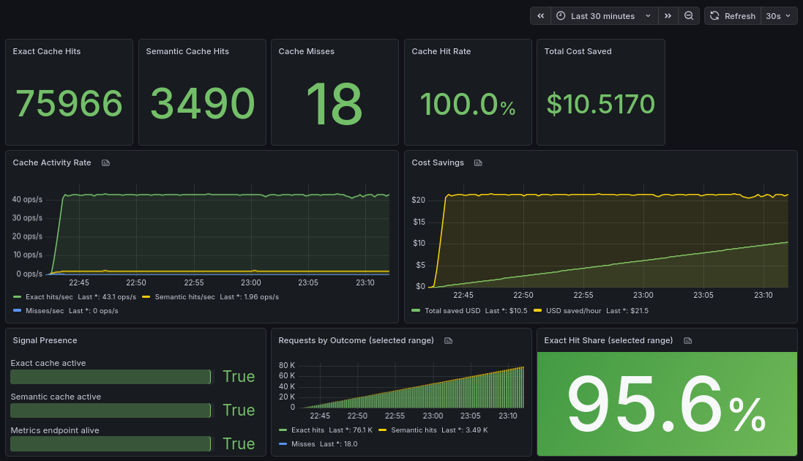
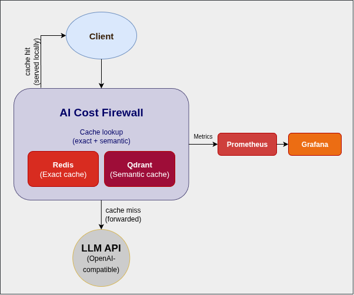

# AI Cost Firewall


**OpenAI-compatible gateway for caching and cost control.**

AI Cost Firewall is a lightweight OpenAI-compatible API gateway that reduces LLM API costs and latency by caching responses using exact
matching and semantic similarity.

It sits between applications and LLM providers and forwards only necessary requests to the upstream API.

The project is developed and supported by the creators of VCAL Server.

https://vcal-project.com

---

# Why AI Cost Firewall?

LLM APIs are expensive and often receive repeated or semantically similar prompts.

Without caching, every request results in:

-   unnecessary API calls
-   increased token usage
-   higher costs
-   additional latency

AI Cost Firewall solves this by introducing a two-layer cache:

1.  Exact cache (Redis) -- instant responses for identical prompts\
2.  Semantic cache (Qdrant) -- reuse answers for similar prompts

Only cache misses are forwarded to the upstream LLM provider.

The firewall behaves similarly to "nginx for LLM APIs".

---

## Example: Cost Savings in Action

**95.6% hit rate • $10.5 saved in 30 minutes • Redis + Qdrant**

[](assets/grafana/dashboard.png)

*Local synthetic workload simulating internal support queries.  
Exact + semantic caching eliminates repeated LLM calls and reduces cost in real time.*

---

# Key Features

-   OpenAI-compatible `/v1/chat/completions` endpoint
-   Exact request caching (Redis)
-   Semantic cache (Qdrant)
-   Token and cost savings metrics
-   Prometheus observability
-   Docker deployment
-   nginx-style configuration
-   Hot configuration reload (`SIGHUP`)
-   Lightweight Rust + Axum implementation

---

# Architecture Overview

Client applications send requests to the firewall instead of directly to the LLM provider.

[](assets/architecture/ai-cost-firewall-diagram.png)

Full architecture documentation:

[docs/architecture.md](docs/architecture.md)

---

# Quick Start (Docker)

The fastest way to try AI Cost Firewall is using Docker Compose.

## Prerequisites

Install:

- Docker
- Docker Compose (included with Docker Desktop)

Verify installation:

```bash
docker --version
docker compose version
```

## Clone the repository

Clone the repository and prepare the configuration:

```bash
git clone https://github.com/vcal-project/ai-firewall.git
cd ai-firewall
cp configs/ai-firewall.conf.example configs/ai-firewall.conf
```

Edit the configuration file and add your API keys:

```bash
nano configs/ai-firewall.conf
```

You should also specify the exact model names returned by your LLM provider (used for cost calculation), for example:

```text
gpt-4o-mini-2024-07-18
```

> The repository already includes all required Prometheus and Grafana configuration 

## Start the stack

This will start the full stack (Firewall, Redis, Qdrant, Prometheus, Grafana):

```bash
```bash
docker compose pull
docker compose up -d
```

## View logs

```bash
docker compose logs -f firewall
```

## Services

| Service | URL |
|-------|------|
| Firewall API | http://localhost:8080 |
| Prometheus | http://localhost:9090 |
| Grafana | http://localhost:3000 |

The stack includes:

-   AI Cost Firewall
-   Redis
-   Qdrant
-   Prometheus
-   Grafana

---

# Example Request

``` bash
curl http://localhost:8080/v1/chat/completions \
  -H "Authorization: Bearer <your-key>" \
  -H "Content-Type: application/json" \
  -d '{
    "model": "gpt-4o-mini-2024-07-18",
    "messages": [
      {"role": "user", "content": "Explain Redis briefly."}
    ]
  }'
```

---

## Metrics

Prometheus metrics are available at:

http://localhost:8080/metrics

Example metrics:

```text
aif_requests_total
aif_cache_exact_hits
aif_cache_semantic_hits
aif_cache_misses
aif_tokens_saved
aif_cost_saved_micro_usd
```

### Note

Token and cost savings are currently calculated only for:

```text
/v1/chat/completions
```

Embedding requests used internally for semantic caching are not included in these metrics in the current version.

---

# Build from Source

Clone the repository if you want to:

- explore the code
- modify configuration templates
- build the firewall locally
- contribute to the project

```bash
git clone https://github.com/vcal-project/ai-firewall.git
cd ai-firewall
```

Build the project:

```bash
cargo build --release
```

Run the firewall:

```bash
cargo run --release
```

---

# Configuration

AI Cost Firewall uses a simple nginx-style configuration format.

Example configuration:

``` text
listen_addr 0.0.0.0:8080;

redis_url redis://redis:6379;

upstream_base_url https://api.openai.com;
upstream_api_key sk-your-api-key;

embedding_base_url https://api.openai.com;
embedding_api_key sk-your-api-key;
embedding_model text-embedding-3-small;

qdrant_url http://qdrant:6334;
qdrant_collection aif_semantic_cache;
qdrant_vector_size 1536;

cache_ttl_seconds 2592000;
request_timeout_seconds 120;

semantic_cache_enabled true;
semantic_similarity_threshold 0.92;

# Chat-completion pricing (USD per 1M tokens)
# model_price <model> <input_usd_per_1m_tokens> <output_usd_per_1m_tokens>;

model_price gpt-4o-mini-2024-07-18 0.15 0.60;
model_price gpt-4.1-mini-2025-04-14 0.30 1.20;
```

> `model_price` matching is **exact in v0.1.0**.  
> If the API returns `gpt-4o-mini-2024-07-18`, the same name must appear in the configuration.

Full configuration reference:

`docs/config-reference.md`

[docs/config-reference.md](docs/config-reference.md)

---

# Documentation

| Document | Description |
|---------|-------------|
| `docs/architecture.md` | System architecture |
| `docs/config-reference.md` | Configuration directives |
| `docs/faq.md` | Frequently asked questions |
| `docs/how-it-works.md` | Request flow and caching logic |
| `docs/quickstart.md` | Full setup guide |

---

# Contributing

Contributions are welcome.

If you would like to contribute to AI Cost Firewall — whether through bug reports, feature suggestions, documentation improvements, or code —
please see:

[CONTRIBUTING.md](CONTRIBUTING.md)

Before submitting a pull request, please open an issue to discuss the change.

We welcome improvements in:

- performance
- documentation
- testing
- integrations with LLM providers
- observability and metrics

---

# Integration with VCAL Server

AI Cost Firewall can optionally integrate with **VCAL Server** for
advanced semantic caching and distributed vector storage.

VCAL Server project:

https://vcal-project.com

---

# License

Apache License 2.0
