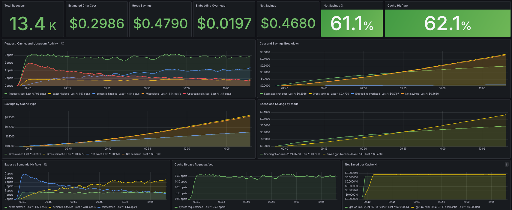
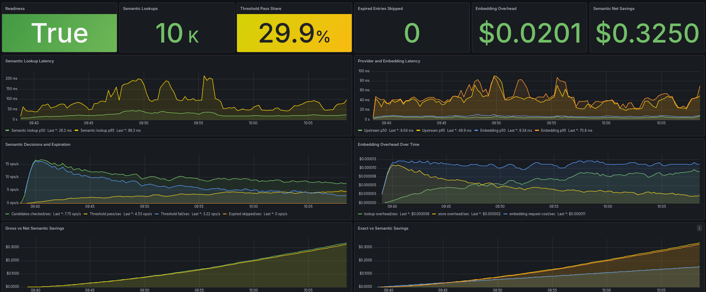
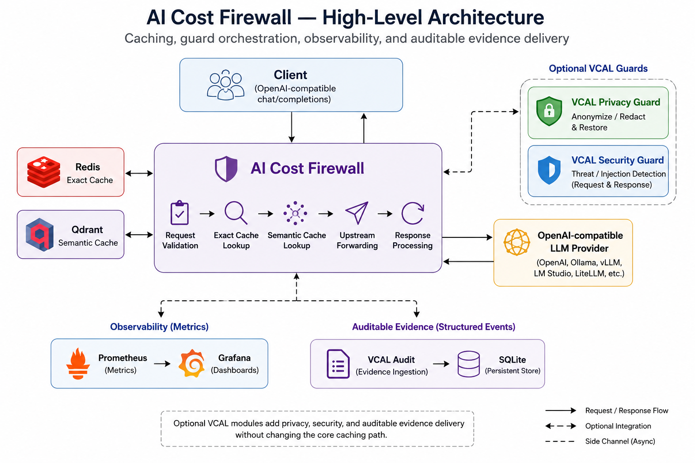

# AI Cost Firewall


## OpenAI-compatible gateway for LLM caching, cost control, observability, and guard orchestration

AI Cost Firewall is a lightweight OpenAI-compatible API gateway that reduces LLM API cost and latency through two cache layers:

* exact cache using Redis
* semantic cache using Qdrant

Only cache misses are forwarded to the upstream LLM endpoint.

AI Cost Firewall also supports optional guard orchestration for enterprise privacy and security deployments, while remaining fully usable as a standalone caching and cost-control gateway.

AI Cost Firewall is developed and maintained by VCAL Labs, Inc.

---

# Why AI Cost Firewall?

LLM applications frequently generate repeated or semantically similar prompts.

Without caching, every request results in:

- repeated upstream API calls
- additional token usage
- higher cost
- avoidable latency

AI Cost Firewall introduces a two-layer cache:

1. Exact cache (Redis)
2. Semantic cache (Qdrant)

The firewall behaves similarly to “nginx for LLM APIs”:

- applications call AI Cost Firewall
- the firewall evaluates exact and semantic cache reuse
- only cache misses reach the upstream provider

Supported OpenAI-compatible providers include:

- OpenAI
- Ollama
- LM Studio
- vLLM
- LiteLLM
- OpenRouter

---

# Current Release Focus

AI Cost Firewall v0.4.1 adds buffered delivery of structured evidence events to VCAL Audit, while preserving the complete request lifecycle traceability and hardened non-streaming request handling introduced in v0.4.0.

This release adds or finalizes:

- `vcal.evidence.event` schema v1.1 structured evidence events;
- stable `trace_id` correlation across request processing stages;
- asynchronous buffered HTTP delivery to VCAL Audit;
- bounded evidence queue, batching, request timeout, retry, and exponential backoff controls;
- configurable Audit endpoint, API key, producer instance ID, and delivery limits;
- exactly one terminal `request.completed` or `request.failed` event for every trace that emits `request.received`;
- request-side and response-side VCAL Security Guard orchestration;
- VCAL Privacy Guard anonymize/restore orchestration;
- propagation of Security Guard `rule_id` values into responses, metrics, and evidence events;
- explicit Privacy Guard restore skipping after response-side Security Guard blocks;
- guard orchestration metrics and latency histograms;
- global rejection of `stream=true` requests with HTTP 422;
- safer preservation of OpenAI-compatible request and response metadata;
- sanitized upstream error handling that does not expose upstream response bodies;
- production wiring for the buffered VCAL Audit evidence sink.

VCAL Security Guard and VCAL Privacy Guard are optional commercial add-ons. They are not required to run AI Cost Firewall as a standalone caching and cost-control gateway.

---

# Included Dashboards

AI Cost Firewall includes Grafana dashboards for cost visibility, cache effectiveness, runtime diagnostics, and high-level guard orchestration health.

The dashboards are included in the Docker deployment files and are automatically provisioned by Grafana when using the provided Docker Compose setup.

Detailed Privacy Guard and Security Guard findings remain in their product-specific dashboards. VCAL Audit provides its own dashboard for ingestion volume, durable persistence latency, authentication failures, hash-chain verification, and license status.

## Cost Savings Overview

<p align="center">
  <a href="assets/grafana/ai-firewall-overview-021.png">
    
  </a>
</p>

<p align="center">
  <em>30-minute cold-cache demo run with local simulated OpenAI-compatible upstream.</em>
</p>

The Overview dashboard shows the high-level cost and cache impact of AI Cost Firewall.

It demonstrates:

- total request volume
- estimated chat-completion cost
- gross savings from cache reuse
- embedding overhead
- net savings after embedding cost
- net savings percentage
- cache hit rate
- exact and semantic cache activity
- cache bypass request rate
- per-model spend and savings
- savings by cache type

This dashboard is intended for quick validation, demos, and cost-savings reviews.

---

## Semantic Diagnostics

[](assets/grafana/ai-firewall-diagnostics-021.png)
<p align="center">
  <em>Semantic diagnostics from the same cold-cache demo run, including readiness, threshold behavior, lookup latency, and cache activity.</em>
</p>

The Diagnostics dashboard provides a deeper operational view of semantic-cache behavior and runtime health.

It demonstrates:

- readiness state
- semantic lookup volume
- semantic threshold pass/fail behavior
- semantic candidate evaluation
- expired semantic entries skipped during lookup
- semantic lookup latency
- upstream and embedding latency
- embedding overhead by operation
- gross vs net semantic savings
- exact vs semantic savings
- semantic cache misses vs threshold passes
- semantic store health
- runtime and provider pressure signals
- provider error classes
- guard orchestration outcomes by guard, stage, and result
- guard orchestration latency

This dashboard is intended for troubleshooting, tuning semantic similarity thresholds, validating fail-open behavior, and understanding runtime cache behavior during pilots.

---

# Deployment Patterns

AI Cost Firewall includes ready-to-run deployment examples under:

```text
deploy/examples/
```

Available patterns:

| Pattern | Description |
|---|---|
| `openai-cloud/` | Fastest cloud evaluation path |
| `local-ollama/` | Fully local OpenAI-compatible deployment |
| `hybrid-openai-local-embeddings/` | OpenAI chat + local embeddings |
| `openrouter/` | OpenRouter upstream with OpenAI embeddings |
| `local-full-stack/` | Fully local stack with dashboards |

Each example includes:

- `docker-compose.yml`
- minimal configuration
- example requests
- expected behavior
- expected metrics
- optional observability overlays

---

# Architecture Overview

[](assets/architecture/ai-cost-firewall-architecture.png)

Client applications send requests to AI Cost Firewall instead of directly to the LLM provider.

The firewall:

1. validates requests
2. optionally calls VCAL Security Guard before cache/upstream processing
3. optionally calls VCAL Privacy Guard to anonymize or redact sensitive text
4. checks exact cache
5. checks semantic cache
6. forwards only cache misses upstream
7. optionally scans assistant responses before Privacy Guard restore
8. emits structured evidence events and Prometheus metrics
9. optionally delivers evidence batches to VCAL Audit
10. exposes operational diagnostics

Full architecture documentation:

```text
docs/architecture.md
```

---

# Quick Start (Docker)

## Prerequisites

Install:

- Docker
- Docker Compose

Verify installation:

```bash
docker --version
docker compose version
```

---

## Clone the repository

```bash
git clone https://github.com/vcal-project/ai-firewall.git
cd ai-firewall
```

Copy the example configuration:

```bash
cp configs/ai-firewall.conf.example configs/ai-firewall.conf
```

Edit the configuration and add your API key:

```bash
nano configs/ai-firewall.conf
```

---

## Start the stack

The default deployment starts:

- AI Cost Firewall
- Redis
- Qdrant
- Prometheus
- Grafana

```bash
docker compose pull
docker compose up -d
```

---

## Validate the deployment

```bash
curl http://localhost:8080/healthz
curl http://localhost:8080/readyz
curl http://localhost:8080/version
```

Expected:

```text
OK
ready
```

The `/version` endpoint returns release metadata, including the AI Cost Firewall version, release title, and OpenAI-compatible compatibility model.

---

## Streaming behavior

AI Cost Firewall v0.4.1 supports non-streaming chat completions only. Requests with `"stream": true` are rejected with HTTP `422` before cache, guard, or upstream processing.

## Example Request

```bash
curl http://localhost:8080/v1/chat/completions \
  -H "Content-Type: application/json" \
  -d '{
    "model": "gpt-4o-mini-2024-07-18",
    "messages": [
      {"role": "user", "content": "Explain Redis briefly."}
    ]
  }'
```

Run the same request twice.

- The first request should go upstream.
- The second request should be served from cache.

---

# Operational Features

AI Cost Firewall includes operational safeguards and observability features designed for real deployments.

## Runtime Features

- readiness and liveness endpoints
- graceful shutdown with request draining
- startup dependency validation
- nginx-style configuration reload (SIGHUP)
- structured Prometheus metrics
- semantic cache lifecycle control
- upstream timeout tracking
- request size protection
- runtime diagnostics
- configurable semantic cache fail-open behavior
- optional Security Guard and Privacy Guard orchestration
- configurable guard fail-open/fail-closed behavior
- structured evidence events with trace correlation
- exactly one terminal request lifecycle event per received trace
- optional buffered HTTP evidence delivery to VCAL Audit
- configurable Audit batching, queue capacity, timeout, and retry behavior

---

## Optional VCAL Guard Integration

AI Cost Firewall can optionally orchestrate VCAL Security Guard and VCAL Privacy Guard before forwarding non-streaming chat requests upstream.

Supported deployment modes:

```text
AI Firewall only
AI Firewall + VCAL Security Guard
AI Firewall + VCAL Privacy Guard
AI Firewall + VCAL Security Guard + VCAL Privacy Guard
```

When both enterprise guards are enabled, the recommended request/response flow is:

```text
Client
  -> AI Cost Firewall
      -> VCAL Security Guard request scan
      -> VCAL Privacy Guard anonymize/redact
      -> exact/semantic cache lookup or upstream LLM
      -> VCAL Security Guard response scan
      -> VCAL Privacy Guard restore
      -> Client
```

Security Guard can block malicious request-side prompts before Privacy Guard, cache, or upstream processing. Privacy Guard can replace sensitive values with placeholders before cache/upstream processing and restore them in the final response.

Example Privacy Guard transformation:

```text
Original request:
Analyze login from 185.23.10.5 by john@example.com

Sent upstream/cache path:
Analyze login from [IP_1] by [EMAIL_1]

Returned response:
john@example.com logged in from 185.23.10.5
```

Example Security Guard block returned by AI Firewall:

```json
{
  "error": {
    "code": 403,
    "guard": "security",
    "type": "security_request_blocked",
    "stage": "request",
    "rule_id": "VSG-PA-003"
  }
}
```

Streaming requests are rejected globally in v0.4.1, regardless of whether guard modules are enabled. Requests with `stream=true` return HTTP 422 before cache, guard, or upstream processing.

Security Guard and Privacy Guard are disabled by default in `configs/ai-firewall.conf.example`.

---

## Health Endpoints

| Endpoint | Purpose |
|---|---|
| `/healthz` | Process liveness |
| `/readyz` | Ready to serve traffic |

---

## Configuration Validation

Validate configuration statically before startup:

```bash
docker compose run --rm firewall \
  --config /configs/ai-firewall.conf \
  --test-config
```

Expected output:

```text
configuration OK
```

---

## Semantic Cache Fail-Open Behavior

When `semantic_cache_fail_open` is enabled, runtime semantic cache lookup or embedding failures skip semantic cache and continue to the upstream LLM endpoint.

This setting applies to runtime semantic cache behavior. It does not bypass startup dependency validation when semantic cache is enabled. If semantic cache is enabled, Qdrant must be reachable during startup and the configured vector size must match the collection.

---

## Print Loaded Configuration

```bash
docker compose run --rm firewall \
  --config /configs/ai-firewall.conf \
  --print-config
```

Secrets are automatically masked.

---

# OpenAI-Compatible Providers

AI Cost Firewall supports practical OpenAI-compatible deployments while keeping a simple flat configuration model.

The current model is:

```text
upstream_provider openai_compatible;
embedding_provider openai_compatible;
```

This means AI Cost Firewall expects OpenAI-style chat and embedding APIs. It does not yet provide provider-specific configuration blocks or native provider-specific request transformations.

Common OpenAI-compatible deployment patterns include:

| Runtime or Gateway | Usage Pattern                               |
| ------------------ | ------------------------------------------- |
| OpenAI             | Cloud OpenAI-compatible chat and embeddings |
| Ollama             | Local OpenAI-compatible model endpoint      |
| LM Studio          | Local OpenAI-compatible model endpoint      |
| vLLM               | Self-hosted OpenAI-compatible serving       |
| LiteLLM            | Gateway in front of multiple providers      |
| OpenRouter         | OpenAI-compatible hosted gateway            |

Example configuration:

```text
upstream_provider openai_compatible;
upstream_base_url https://api.openai.com;
upstream_api_key sk-your-key;

embedding_provider openai_compatible;
embedding_base_url https://api.openai.com;
embedding_api_key sk-your-key;
```

The upstream provider and embedding provider may use different OpenAI-compatible base URLs.

Important limitations:

* AI Cost Firewall does not claim universal compatibility with every OpenAI-like API.
* Native Anthropic, Gemini, Mistral, and Cohere APIs are not directly supported in v0.4.1.
* Mistral, Anthropic, Gemini, or other providers may be used only when exposed through an OpenAI-compatible layer such as LiteLLM, OpenRouter, or another compatible gateway.
* Provider-specific config blocks, fallback chains, native provider transformations, and provider-specific pricing catalogs are not included in v0.4.1.

See:

```text
configs/examples/
deploy/examples/
docs/provider-compatibility.md
```

---

# Metrics Overview

Metrics are exposed at:

```text
http://localhost:8080/metrics
```

Example metrics:

```text
aif_requests_total
aif_cache_exact_hits
aif_cache_semantic_hits
aif_cache_hits_total
aif_cache_bypass_requests_total
aif_model_cost_micro_usd_total
aif_gross_saved_micro_usd_total
aif_net_saved_micro_usd_total
aif_embedding_overhead_micro_usd_total
aif_guard_requests_total
aif_guard_latency_seconds
aif_security_blocks_total
aif_privacy_restore_skipped_total
```

AI Cost Firewall reports:

- gross chat-completion savings
- embedding overhead
- net savings after embedding cost
- cache hit ratios
- semantic cache diagnostics
- per-model traffic and cost metrics
- guard request counts by guard, stage, and result
- Security Guard block counts by stage and rule ID
- Privacy Guard restore-skip counters when response Security blocks occur

Evidence events are emitted through structured application logs and can optionally be delivered to VCAL Audit. Enable evidence logging with:

```text
RUST_LOG=info,vcal_evidence=info
```

---

# Configuration

AI Cost Firewall uses a simple nginx-style configuration format.

Minimal example:

```text
listen_addr 0.0.0.0:8080;

redis_url redis://redis:6379;

upstream_provider openai_compatible;
upstream_base_url https://api.openai.com;
upstream_api_key sk-your-key;

semantic_cache_enabled true;
```

Full documentation:

- `docs/config-reference.md`
- `docs/provider-compatibility.md`
- `docs/quickstart.md`

---

## Benchmarks

AI Cost Firewall has been benchmarked with a local simulated OpenAI-compatible upstream provider to isolate gateway behavior, Redis/Qdrant integration, cache effectiveness, and Prometheus metrics without external API cost or provider rate-limit noise.

In a 30-minute cache-effectiveness benchmark, AI Cost Firewall sustained 30 RPS with 0% request failures, p95 latency of 9.03 ms, and a 98.86% aggregate cache-hit rate.

In a single-VM high-load benchmark, AI Cost Firewall sustained approximately 500 RPS for 5 minutes with 0% HTTP failures. Higher RPS values caused instability in the single-VM test environment, so this should be treated as a local benchmark observation, not a universal capacity limit.

See [BENCHMARKS.md](BENCHMARKS.md) for benchmark methodology, environment, limitations, and detailed results.

---

# v0.4.1 Validation

AI Cost Firewall v0.4.1 was validated with VCAL Privacy Guard, VCAL Security Guard, and VCAL Audit.

Validated behavior includes:

- safe requests are allowed through AI Firewall;
- request-side prompt attacks are blocked by VCAL Security Guard with HTTP 403;
- sensitive text is anonymized by VCAL Privacy Guard before cache/upstream processing;
- placeholders are restored before the final client response;
- streaming requests are rejected globally with HTTP 422 before cache, guard, or upstream processing;
- cache bypass requests still run through guard orchestration;
- Prometheus metrics are emitted for Security Guard, Privacy Guard, and AI Firewall guard stages;
- response-side Security Guard blocks skip Privacy Guard restore;
- failure paths emit `request.failed` exactly once;
- successful upstream requests emit `request.completed` exactly once;
- Security Guard rule IDs are preserved in responses, metrics, and evidence events;
- the short mixed-traffic simulation completed with no unexpected HTTP errors;
- buffered evidence batches were delivered to VCAL Audit;
- stored traces were reconstructed by `trace_id`;
- the VCAL Audit SHA-256 record chain verified successfully;
- the SQLite evidence database persisted across container restarts.

The current guard modules inspect text content. Non-text content such as images, audio, video, or binary payloads is preserved where possible but is not scanned, anonymized, or classified by AI Firewall guard modules.

# Evidence Events and VCAL Audit

AI Cost Firewall v0.4.1 emits structured evidence using schema:

```text
vcal.evidence.event
schema_version: 1.1
```

Each request trace that emits `request.received` ends with exactly one terminal event:

```text
request.completed
```

or:

```text
request.failed
```

Evidence events use a stable `trace_id` to correlate request validation, cache activity, upstream calls, guard decisions, and terminal outcomes.

By default, evidence is emitted through structured application logs. Enable it with:

```text
RUST_LOG=info,vcal_evidence=info
```

Inspect logged evidence with:

```bash
docker compose logs firewall | grep 'VCAL evidence event'
```

AI Cost Firewall can also deliver evidence asynchronously to VCAL Audit through a bounded, buffered HTTP sink.

Example configuration:

```text
audit_enabled true;
audit_url http://vcal-audit:8092;
audit_api_key replace-with-shared-audit-token;
audit_producer_instance_id ai-firewall-01;
audit_queue_capacity 10000;
audit_batch_size 100;
audit_flush_interval_ms 1000;
audit_timeout_seconds 5;
audit_retry_max_attempts 5;
audit_retry_initial_backoff_ms 250;
```

VCAL Audit provides authenticated batch ingestion, SQLite persistence, ordered event queries, trace reconstruction, NDJSON export, and SHA-256 hash-chain verification.

The current AI Firewall sender queue is memory-backed. After retry exhaustion, an undelivered batch is dropped and logged rather than blocking the LLM request path.

---

# Troubleshooting

See:

- `docs/troubleshooting.md`
- `docs/provider-compatibility.md`
- `docs/operation.md`

Common issues include:

- incorrect upstream base URLs
- provider TLS/certificate failures
- embedding dimension mismatches
- Qdrant vector-size mismatch
- unsupported provider behavior
- semantic threshold tuning

---

# Documentation

| Document | Description |
|---|---|
| `docs/architecture.md` | System architecture |
| `docs/config-reference.md` | Configuration directives |
| `docs/faq.md` | Frequently asked questions |
| `docs/how-it-works.md` | Request flow and cache logic |
| `docs/metrics-and-costs.md` | Cost and savings accounting |
| `docs/operation.md` | Runtime behavior |
| `docs/provider-compatibility.md` | OpenAI-compatible providers |
| `docs/quickstart.md` | Extended setup guide |
| `docs/troubleshooting.md` | Troubleshooting guide |
| `docs/audit-integration.md` | VCAL Audit evidence delivery and operations |

Full documentation:

https://ai-firewall.docs.vcal-project.com/

---

# Build from Source

```bash
git clone https://github.com/vcal-project/ai-firewall.git
cd ai-firewall

cargo build --release
cargo run --release
```

---

# Testing

Run tests:

```bash
cargo test
```

AI Cost Firewall includes tests for:

- configuration validation
- request validation
- semantic cache requirements
- semantic cache fail-open behavior
- environment variable parsing
- request size parsing
- cost accounting logic
- guard configuration parsing
- Privacy Guard orchestration
- Security Guard orchestration
- OpenAI-compatible metadata preservation
- evidence lifecycle completion
- request and response Security Guard block evidence
- global streaming rejection
- buffered Audit evidence delivery configuration
- evidence batching, retry, and delivery failure handling

---

# Contributing

Contributions are welcome.

Areas where contributions are especially valuable:

- documentation
- performance
- observability
- provider compatibility
- deployment examples
- testing

See:

```text
CONTRIBUTING.md
```

---

# Integration with VCAL Semantic Cache

AI Cost Firewall can optionally integrate with VCAL Semantic Cache for advanced semantic caching and distributed vector storage.

https://vcal-project.com/vcal-server

---

# License

Apache License 2.0
