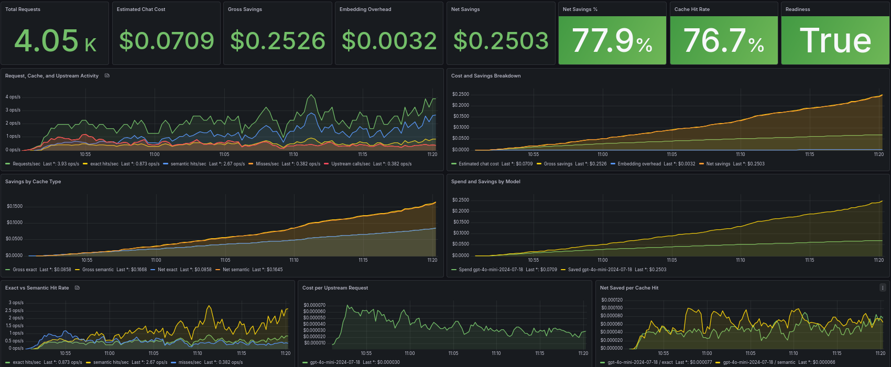
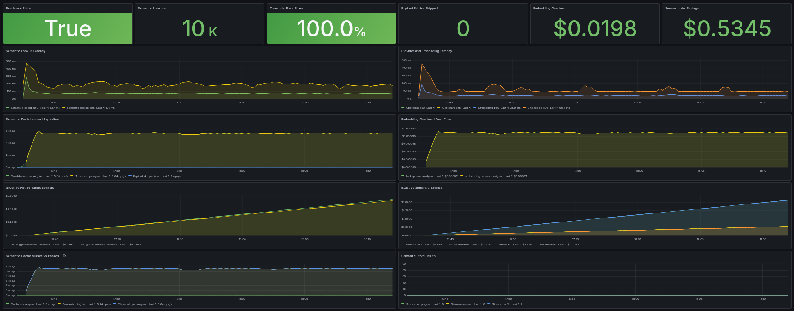

# AI Cost Firewall


## OpenAI-compatible gateway for LLM cost reduction, semantic caching, and operational control

AI Cost Firewall is a lightweight OpenAI-compatible API gateway that reduces LLM API cost and latency using:

- exact cache (Redis)
- semantic cache (Qdrant)

Only cache misses are forwarded upstream.

AI Cost Firewall is developed and maintained by VCAL Labs, Inc.

---

# Why AI Cost Firewall?

LLM applications frequently generate repeated or semantically similar prompts.

Without caching, every request results in:

- repeated upstream API calls
- additional token usage
- higher cost
- avoidable latency

AI Cost Firewall introduces a two-layer cache:

1. Exact cache (Redis)
2. Semantic cache (Qdrant)

The firewall behaves similarly to “nginx for LLM APIs”:

- applications call AI Cost Firewall
- the firewall evaluates exact and semantic cache reuse
- only cache misses reach the upstream provider

Supported OpenAI-compatible providers include:

- OpenAI
- Ollama
- LM Studio
- vLLM
- LiteLLM
- OpenRouter

---

# Included Dashboards

## Cost Savings Overview

[](assets/grafana/ai-firewall-overview-018.png)

Demonstrates:

- exact cache savings
- semantic cache savings
- embedding overhead
- net savings
- per-model request activity

---

## Semantic Diagnostics

[](assets/grafana/ai-firewall-diagnostics_019.png)

Demonstrates:

- semantic threshold pass/fail behavior
- semantic candidate evaluation
- cache hit quality
- semantic lookup latency
- runtime cache behavior

The dashboards are included in the Docker deployment and automatically provisioned through Grafana.

---

# Deployment Patterns

AI Cost Firewall includes ready-to-run deployment examples under:

```text
deploy/examples/
```

Available patterns:

| Pattern | Description |
|---|---|
| `openai-cloud/` | Fastest cloud evaluation path |
| `local-ollama/` | Fully local OpenAI-compatible deployment |
| `hybrid-openai-local-embeddings/` | OpenAI chat + local embeddings |
| `openrouter/` | OpenRouter upstream with OpenAI embeddings |
| `local-full-stack/` | Fully local stack with dashboards |

Each example includes:

- `docker-compose.yml`
- minimal configuration
- example requests
- expected behavior
- expected metrics
- optional observability overlays

---

# Architecture Overview

[](assets/architecture/ai-cost-firewall-diagram.png)

Client applications send requests to AI Cost Firewall instead of directly to the LLM provider.

The firewall:

1. validates requests
2. checks exact cache
3. checks semantic cache
4. forwards only cache misses upstream
5. exposes metrics and operational diagnostics

Full architecture documentation:

```text
docs/architecture.md
```

---

# Quick Start (Docker)

## Prerequisites

Install:

- Docker
- Docker Compose

Verify installation:

```bash
docker --version
docker compose version
```

---

## Clone the repository

```bash
git clone https://github.com/vcal-project/ai-firewall.git
cd ai-firewall
```

Copy the example configuration:

```bash
cp configs/ai-firewall.conf.example configs/ai-firewall.conf
```

Edit the configuration and add your API key:

```bash
nano configs/ai-firewall.conf
```

---

## Start the stack

The default deployment starts:

- AI Cost Firewall
- Redis
- Qdrant
- Prometheus
- Grafana

```bash
docker compose pull
docker compose up -d
```

---

## Validate the deployment

```bash
curl http://localhost:8080/healthz
curl http://localhost:8080/readyz
```

Expected:

```text
OK
ready
```

---

## Example Request

```bash
curl http://localhost:8080/v1/chat/completions \
  -H "Content-Type: application/json" \
  -d '{
    "model": "gpt-4o-mini-2024-07-18",
    "messages": [
      {"role": "user", "content": "Explain Redis briefly."}
    ]
  }'
```

Run the same request twice.

- The first request should go upstream.
- The second request should be served from cache.

---

# Operational Features

AI Cost Firewall includes operational safeguards and observability features designed for real deployments.

## Runtime Features

- readiness and liveness endpoints
- graceful shutdown with request draining
- startup dependency validation
- nginx-style configuration reload (SIGHUP)
- structured Prometheus metrics
- semantic cache lifecycle control
- upstream timeout tracking
- request size protection
- runtime diagnostics

---

## Health Endpoints

| Endpoint | Purpose |
|---|---|
| `/healthz` | Process liveness |
| `/readyz` | Ready to serve traffic |

---

## Configuration Validation

Validate configuration statically before startup:

```bash
docker compose run --rm firewall \
  --config /configs/ai-firewall.conf \
  --test-config
```

Expected output:

```text
configuration OK
```

---

## Print Loaded Configuration

```bash
docker compose run --rm firewall \
  --config /configs/ai-firewall.conf \
  --print-config
```

Secrets are automatically masked.

---

# OpenAI-Compatible Providers

AI Cost Firewall supports practical OpenAI-compatible deployments while keeping a flat configuration model.

Supported provider patterns include:

| Provider | Status |
|---|---|
| OpenAI | Fully tested |
| Ollama | Supported |
| LM Studio | Supported |
| vLLM | Supported |
| LiteLLM | Supported |
| OpenRouter | Supported |

Example configuration:

```text
upstream_provider openai_compatible;
upstream_base_url https://api.openai.com;
upstream_api_key sk-your-key;

embedding_provider openai_compatible;
embedding_base_url https://api.openai.com;
embedding_api_key sk-your-key;
```

The upstream provider and embedding provider may use different base URLs.

See:

```text
configs/examples/
deploy/examples/
```

---

# Metrics Overview

Metrics are exposed at:

```text
http://localhost:8080/metrics
```

Example metrics:

```text
aif_requests_total
aif_cache_exact_hits
aif_cache_semantic_hits
aif_model_cost_micro_usd_total
aif_gross_saved_micro_usd_total
aif_net_saved_micro_usd_total
aif_embedding_overhead_micro_usd_total
```

AI Cost Firewall reports:

- gross chat-completion savings
- embedding overhead
- net savings after embedding cost
- cache hit ratios
- semantic cache diagnostics
- per-model traffic and cost metrics

---

# Configuration

AI Cost Firewall uses a simple nginx-style configuration format.

Minimal example:

```text
listen_addr 0.0.0.0:8080;

redis_url redis://redis:6379;

upstream_provider openai_compatible;
upstream_base_url https://api.openai.com;
upstream_api_key sk-your-key;

semantic_cache_enabled true;
```

Full documentation:

- `docs/config-reference.md`
- `docs/provider-compatibility.md`
- `docs/quickstart.md`

---

# Troubleshooting

See:

- `docs/troubleshooting.md`
- `docs/provider-compatibility.md`
- `docs/operation.md`

Common issues include:

- incorrect upstream base URLs
- provider TLS/certificate failures
- embedding dimension mismatches
- Qdrant vector-size mismatch
- unsupported provider behavior
- semantic threshold tuning

---

# Documentation

| Document | Description |
|---|---|
| `docs/architecture.md` | System architecture |
| `docs/config-reference.md` | Configuration directives |
| `docs/faq.md` | Frequently asked questions |
| `docs/how-it-works.md` | Request flow and cache logic |
| `docs/metrics-and-costs.md` | Cost and savings accounting |
| `docs/operation.md` | Runtime behavior |
| `docs/provider-compatibility.md` | OpenAI-compatible providers |
| `docs/quickstart.md` | Extended setup guide |
| `docs/troubleshooting.md` | Troubleshooting guide |

Full documentation:

https://ai-firewall.docs.vcal-project.com/

---

# Build from Source

```bash
git clone https://github.com/vcal-project/ai-firewall.git
cd ai-firewall

cargo build --release
cargo run --release
```

---

# Testing

Run tests:

```bash
cargo test
```

AI Cost Firewall includes tests for:

- configuration validation
- request validation
- semantic cache requirements
- environment variable parsing
- request size parsing
- cost accounting logic

---

# Contributing

Contributions are welcome.

Areas where contributions are especially valuable:

- documentation
- performance
- observability
- provider compatibility
- deployment examples
- testing

See:

```text
CONTRIBUTING.md
```

---

# Integration with VCAL Server

AI Cost Firewall can optionally integrate with VCAL Server for advanced semantic caching and distributed vector storage.

https://vcal-project.com/vcal-server

---

# License

Apache License 2.0
