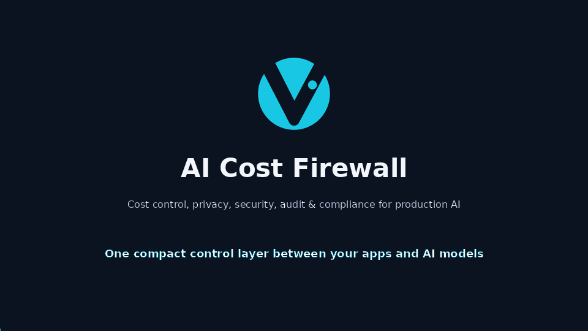

# AI Cost Firewall


## OpenAI-compatible control layer for AI cost, with optional privacy, security, usage-policy, audit, and compliance integrations

AI Cost Firewall is a lightweight OpenAI-compatible gateway that reduces unnecessary LLM API calls through exact and semantic cache reuse.

AI Cost Firewall can be deployed independently as a complete caching and cost-control gateway.

It can also integrate with separately licensed VCAL modules for privacy, security, usage-policy enforcement, audit, and compliance.

<p align="center">
  
</p>

<p align="center">
  <em>AI Cost Firewall controls the request path between AI applications and model providers.</em>
</p>

AI Cost Firewall is developed and maintained by VCAL Labs, Inc.

---

# Why AI Cost Firewall?

LLM applications frequently generate repeated or semantically similar prompts.

Without caching, every request results in:

- repeated upstream API calls
- additional token usage
- higher cost
- avoidable latency

AI Cost Firewall introduces a two-layer cache:

1. Exact cache (Redis)
2. Semantic cache (Qdrant)

The firewall behaves similarly to “nginx for LLM APIs”:

- applications call AI Cost Firewall
- the firewall evaluates exact and semantic cache reuse
- only cache misses reach the upstream provider

Supported OpenAI-compatible providers include:

- OpenAI
- Ollama
- LM Studio
- vLLM
- LiteLLM
- OpenRouter

---

# Production Capabilities

AI Cost Firewall includes:

- exact Redis caching
- semantic Qdrant caching
- OpenAI-compatible request routing
- OpenAI-compatible streaming chat completions (SSE)
- configurable cache fail-open/fail-closed behavior
- structured lifecycle evidence
- Prometheus metrics and Grafana dashboards
- readiness, liveness, graceful shutdown, and runtime diagnostics

Optional integrations with separately licensed VCAL modules include:

- VCAL Privacy Guard
- VCAL Security Guard
- VCAL Usage Guard
- VCAL Audit
- VCAL Compliance

See the latest GitHub release for release-specific changes.

---

# Included Dashboards

AI Cost Firewall includes Grafana dashboards for cost visibility, cache effectiveness, runtime diagnostics, and high-level guard orchestration health.

The dashboards are included in the Docker deployment files and are automatically provisioned by Grafana when using the provided Docker Compose setup.

Detailed Privacy Guard, Security Guard, and Usage Guard findings remain in their product-specific dashboards. VCAL Audit provides its own dashboard for ingestion volume, durable persistence latency, authentication failures, hash-chain verification, and license status.

## Cost Savings Overview

<p align="center">
  <a href="assets/grafana/ai-firewall-overview-021.png">
    
  </a>
</p>

<p align="center">
  <em>30-minute cold-cache demo run with local simulated OpenAI-compatible upstream.</em>
</p>

The Overview dashboard shows the high-level cost and cache impact of AI Cost Firewall.

It demonstrates:

- total request volume
- estimated chat-completion cost
- gross savings from cache reuse
- embedding overhead
- net savings after embedding cost
- net savings percentage
- cache hit rate
- exact and semantic cache activity
- cache bypass request rate
- per-model spend and savings
- savings by cache type
- Usage Guard policy blocks
- high-level guard orchestration health

This dashboard is intended for quick validation, demos, and cost-savings reviews.

---

## Semantic Diagnostics

[](assets/grafana/ai-firewall-diagnostics-021.png)
<p align="center">
  <em>Semantic diagnostics from the same cold-cache demo run, including readiness, threshold behavior, lookup latency, and cache activity.</em>
</p>

The Diagnostics dashboard provides a deeper operational view of semantic-cache behavior and runtime health.

It demonstrates:

- readiness state
- semantic lookup volume
- semantic threshold pass/fail behavior
- semantic candidate evaluation
- expired semantic entries skipped during lookup
- semantic lookup latency
- upstream and embedding latency
- embedding overhead by operation
- gross vs net semantic savings
- exact vs semantic savings
- semantic cache misses vs threshold passes
- semantic store health
- runtime and provider pressure signals
- provider error classes
- guard orchestration outcomes by guard, stage, and result
- guard orchestration latency
- Usage Guard policy blocks by category
- guard operational signals across Security Guard, Privacy Guard, and Usage Guard

This dashboard is intended for troubleshooting, tuning semantic similarity thresholds, validating fail-open behavior, and understanding runtime cache behavior during pilots.

---

# Deployment Patterns

AI Cost Firewall includes ready-to-run deployment examples under:

```text
deploy/examples/
```

Available patterns:

| Pattern | Description |
|---|---|
| `openai-cloud/` | Fastest cloud evaluation path |
| `local-ollama/` | Fully local OpenAI-compatible deployment |
| `hybrid-openai-local-embeddings/` | OpenAI chat + local embeddings |
| `openrouter/` | OpenRouter upstream with OpenAI embeddings |
| `local-full-stack/` | Fully local stack with dashboards |

Each example includes:

- `docker-compose.yml`
- minimal configuration
- example requests
- expected behavior
- expected metrics
- optional observability overlays

---

# Architecture Overview

[](assets/architecture/ai-cost-firewall-architecture.png)

Client applications send requests to AI Cost Firewall instead of directly to the LLM provider.

The firewall:

1. validates requests
2. optionally calls VCAL Security Guard on the raw request
3. optionally calls VCAL Privacy Guard to anonymize or redact sensitive text
4. optionally calls VCAL Usage Guard to evaluate organizational usage policy
5. checks exact cache
6. checks semantic cache
7. on a cache miss, calls the upstream provider using normal JSON for `stream=false`/omitted or consumes provider SSE internally for `stream=true`
8. normalizes cache hits and upstream results into the same canonical chat-completion response
9. optionally scans the complete assistant response with VCAL Security Guard
10. stores eligible cache-miss responses using the existing pre-Privacy-restore cache semantics
11. optionally restores Privacy Guard placeholders
12. records usage, cost, metrics, and structured evidence
13. returns JSON for non-streaming requests or replays an approved OpenAI-compatible SSE response for controlled streaming requests
14. optionally delivers evidence batches to VCAL Audit
15. exposes operational diagnostics

Full architecture documentation:

```text
docs/architecture.md
```

---

# Quick Start (Docker)

## Prerequisites

Install:

- Docker
- Docker Compose

Verify installation:

```bash
docker --version
docker compose version
```

---

## Clone the repository

```bash
git clone https://github.com/vcal-project/ai-firewall.git
cd ai-firewall
```

Copy the example configuration:

```bash
cp configs/ai-firewall.conf.example configs/ai-firewall.conf
```

Edit the configuration and add your API key:

```bash
nano configs/ai-firewall.conf
```

For the default OpenAI deployment, the upstream API key is the only provider-specific value that normally needs to be replaced before starting the stack. Provider streaming support is not required for ordinary JSON chat-completion requests; it is required only when a client sends `"stream": true`.

---

## Start the stack

The default deployment starts:

- AI Cost Firewall
- Redis
- Qdrant
- Prometheus
- Grafana

```bash
docker compose pull
docker compose up -d
```

---

## Validate the deployment

```bash
curl http://localhost:8080/healthz
curl http://localhost:8080/readyz
curl http://localhost:8080/version
```

Expected:

```text
OK
ready
```

The `/version` endpoint returns release metadata, including the AI Cost Firewall version, release title, and OpenAI-compatible compatibility model.

---

## Streaming behavior

AI Cost Firewall supports **controlled OpenAI-compatible chat-completion streaming** with `"stream": true`. Controlled streaming accepts provider SSE internally, assembles the complete response, applies response controls, and only then replays an OpenAI-compatible Server-Sent Events (`text/event-stream`) response to the client.

The core guarantee is:

> No generated response content leaves AI Cost Firewall until AI Cost Firewall has approved the complete response.

Controlled streaming uses the same request controls, cache identity, response controls, Privacy restoration, accounting, and evidence pipeline as non-streaming requests:

- Security Guard, Privacy Guard, and Usage Guard request-side processing runs before cache lookup or the upstream call.
- Exact and semantic cache lookup/store remain active for streaming requests. JSON and SSE delivery share transport-independent cache identity, so an eligible cached completion can be reused across `stream=false` and `stream=true`.
- On a cache miss, AI Cost Firewall requests provider SSE and consumes it internally. Provider chunks are parsed and assembled into the canonical chat-completion response before downstream delivery.
- Security Guard response scanning runs on the complete assembled or cached response before any generated response content is committed to the client.
- Eligible cache-miss responses are stored using the existing pre-Privacy-restore cache semantics.
- Privacy Guard placeholder restoration runs before controlled SSE delivery, including flows that created an anonymization mapping on the request path.
- Usage and model-cost accounting are derived from the assembled response. AI Cost Firewall requests upstream usage data for internal accounting; a downstream usage chunk is replayed when the client requests `stream_options.include_usage`.
- After all controls and accounting complete successfully, AI Cost Firewall encodes the approved canonical response as OpenAI-compatible SSE and terminates it with `[DONE]`.
- If the provider stream fails, is malformed, is truncated, exceeds the configured cumulative upstream SSE byte limit, becomes idle for too long, or exceeds the absolute generation ceiling before approval, AI Cost Firewall returns a normal HTTP error and does not expose partial provider content to the client.

Controlled streaming is enabled by default and can be configured with:

```text
streaming_enabled true;
max_stream_upstream_bytes 8M;
upstream_timeout_seconds 120;
```

`streaming_enabled` permits clients to use `"stream": true`; it does not force streaming for ordinary requests. Requests with `stream=false` or no `stream` field continue to use the normal JSON completion path.

`max_stream_upstream_bytes` limits the **cumulative provider SSE bytes accepted for one controlled streaming request**. It is a total-response-size limit, not a measurement of instantaneous parser buffer occupancy.

For controlled provider streams, `upstream_timeout_seconds` also acts as the maximum idle gap between provider SSE body chunks after response headers have been received. In addition, controlled generation has a 15-minute absolute ceiling so a provider cannot hold an upstream concurrency permit indefinitely by continuously drip-feeding data.

Provider SSE support is required only for requests that use `"stream": true`. An OpenAI-compatible provider without streaming support remains usable for ordinary non-streaming chat-completion requests.

Operational characteristics:

- controlled streaming prioritizes response-control guarantees over token-by-token immediacy; client SSE delivery begins only after upstream generation and response controls complete
- downstream SSE is generated from the canonical response and is OpenAI-compatible, but it is not guaranteed to be byte-for-byte identical to the provider's original SSE framing
- fragmented content and tool-call deltas are reconstructed before replay
- upstream and client time-to-first-byte are measured separately
- provider SSE chunks and cumulative bytes, generation duration, timeout/failure outcomes, upstream response size, approved client-buffer size, request errors, and terminal stream lifecycle are exposed through Prometheus metrics and structured evidence

---

# Operational Features

AI Cost Firewall includes operational safeguards and observability features designed for real deployments.

## Runtime Features

- readiness and liveness endpoints
- graceful shutdown with request draining
- startup dependency validation
- nginx-style configuration reload (SIGHUP)
- structured Prometheus metrics
- semantic cache lifecycle control
- upstream request timeout tracking plus controlled-stream idle and absolute-generation timeout protection
- request size protection
- runtime diagnostics
- configurable semantic cache fail-open behavior
- optional Security Guard, Privacy Guard, and Usage Guard orchestration
- configurable guard fail-open/fail-closed behavior
- structured evidence events with trace correlation
- exactly one terminal request lifecycle event per received trace
- optional buffered HTTP evidence delivery to VCAL Audit
- configurable Audit batching, queue capacity, timeout, and retry behavior

---

## Optional VCAL Modules

VCAL Privacy Guard, VCAL Security Guard, VCAL Usage Guard, VCAL Audit, and VCAL Compliance are separate commercial products. They are not required to deploy or use AI Cost Firewall.

AI Cost Firewall can optionally orchestrate VCAL Security Guard, VCAL Privacy Guard, and VCAL Usage Guard around chat requests and responses. These modules can be enabled independently or in combination. Controlled streaming uses the same request-side guard processing and complete-response Security/Privacy controls described in the Streaming behavior section.

The recommended full guard flow is:

```text
Client
  -> AI Cost Firewall
      -> VCAL Security Guard request scan
      -> VCAL Privacy Guard anonymize/redact
      -> VCAL Usage Guard policy evaluation
      -> exact/semantic cache lookup or upstream LLM
      -> VCAL Security Guard response scan
      -> VCAL Privacy Guard restore
      -> Client
```

Security Guard can block malicious request-side prompts before Privacy Guard, Usage Guard, cache, or upstream processing. Privacy Guard can replace sensitive values with placeholders before Usage Guard, cache, or upstream processing and restore them in the final response. Usage Guard evaluates whether the request is permitted under organizational AI usage policy and can allow, warn, block, or escalate the request before cache or upstream processing.

Example Privacy Guard transformation:

```text
Original request:
Analyze login from 185.23.10.5 by john@example.com

Sent upstream/cache path:
Analyze login from [IP_1] by [EMAIL_1]

Returned response:
john@example.com logged in from 185.23.10.5
```

Example Security Guard block returned by AI Firewall:

```json
{
  "error": {
    "code": 403,
    "guard": "security",
    "type": "security_request_blocked",
    "stage": "request",
    "rule_id": "VSG-PA-003"
  }
}
```

Example Usage Guard block returned by AI Firewall:

```json
{
  "error": {
    "code": 403,
    "guard": "usage",
    "type": "usage_request_blocked",
    "stage": "request",
    "rule_id": "VUG-PER-001",
    "category": "personal_travel"
  }
}
```

For controlled streaming requests, request-side Security Guard, Privacy Guard, and Usage Guard processing remains active. On cache misses, AI Cost Firewall fully assembles the provider stream before response Security Guard scanning and Privacy Guard restoration. The approved result is then replayed as SSE, so response controls do not need to be skipped and Privacy mappings can be restored before client delivery.

Security Guard, Privacy Guard, and Usage Guard are disabled by default in `configs/ai-firewall.conf.example`.

---

## Health Endpoints

| Endpoint | Purpose |
|---|---|
| `/healthz` | Process liveness |
| `/readyz` | Ready to serve traffic |

---

## Configuration Validation

Validate configuration statically before startup:

```bash
docker compose run --rm firewall \
  --config /configs/ai-firewall.conf \
  --test-config
```

Expected output:

```text
configuration OK
```

---

## Semantic Cache Fail-Open Behavior

When `semantic_cache_fail_open` is enabled, runtime semantic cache lookup or embedding failures skip semantic cache and continue to the upstream LLM endpoint.

This setting applies to runtime semantic cache behavior. It does not bypass startup dependency validation when semantic cache is enabled. If semantic cache is enabled, Qdrant must be reachable during startup and the configured vector size must match the collection.

---

## Print Loaded Configuration

```bash
docker compose run --rm firewall \
  --config /configs/ai-firewall.conf \
  --print-config
```

Secrets are automatically masked.

---

# OpenAI-Compatible Providers

AI Cost Firewall supports practical OpenAI-compatible deployments while keeping a simple flat configuration model.

The current model is:

```text
upstream_provider openai_compatible;
embedding_provider openai_compatible;
```

This means AI Cost Firewall expects OpenAI-style chat and embedding APIs. It does not yet provide provider-specific configuration blocks or native provider-specific request transformations.

Common OpenAI-compatible deployment patterns include:

| Runtime or Gateway | Usage Pattern                               |
| ------------------ | ------------------------------------------- |
| OpenAI             | Cloud OpenAI-compatible chat and embeddings |
| Ollama             | Local OpenAI-compatible model endpoint      |
| LM Studio          | Local OpenAI-compatible model endpoint      |
| vLLM               | Self-hosted OpenAI-compatible serving       |
| LiteLLM            | Gateway in front of multiple providers      |
| OpenRouter         | OpenAI-compatible hosted gateway            |

Example configuration:

```text
upstream_provider openai_compatible;
upstream_base_url https://api.openai.com;
upstream_api_key sk-your-key;

embedding_provider openai_compatible;
embedding_base_url https://api.openai.com;
embedding_api_key sk-your-key;
```

The upstream provider and embedding provider may use different OpenAI-compatible base URLs.

For normal `stream=false` or omitted-stream requests, the upstream only needs to provide an OpenAI-compatible JSON chat-completion response. When clients request `stream=true`, the configured upstream must additionally provide OpenAI-compatible SSE streaming.

Important limitations:

* AI Cost Firewall does not claim universal compatibility with every OpenAI-like API.
* Native Anthropic, Gemini, Mistral, and Cohere APIs are not currently supported directly.
* Mistral, Anthropic, Gemini, or other providers may be used only when exposed through an OpenAI-compatible layer such as LiteLLM, OpenRouter, or another compatible gateway.

See:

```text
configs/examples/
deploy/examples/
docs/provider-compatibility.md
```

---

# Metrics Overview

Metrics are exposed at:

```text
http://localhost:8080/metrics
```

Example metrics:

```text
aif_requests_total
aif_cache_exact_hits
aif_cache_semantic_hits
aif_cache_hits_total
aif_cache_bypass_requests_total
aif_model_cost_micro_usd_total
aif_gross_saved_micro_usd_total
aif_net_saved_micro_usd_total
aif_embedding_overhead_micro_usd_total
aif_guard_requests_total
aif_guard_latency_seconds
aif_security_blocks_total
aif_privacy_restore_skipped_total
aif_usage_blocks_total
aif_stream_requests_total
aif_stream_completed_total
aif_stream_errors_total
aif_stream_aborted_total
aif_stream_upstream_errors_total
aif_stream_upstream_chunks_total
aif_stream_upstream_bytes_total
aif_stream_upstream_time_to_first_byte_seconds
aif_stream_generation_duration_seconds
aif_stream_client_time_to_first_byte_seconds
aif_stream_upstream_response_bytes
aif_stream_client_buffer_bytes
aif_stream_duration_seconds
```

AI Cost Firewall reports:

- gross chat-completion savings
- embedding overhead
- net savings after embedding cost
- cache hit ratios
- semantic cache diagnostics
- per-model traffic and cost metrics
- guard request counts by guard, stage, and result
- Security Guard block counts by stage and rule ID
- Privacy Guard restore-skip counters when response Security blocks occur
- Usage Guard block counts by policy category and rule ID

Evidence events are emitted through structured application logs and can optionally be delivered to VCAL Audit. Enable evidence logging with:

```text
RUST_LOG=info,vcal_evidence=info
```

---

# Configuration

AI Cost Firewall uses a simple nginx-style configuration format.

Minimal example:

```text
listen_addr 0.0.0.0:8080;

redis_url redis://redis:6379;

upstream_provider openai_compatible;
upstream_base_url https://api.openai.com;
upstream_api_key sk-your-key;

streaming_enabled true;
max_stream_upstream_bytes 8M;

semantic_cache_enabled true;
```

Full documentation:

- `docs/config-reference.md`
- `docs/provider-compatibility.md`
- `docs/quickstart.md`

---

# Benchmarks

Earlier controlled benchmarks using AI Cost Firewall v0.2.0 measured with a local simulated OpenAI-compatible upstream provider to isolate gateway behavior, Redis/Qdrant integration, cache effectiveness, and Prometheus metrics without external API cost or provider rate-limit noise.

In a 30-minute cache-effectiveness benchmark, AI Cost Firewall sustained 30 RPS with 0% request failures, p95 latency of 9.03 ms, and a 98.86% aggregate cache-hit rate.

In a single-VM high-load benchmark, AI Cost Firewall sustained approximately 500 RPS for 5 minutes with 0% HTTP failures. Higher RPS values caused instability in the single-VM test environment, so this should be treated as a local benchmark observation, not a universal capacity limit.

These historical measurements have not yet been revalidated against v0.7.0.

See [BENCHMARKS.md](BENCHMARKS.md) for benchmark methodology, environment, limitations, and detailed results.

---

# Evidence Events and VCAL Audit

AI Cost Firewall emits structured evidence using:

```text
vcal.evidence.event
schema_version: 1.1
```

Each request trace uses a stable trace_id to correlate request validation, cache activity, upstream calls, guard decisions, response processing, and the terminal request outcome.

Every received request trace ends with exactly one terminal event:

```text
request.completed
```

or:

```text
request.failed
```

AI Cost Firewall also emits structured evidence for VCAL Security Guard, VCAL Privacy Guard, and VCAL Usage Guard activity.

Guard evidence contains operational metadata only. Prompt and response content is not included.

Evidence can be emitted through structured application logs and optionally delivered asynchronously to VCAL Audit.

VCAL Audit provides:

- authenticated evidence ingestion
- durable event persistence
- ordered trace reconstruction
- NDJSON export
- integrity verification

See `docs/audit-integration.md` for configuration, delivery behavior, retry handling, and operational guidance.

---

# Troubleshooting

See:

- `docs/troubleshooting.md`
- `docs/provider-compatibility.md`
- `docs/operation.md`

Common issues include:

- incorrect upstream base URLs
- provider TLS/certificate failures
- embedding dimension mismatches
- Qdrant vector-size mismatch
- unsupported provider behavior
- semantic threshold tuning

---

# Documentation

| Document | Description |
|---|---|
| `docs/architecture.md` | System architecture |
| `docs/config-reference.md` | Configuration directives |
| `docs/faq.md` | Frequently asked questions |
| `docs/how-it-works.md` | Request flow and cache logic |
| `docs/metrics-and-costs.md` | Cost and savings accounting |
| `docs/operation.md` | Runtime behavior |
| `docs/provider-compatibility.md` | OpenAI-compatible providers |
| `docs/quickstart.md` | Extended setup guide |
| `docs/troubleshooting.md` | Troubleshooting guide |
| `docs/audit-integration.md` | VCAL Audit evidence delivery and operations |

Full documentation:

https://ai-firewall.docs.vcal-project.com/

---

# Build from Source

```bash
git clone https://github.com/vcal-project/ai-firewall.git
cd ai-firewall

cargo build --release
cargo run --release
```

---

# Testing

Run tests:

```bash
cargo test
```

AI Cost Firewall includes tests for:

- configuration validation
- request validation
- semantic cache requirements
- semantic cache fail-open behavior
- environment variable parsing
- request size parsing
- cost accounting logic
- guard configuration parsing
- Privacy Guard orchestration
- Security Guard orchestration
- Usage Guard orchestration
- OpenAI-compatible metadata preservation
- evidence lifecycle completion
- request and response Security Guard block evidence
- controlled streaming assembly, cross-mode cache reuse, response controls, Privacy restoration, SSE replay, pre-commit failure isolation, provider idle timeout, absolute generation timeout, and upstream-permit release
- buffered Audit evidence delivery configuration
- evidence batching, retry, and delivery failure handling

---

# Contributing

Contributions are welcome.

Areas where contributions are especially valuable:

- documentation
- performance
- observability
- provider compatibility
- deployment examples
- testing

See:

```text
CONTRIBUTING.md
```

---

# Integration with VCAL Semantic Cache

AI Cost Firewall can optionally integrate with VCAL Semantic Cache for advanced semantic caching and distributed vector storage.

https://vcal-project.com/vcal-server

---

# Releases

For release-specific features, fixes, compatibility notes, and validation
results, see the [GitHub Releases](https://github.com/vcal-project/ai-firewall/releases)
page.

---

# License

Apache License 2.0
