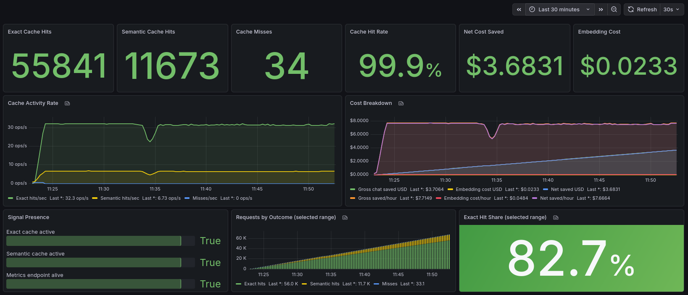
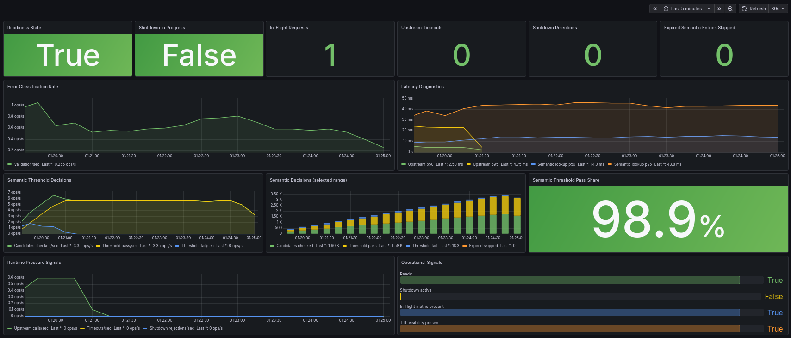
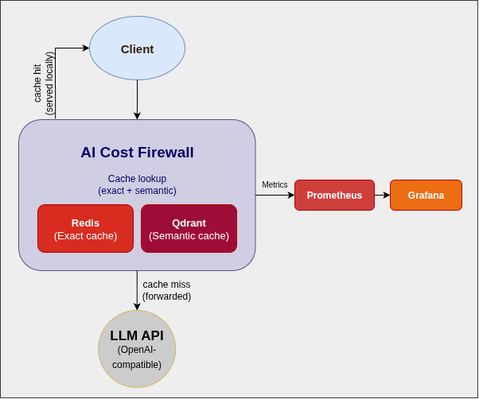

# AI Cost Firewall


**OpenAI-compatible gateway for caching and cost control.**

AI Cost Firewall is a lightweight OpenAI-compatible API gateway that reduces LLM API costs and latency by caching responses using exact matching and semantic similarity.

It sits between applications and LLM providers and forwards only necessary requests to the upstream API.

AI Cost Firewall is developed and maintained by [VCAL Labs, Inc.](https://vcal-project.com), the team behind VCAL Project.

---

# Why AI Cost Firewall?

LLM APIs are expensive and often receive repeated or semantically similar prompts.

Without caching, every request results in:

-   unnecessary API calls
-   increased token usage
-   higher costs
-   additional latency

AI Cost Firewall solves this by introducing a two-layer cache:

1.  Exact cache (Redis) -- instant responses for identical prompts
2.  Semantic cache (Qdrant) -- reuse answers for similar prompts

Only cache misses are forwarded to the upstream LLM provider.

The firewall behaves similarly to "nginx for LLM APIs".

---

## Example 1: Cost Savings with Exact + Semantic Caching

**cache hit rate • net savings after embedding overhead • real-time cost reduction**

[](assets/grafana/dashboard2.png)

*Local synthetic workload simulating enterprise support queries (VPN, onboarding, access requests).  
Demonstrates real-time cost reduction using exact and semantic caching, with full cost breakdown (gross savings, embedding overhead, and net savings).*

## Example 2: Semantic Decision Quality & Runtime Behavior

**semantic threshold decisions • pass/fail boundary • real-time request classification**

[](assets/grafana/ai-firewall-diagnostics.png)

*Mixed synthetic workload simulating enterprise support traffic with both similar and divergent queries.
Demonstrates semantic cache behavior under realistic conditions: high semantic pass rate, non-zero threshold failures (boundary cases), and continuous candidate evaluation.
Shows how the system balances reuse and precision while maintaining near-zero upstream calls and stable latency.*

> Both dashboards are pre-configured and included in the default `docker-compose.yml`. See [**Quick Start (Docker)**](#quick-start-docker) to run the stack locally.

---

# Key Features

- OpenAI-compatible `/v1/chat/completions` gateway endpoint
- Exact request caching (Redis)
- Semantic cache (Qdrant)
- Token, cost, and savings metrics by model and cache type
- Prometheus observability (cost, cache, errors, runtime behavior)
- Error classification (validation / upstream / timeout / internal)
- Upstream latency and timeout tracking
- Semantic cache diagnostics (threshold, candidates, expiration behavior)
- Docker deployment
- nginx-style configuration
- Strict startup validation with clear error messages
- Hardened support for OpenAI-compatible providers and local model gateways
- Signal-driven operations (SIGHUP reload, SIGTERM graceful shutdown)
- Graceful shutdown with request draining (SIGTERM / SIGINT)
- Readiness and liveness endpoints (`/readyz`, `/healthz`)
- Request size protection (`max_request_body_bytes`)
- Lightweight Rust + Axum implementation

AI Cost Firewall is designed to be safe by default, preventing accidental misconfiguration and unintended upstream costs.

AI Cost Firewall is in an early production-ready stage: suitable for controlled deployments, pilots, and self-hosted evaluation. Operators should still validate configuration, provider behavior, cache thresholds, and observability in their own environment before broad production rollout.

---

## OpenAI-compatible providers

AI Cost Firewall supports practical OpenAI-compatible model and embedding endpoints while keeping the flat config model:

```text
upstream_provider openai_compatible;
upstream_base_url <base-url>;
upstream_api_key <key-or-placeholder>;

embedding_provider openai_compatible;
embedding_base_url <base-url>;
embedding_api_key <key-or-placeholder>;
```

The base URL may be either the provider root URL or its `/v1` base path:

```text
https://api.openai.com
https://api.openai.com/v1
http://ollama:11434
http://ollama:11434/v1
http://lmstudio:1234/v1
http://vllm:8000/v1
http://litellm:4000/v1
```

Do not configure the full endpoint path:

```text
# Wrong
upstream_base_url http://ollama:11434/v1/chat/completions;

# Correct
upstream_base_url http://ollama:11434/v1;
```

For local providers that do not require authentication, use a placeholder key:

```text
upstream_api_key dummy;
embedding_api_key dummy;
```

Accepted placeholder values are `dummy`, `none`, `null`, and `-`.

The main model upstream and embedding provider may use different base URLs. See `configs/examples/` for OpenAI, Ollama, LM Studio, vLLM, LiteLLM, and OpenRouter examples.

This is useful when chat completions are served locally but embeddings are provided by a different OpenAI-compatible service.

---

# Architecture Overview

Client applications send requests to the firewall instead of directly to the LLM provider.

[](assets/architecture/ai-cost-firewall-diagram.png)

Full architecture documentation:

[docs/architecture.md](docs/architecture.md)

---

# Quick Start (Docker)

The fastest way to try AI Cost Firewall is using Docker Compose.

## Prerequisites

Install:

- Docker
- Docker Compose (included with Docker Desktop)

Verify installation:

```bash
docker --version
docker compose version
```

## Clone the repository

Clone the repository and prepare the configuration:

```bash
git clone https://github.com/vcal-project/ai-firewall.git
cd ai-firewall
cp configs/ai-firewall.conf.example configs/ai-firewall.conf
```

Edit the configuration file and add your API keys:

```bash
nano configs/ai-firewall.conf
```

You should also specify the exact model names returned by your LLM provider (used for cost calculation), for example:

```text
gpt-4o-mini-2024-07-18
```

## Start the stack

This will start the full stack (Firewall, Redis, Qdrant, Prometheus, Grafana):

```bash
docker compose pull
docker compose up -d
```

## View logs

```bash
docker compose logs -f firewall
```

## Validate the configuration

`--test-config` performs static configuration validation only. It checks that the configuration can be parsed and that required values are present and valid.

```bash
docker compose run --rm firewall \
  --config /configs/ai-firewall.conf \
  --test-config
```

Expected output:

```text
configuration OK
```

This command does not connect to Redis, Qdrant, embedding providers, or upstream LLM providers.

## Print the loaded configuration

```bash
docker compose run --rm firewall \
  --config /configs/ai-firewall.conf \
  --print-config
```

Secrets such as API keys and service credentials are masked in the output.

## Services

| Service | URL |
|-------|------|
| Firewall API | http://localhost:8080 |
| Prometheus | http://localhost:9090 |
| Grafana | http://localhost:3000 |

The stack includes:

-   AI Cost Firewall
-   Redis
-   Qdrant
-   Prometheus
-   Grafana

> The repository already includes all required Prometheus and Grafana configuration 

---

# Example Request

``` bash
curl http://localhost:8080/v1/chat/completions \
  -H "Content-Type: application/json" \
  -d '{
    "model": "gpt-4o-mini-2024-07-18",
    "messages": [
      {"role": "user", "content": "Explain Redis briefly."}
    ]
  }'
```

> By default, AI Cost Firewall does not require client-side authorization on incoming requests.
> The `upstream_api_key` in the configuration is used by the firewall when calling the upstream LLM provider.
> For production deployments, place the firewall behind an authenticated reverse proxy, API gateway, VPN, or private network boundary.

---

# Configuration

AI Cost Firewall uses a simple nginx-style configuration format.

Example configuration:

``` text
listen_addr 0.0.0.0:8080;

redis_url redis://redis:6379;

upstream_provider openai_compatible;
upstream_base_url https://api.openai.com;
upstream_api_key sk-your-api-key;

embedding_provider openai_compatible;
embedding_base_url https://api.openai.com;
embedding_api_key sk-your-api-key;
embedding_model text-embedding-3-small;

qdrant_url http://qdrant:6334;
qdrant_collection aif_semantic_cache;
qdrant_vector_size 1536;

# Backward-compatible default
cache_ttl_seconds 2592000;

# Optional explicit lifecycle controls
exact_cache_ttl_seconds 86400;
semantic_cache_retention_seconds 604800;

request_timeout_seconds 120;
graceful_shutdown_timeout_seconds 10;  # default
max_request_body_bytes 1M;

semantic_cache_enabled true;
semantic_similarity_threshold 0.92;

# Model validation behavior
# By default, only models defined via `model_price` are allowed.
# Unknown models will be rejected with 400.
allow_unknown_models_pass_through false;

# Chat-completion pricing (USD per 1M tokens)
# model_price <model> <input_usd_per_1m_tokens> <output_usd_per_1m_tokens>;

model_price gpt-4o-mini-2024-07-18 0.15 0.60;
model_price gpt-4.1-mini-2025-04-14 0.30 1.20;

# Embedding pricing (optional, used for net cost estimation only)
embedding_price 0.020;
```

> If the API returns `gpt-4o-mini-2024-07-18`, the same name must appear in the configuration.

Misconfiguration is one of the most common causes of unexpected LLM costs. AI Cost Firewall prevents this at startup.

## Startup Validation & Error Handling

AI Cost Firewall performs strict validation at startup.

### Example errors

```text
configuration error: semantic_cache_enabled=true requires: embedding_model, qdrant_url
```

```text
configuration error: embedding_api_key must not be empty when semantic_cache_enabled=true. For local embedding providers without authentication, use dummy, none, null, or -
```

```text
configuration error: no allowed models configured: add at least one model_price or set allow_unknown_models_pass_through=true
```

```text
configuration error: invalid AIF_MAX_REQUEST_BODY_BYTES value 'abc'. Use formats like 1024, 512K, 1M, 2M
```

### Behavior

- Multiple issues reported in a single error
- Invalid configs fail fast
- Prevents unintended upstream usage

## Model validation

AI Cost Firewall validates the `model` field before forwarding requests upstream.

- Only models defined via `model_price` are considered supported
- Requests with unknown models are rejected with 400 Bad Request
- This prevents accidental or unauthorized upstream usage

Example:

```bash
{
  "error": {
    "code": 400,
    "message": "Unsupported model: gpt-unknown",
    "type": "validation_error"
  }
}
```

## Optional: allow pass-through

If you want the gateway to behave like a transparent proxy:

```bash
allow_unknown_models_pass_through true;
```

In this mode:

- Unknown models are forwarded upstream
- Cost tracking will not be applied for unknown models
- Validation is relaxed

### Cache behavior and TTL

AI Cost Firewall separates lifecycle control between cache layers:

- `exact_cache_ttl_seconds` — TTL for Redis exact cache
- `semantic_cache_retention_seconds` — retention window for semantic cache entries
- `cache_ttl_seconds` — backward-compatible default for both

Behavior:

- Exact cache (Redis): TTL enforced automatically
- Semantic cache (Qdrant):
  - entries include `inserted_at` and `expires_at`
  - expired entries are filtered during lookup before similarity ranking
  - entries are not deleted automatically

This ensures consistent and predictable cache behavior across both layers.

### Semantic cache cleanup

Expired semantic cache entries are ignored automatically during lookup, but they are not physically deleted from Qdrant.

To remove expired entries manually, run the pruning command with the same configuration file used by your deployment.

Recommended usage depends on how AI Cost Firewall is deployed.

#### Local release binary

Use this when running AI Cost Firewall directly from the source tree:

```bash
./target/release/ai-firewall --config configs/ai-firewall.conf --prune-expired-semantic-cache
```

#### Installed binary / systemd deployment

For conservative maintenance windows, stop the service before pruning:

```bash
systemctl stop ai-firewall
./target/release/ai-firewall --config configs/ai-firewall.conf --prune-expired-semantic-cache
systemctl start ai-firewall
```

Adjust the config path if your systemd service uses a different --config value.

#### Docker Compose deployment

Run pruning as a one-off container using the same Compose service and config:

```bash
docker compose run --rm firewall \
  --config /configs/ai-firewall.conf \
  --prune-expired-semantic-cache
```

In the default `docker-compose.yml`, the AI Firewall service is named `firewall`.

This command does not stop or modify the running AI Firewall container. It starts a temporary one-off container on the same Docker network, connects to Qdrant using the configured `qdrant_url`, prunes expired semantic entries in Qdrant, and exits.

The running AI Firewall service continues handling traffic during pruning.

If your Compose service has a different name, replace firewall with the output of:

```bash
docker compose ps --services
```

##### Verify Qdrant collection size

To verify the Qdrant collection size before or after pruning:

```bash
curl -s http://127.0.0.1:6333/collections/aif_semantic_cache/points/count \
  -H "Content-Type: application/json" \
  -d '{"exact": true}'
```

Replace aif_semantic_cache if your qdrant_collection uses a different name.

---

## Request size limits

`max_request_body_bytes` defines the maximum request size.

Supported formats:

```text
1024
512K
1M
2M
```

Requests exceeding the limit are rejected early:

```json
{
  "error": {
    "code": 413,
    "type": "validation_error",
    "message": "request body exceeds max_request_body_bytes limit"
  }
}
```

Very small values (<1K) trigger a startup warning.

## Semantic cache requirements

When enabled:

```conf
semantic_cache_enabled true;
```

Required fields:

- embedding_base_url
- embedding_api_key
- embedding_model
- qdrant_url
- qdrant_collection
- qdrant_vector_size

Startup behavior is strict: when `semantic_cache_enabled true;` is configured, Qdrant must be reachable and the existing Qdrant collection, if present, must match `qdrant_vector_size`.

`semantic_cache_fail_open true;` applies to runtime semantic lookup failures. It does not bypass startup dependency initialization.


For local embedding providers that do not require authentication, set `embedding_api_key` to `dummy`, `none`, `null`, or `-`.

---

## Environment Variables

If no configuration file is provided, AI Cost Firewall falls back to environment variables.

For convenience, you can use a `.env` file in development:

```conf
AIF_REDIS_URL=redis://127.0.0.1:6379
AIF_UPSTREAM_API_KEY=sk-xxxx
AIF_EMBEDDING_MODEL=text-embedding-3-small
AIF_EMBEDDING_PRICE_USD_PER_1M_TOKENS=0.020
```

- Variables follow the AIF_ prefix convention
- `.env` is loaded automatically if present
- Intended for development and simple deployments

If neither a config file nor required environment variables are provided, the application will fail to start with a clear configuration error.

Example errors:

```text
configuration error: AIF_REDIS_URL is required when no config file is used
```

```text
configuration error: invalid AIF_QDRANT_VECTOR_SIZE value 'abc'
```

Full configuration reference:

[docs/config-reference.md](docs/config-reference.md)

---

## Operational Behavior

AI Cost Firewall is designed to behave predictably in production environments.

### Graceful shutdown

- Stops accepting new requests
- Allows in-flight requests to complete
- Rejects new requests with 503 during shutdown
- Tracks shutdown state and rejection count

### Readiness vs liveness

- `/healthz` — process is alive
- `/readyz` — ready to serve traffic

During shutdown:

- `/healthz` → OK
- `/readyz` → 503

### Timeout handling

- Upstream requests are bounded by `request_timeout_seconds`
- Timeouts are explicitly tracked and classified

### Logging

AI Cost Firewall writes logs to stdout/stderr by default and does not manage log files internally. See `docs/operation.md` for examples of collecting logs from Docker Compose or local binary runs.

---

## Metrics

Prometheus metrics are available at:

http://localhost:8080/metrics

Example metrics:

```text
aif_requests_total
aif_cache_exact_hits
aif_cache_semantic_hits
aif_cache_misses
aif_tokens_saved
aif_model_cost_micro_usd_total
aif_gross_saved_micro_usd_total
aif_net_saved_micro_usd_total
aif_embedding_overhead_micro_usd_total
aif_request_cost_micro_usd_total
```

### Note

Token and cost savings are calculated for:

```text
/v1/chat/completions
```

For semantic cache hits:

- Gross savings are based on avoided chat-completion tokens
- Embedding overhead is tracked separately and deducted from net savings
- Reported savings represent net savings

Metrics include:

- `aif_requests_total`
- `aif_cache_exact_hits`
- `aif_cache_semantic_hits`
- `aif_cache_misses`
- `aif_tokens_saved`
- `aif_inflight_requests`
- `aif_shutdown_in_progress`
- `aif_shutdown_rejections_total`
- `aif_errors_total{class=...}`
- `aif_upstream_timeouts_total`
- `aif_upstream_request_duration_seconds`
- `aif_embedding_request_duration_seconds`
- `aif_embedding_timeouts_total`
- `aif_readiness_state`
- `aif_semantic_candidates_checked_total`
- `aif_semantic_threshold_results_total{result="pass|fail"}`
- `aif_semantic_expired_entries_skipped_total`
- `aif_semantic_lookup_duration_seconds`
- `aif_semantic_store_total`
- `aif_semantic_store_errors_total`

Backward-compatible aggregate cost metrics:

- `aif_chat_cost_saved_micro_usd` – aggregate gross chat-completion savings
- `aif_embedding_cost_micro_usd` – aggregate embedding overhead
- `aif_cost_saved_micro_usd` – aggregate net savings

Structured cost intelligence metrics:

- `aif_model_cost_micro_usd_total{model="..."}`
- `aif_model_requests_total{model="..."}`
- `aif_model_input_tokens_total{model="..."}`
- `aif_model_output_tokens_total{model="..."}`
- `aif_gross_saved_micro_usd_total{model="...", cache_type="exact|semantic"}`
- `aif_net_saved_micro_usd_total{model="...", cache_type="exact|semantic"}`
- `aif_embedding_overhead_micro_usd_total{model="...", operation="lookup|store"}`
- `aif_request_cost_micro_usd_total{model="...", cost_type="chat|embedding"}`
- `aif_cache_hits_total{model="...", cache_type="exact|semantic"}`

Exact cache hits have no embedding cost.

If `embedding_price` is not configured, embedding cost is treated as `0` and savings may be overestimated.

## Understanding cost and savings metrics

AI Cost Firewall reports cost and savings metrics to show where value comes from.

There are two types of cache savings:

- **Exact cache savings**: the request matches a cached request exactly, so the upstream chat call is avoided.
- **Semantic cache savings**: the request is matched by meaning, so the upstream chat call is avoided, but an embedding lookup is required.

The main accounting model is:

```text
gross savings = avoided upstream chat completion cost
embedding overhead = cost of semantic lookup/store embedding calls
net savings = gross savings - embedding overhead
```

For exact cache hits, there is no embedding lookup, so:

```text
net savings ≈ gross savings
```

For semantic cache hits:

```text
net savings = avoided chat cost - embedding overhead
```

This means exact and semantic cache savings should be evaluated separately. Semantic caching is usually most valuable for expensive models, repeated questions, and workloads with many similar prompts. For very cheap models or low-repeat workloads, semantic caching may show lower net savings because embedding overhead can reduce the benefit.

All cost values are reported in micro-USD:

```text
1 USD = 1,000,000 micro-USD
```

The Grafana dashboards use these metrics to show estimated chat cost, gross savings, embedding overhead, net savings, per-model cost, and savings by cache type.

---

# Build from Source

Clone the repository if you want to:

- explore the code
- modify configuration templates
- build the firewall locally
- contribute to the project

```bash
git clone https://github.com/vcal-project/ai-firewall.git
cd ai-firewall
```

Build the project:

```bash
cargo build --release
```

Run the firewall:

```bash
cargo run --release
```

---

## Testing

AI Cost Firewall includes unit tests for configuration parsing, validation, and core request handling paths.

Key areas covered:
- Config validation (required fields, limits, semantic cache requirements)
- Byte-size parsing (`1M`, `2M`, etc.) for request limits
- Negative configuration tests (invalid values, missing fields, invalid sizes)
- Aggregated validation error tests (multiple misconfigurations reported together)
- Environment variable validation (invalid formats, missing required variables)
- Cost accounting correctness (chat vs embedding vs net)

Run tests locally:

```bash
cargo test
```

---

## Troubleshooting & Debugging

If cache performance is lower than expected:

1. Check semantic threshold:
   - High threshold → fewer semantic hits

2. Inspect diagnostics dashboard:
   - High `threshold_fail` → threshold too strict
   - High `expired_entries_skipped` → TTL too short

3. Check upstream latency:
   - Increasing latency may indicate provider issues

4. Check error classification:
   - `validation_error` → request or configuration issue
   - `upstream_authentication_error` → provider rejected the configured API key
   - `upstream_not_found` → wrong provider base URL or full endpoint path configured
   - `upstream_timeout` → provider too slow
   - `upstream_tls_error` → certificate or hostname validation issue
   - `internal_error` → system issue
   - `upstream_dns_error` → provider hostname cannot be resolved
   - `upstream_connect_error` → provider host or port is unreachable
   - `aif_embedding_timeouts_total` increasing → embedding provider is slow or unreachable

---

# Documentation

| Document | Description |
|---------|-------------|
| `docs/architecture.md` | System architecture |
| `docs/config-reference.md` | Configuration directives |
| `docs/faq.md` | Frequently asked questions |
| `docs/how-it-works.md` | Request flow and caching logic |
| `docs/quickstart.md` | Full setup guide |
| `docs/operation.md` | Runtime behavior (health checks, shutdown, reload) |

---

# Contributing

Contributions are welcome.

If you would like to contribute to AI Cost Firewall — whether through bug reports, feature suggestions, documentation improvements, or code — please see:

[CONTRIBUTING.md](CONTRIBUTING.md)

Before submitting a pull request, please open an issue to discuss the change.

We welcome improvements in:

- performance
- documentation
- testing
- integrations with LLM providers
- observability and metrics

---

# Integration with VCAL Server

AI Cost Firewall can optionally integrate with [**VCAL Server**](https://vcal-project.com/vcal-server) for
advanced semantic caching and distributed vector storage.

---

# Full documentation

[AI Cost Firewall Docs](https://ai-firewall.docs.vcal-project.com/)

---

# License

Apache License 2.0
