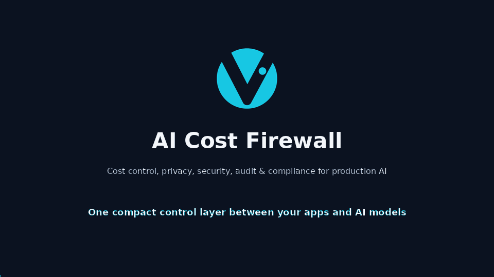
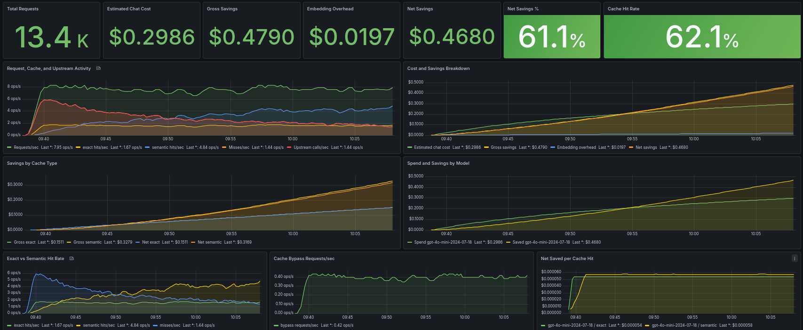
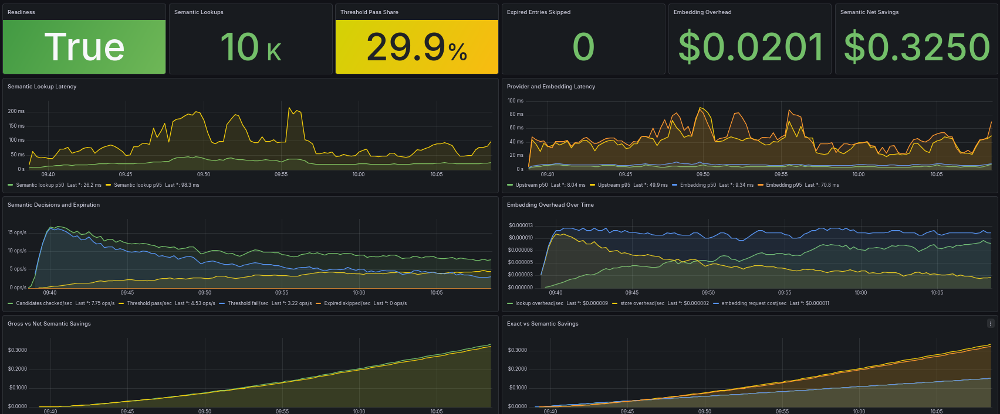
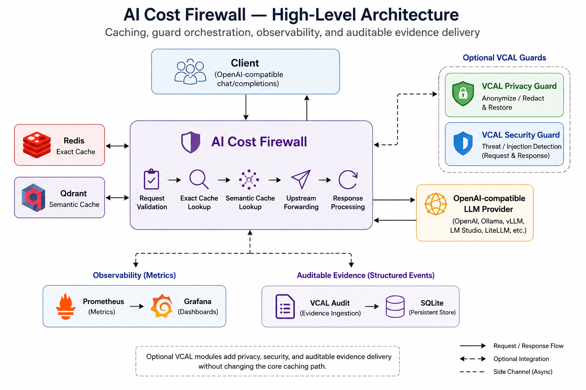

# AI Cost Firewall


## OpenAI-compatible control layer for AI cost, with optional privacy, security, usage-policy, audit, and compliance integrations

AI Cost Firewall is a lightweight OpenAI-compatible gateway that reduces unnecessary LLM API calls through exact and semantic cache reuse.

AI Cost Firewall can be deployed independently as a complete caching and cost-control gateway.

It can also integrate with separately licensed VCAL modules for privacy, security, usage-policy enforcement, audit, and compliance.

<p align="center">
  
</p>

<p align="center">
  <em>AI Cost Firewall controls the request path between AI applications and model providers.</em>
</p>

AI Cost Firewall is developed and maintained by VCAL Labs, Inc.

---

# Why AI Cost Firewall?

LLM applications frequently generate repeated or semantically similar prompts.

Without caching, every request results in:

- repeated upstream API calls
- additional token usage
- higher cost
- avoidable latency

AI Cost Firewall introduces a two-layer cache:

1. Exact cache (Redis)
2. Semantic cache (Qdrant)

The firewall behaves similarly to “nginx for LLM APIs”:

- applications call AI Cost Firewall
- the firewall evaluates exact and semantic cache reuse
- only cache misses reach the upstream provider

Supported OpenAI-compatible providers include:

- OpenAI
- Ollama
- LM Studio
- vLLM
- LiteLLM
- OpenRouter

---

# Production Capabilities

AI Cost Firewall includes:

- exact Redis caching
- semantic Qdrant caching
- OpenAI-compatible request routing
- OpenAI-compatible `GET /v1/models` proxying to the configured chat/inference upstream
- OpenAI-compatible streaming chat completions (SSE)
- exact-cache identity that preserves OpenAI-compatible request/message extension fields
- structured-content array handling with Privacy Guard inspection of supported text parts and safe preservation of non-text parts
- privacy-aware exact and semantic cache isolation by effective tenant and policy identity
- AIF enforcement modes: `enforce` and non-disruptive `observe`
- isolated shadow exact/semantic cache state for Evaluation Mode
- sanitized Assessment Context API for reproducible Observe-mode assessment
- deterministic configuration identity exposed through `aif_runtime_info`
- configurable cache fail-open/fail-closed behavior
- structured lifecycle evidence
- Prometheus metrics and Grafana dashboards
- startup, readiness, liveness, graceful shutdown, and runtime diagnostics
- generic non-root OCI runtime hardening for Docker, Podman, Kubernetes, and OpenShift

Optional integrations with separately licensed VCAL modules include:

- VCAL Privacy Guard
- VCAL Security Guard
- VCAL Usage Guard
- VCAL Audit
- VCAL Compliance

See the latest GitHub release for release-specific changes.

---

# Assessment Context and Configuration Identity

AIF exposes sanitized runtime/configuration context so a bounded Observe-mode period can be interpreted as a reproducible assessment without altering request-path behavior.

Capabilities include:

- `GET /assessment-context`
- Assessment Context schema `1.0`
- deterministic SHA-256 configuration identity
- historical runtime identity through the `aif_runtime_info` Prometheus metric
- `/version` advertisement of the supported Assessment Context schema
- safe effective configuration context for cache, embedding, request-path, pricing, and mode interpretation
- stricter SIGHUP handling for restart-only settings

The evidence schema remains `1.1`, and Observe/Enforce cache semantics are unchanged.

## Assessment Context endpoint

The endpoint:

```bash
curl -s http://localhost:8080/assessment-context | jq
```

returns an allow-listed effective configuration snapshot intended for assessment and reporting tools.

It includes context such as:

- product version and schema versions
- enforcement mode and effective cache scope
- exact-cache state, TTL, timeout, and effective prefix
- semantic-cache state, threshold, retention, and effective collection
- embedding provider/model/vector size
- upstream provider and timeout behavior
- request-path limits relevant to interpretation
- configured pricing assumptions
- optional-module state
- `configuration_hash`

The response does **not** expose provider API keys, credentials, tenant identifiers, private license material, or other secret configuration values.

The configuration hash is deterministic for the safe effective configuration represented by the Assessment Context. Pricing entries are normalized before hashing so ordering alone does not change the identity. Secret-only changes do not change the public configuration hash.

## Historical runtime identity

AIF exports the currently active runtime identity as:

```text
aif_runtime_info{version="<running-version>",config_schema="1",configuration_hash="sha256:..."} 1
```

Assessment/reporting systems can query this metric over an exact historical window to verify that one AIF version/configuration identity remained active throughout the period.

When a supported runtime reload changes the effective configuration, AIF replaces the current `aif_runtime_info` label set. Prometheus can therefore retain the previous series historically while the current process exposes only the active identity.

## Reload safety

AIF supports nginx-style SIGHUP configuration reloads but rejects reloads that attempt to change settings requiring a process restart.

Restart-only settings include:

```text
listen_addr
max_request_body_bytes
max_inflight_requests
graceful_shutdown_timeout_seconds
```

This prevents the process from reporting a new configuration identity for settings that the running process could not actually apply.

---

# Included Dashboards

AI Cost Firewall includes Grafana dashboards for production cost visibility, cache effectiveness, runtime diagnostics, and high-level guard orchestration health. Evaluation-specific Prometheus metrics are exposed for pilot analysis without being merged into normal production savings counters.

The dashboards are included in the Docker deployment files and are automatically provisioned by Grafana when using the provided Docker Compose setup.

Detailed Privacy Guard, Security Guard, and Usage Guard findings remain in their product-specific dashboards. VCAL Audit provides its own dashboard for ingestion volume, durable persistence latency, authentication failures, hash-chain verification, and license status.

## Cost Savings Overview

<p align="center">
  <a href="assets/grafana/ai-firewall-overview-021.png">
    
  </a>
</p>

<p align="center">
  <em>30-minute cold-cache demo run with local simulated OpenAI-compatible upstream.</em>
</p>

The Overview dashboard shows the high-level cost and cache impact of AI Cost Firewall.

It demonstrates:

- total request volume
- estimated chat-completion cost
- gross savings from cache reuse
- embedding overhead
- net savings after embedding cost
- net savings percentage
- cache hit rate
- exact and semantic cache activity
- cache bypass request rate
- per-model spend and savings
- savings by cache type
- Usage Guard policy blocks
- high-level guard orchestration health

This dashboard is intended for quick validation, demos, and cost-savings reviews.

---

## Semantic Diagnostics

[](assets/grafana/ai-firewall-diagnostics-021.png)
<p align="center">
  <em>Semantic diagnostics from the same cold-cache demo run, including readiness, threshold behavior, lookup latency, and cache activity.</em>
</p>

The Diagnostics dashboard provides a deeper operational view of semantic-cache behavior and runtime health.

It demonstrates:

- readiness state
- semantic lookup volume
- semantic threshold pass/fail behavior
- semantic candidate evaluation
- expired semantic entries skipped during lookup
- semantic lookup latency
- upstream and embedding latency
- embedding overhead by operation
- gross vs net semantic savings
- exact vs semantic savings
- semantic cache misses vs threshold passes
- semantic store health
- runtime and provider pressure signals
- provider error classes
- guard orchestration outcomes by guard, stage, and result
- guard orchestration latency
- Usage Guard policy blocks by category
- guard operational signals across Security Guard, Privacy Guard, and Usage Guard

This dashboard is intended for troubleshooting, tuning semantic similarity thresholds, validating fail-open behavior, and understanding runtime cache behavior during pilots.

---

# Deployment Patterns

AI Cost Firewall includes ready-to-run deployment examples under:

```text
deploy/examples/
```

Available patterns:

| Pattern | Description |
|---|---|
| `openai-cloud/` | Fastest cloud evaluation path |
| `local-ollama/` | Fully local OpenAI-compatible deployment |
| `hybrid-openai-local-embeddings/` | OpenAI chat + local embeddings |
| `openrouter/` | OpenRouter upstream with OpenAI embeddings |
| `local-full-stack/` | Fully local stack with dashboards |

Each example includes:

- `docker-compose.yml`
- minimal configuration
- example requests
- expected behavior
- expected metrics
- optional observability overlays

An OpenShift-specific baseline is available under:

```text
deploy/openshift/
```

The OpenShift assets are additive: the AIF container remains a generic OCI image and the normal Docker Compose deployment remains supported. The base manifests are designed for OpenShift `restricted-v2` without requesting `anyuid` or a custom SCC, use a read-only root filesystem, drop Linux capabilities, disable privilege escalation, and rely on the runtime-assigned OpenShift UID.

The OpenShift configuration can use separate OpenAI-compatible services for chat/inference and embeddings, for example separate vLLM endpoints. Verify the served embedding model ID and returned vector dimension before enabling semantic caching and configuring the Qdrant vector size.

---

# Architecture Overview

[](assets/architecture/ai-cost-firewall-architecture.png)

Client applications send requests to AI Cost Firewall instead of directly to the LLM provider.

The firewall:

1. validates requests
2. optionally calls VCAL Security Guard on the raw request
3. optionally calls VCAL Privacy Guard to anonymize or redact sensitive text
4. optionally calls VCAL Usage Guard to evaluate organizational usage policy
5. checks exact cache
6. checks semantic cache
7. in `enforce` mode, serves eligible cache hits normally; in `observe` mode, records what the cache would have done but continues to the live upstream provider
8. on a cache miss, calls the upstream provider using normal JSON for `stream=false`/omitted or consumes provider SSE internally for `stream=true`
9. normalizes cache hits and upstream results into the same canonical chat-completion response
10. optionally scans the complete assistant response with VCAL Security Guard
11. stores eligible cache-miss responses using production cache state in `enforce` or isolated shadow cache state in `observe`
12. optionally restores Privacy Guard placeholders
13. records usage, cost, metrics, and structured evidence
14. returns JSON for non-streaming requests or replays an approved OpenAI-compatible SSE response for controlled streaming requests
15. optionally delivers evidence batches to VCAL Audit
16. exposes operational diagnostics

Full architecture documentation:

```text
docs/architecture.md
```

---

# Quick Start (Docker)

## Prerequisites

Install:

- Docker
- Docker Compose

Verify installation:

```bash
docker --version
docker compose version
```

---

## Clone the repository

```bash
git clone https://github.com/vcal-project/ai-firewall.git
cd ai-firewall
```

Copy the example configuration:

```bash
cp configs/ai-firewall.conf.example configs/ai-firewall.conf
```

Edit the configuration and add your API key:

```bash
nano configs/ai-firewall.conf
```

For the default OpenAI deployment, the upstream API key is the only provider-specific value that normally needs to be replaced before starting the stack. Provider streaming support is not required for ordinary JSON chat-completion requests; it is required only when a client sends `"stream": true`.

---

## Start the stack

The default deployment starts:

- AI Cost Firewall
- Redis
- Qdrant
- Prometheus
- Grafana

```bash
docker compose pull
docker compose up -d
```

---

## Validate the deployment

```bash
curl http://localhost:8080/healthz
curl http://localhost:8080/startupz
curl http://localhost:8080/readyz
curl http://localhost:8080/version
curl http://localhost:8080/assessment-context
```

Expected:

```text
OK
started
ready
```

The `/version` endpoint returns release metadata, including the AI Cost Firewall version, release title, OpenAI-compatible compatibility model, current AIF enforcement mode, effective cache scope, and supported Assessment Context schema.

The release title reflects the installed build, and `assessment_context_schema` identifies the supported Assessment Context schema.

The `/assessment-context` endpoint returns the sanitized effective configuration snapshot described in the Assessment Context section above.

When the configured chat/inference upstream supports OpenAI-style model discovery, AIF also proxies:

```bash
curl http://localhost:8080/v1/models
```

Model discovery is forwarded to the configured chat/inference upstream and is not counted as an inference/upstream chat call for cache-savings accounting.

---

## Evaluation / Observe Mode

AIF includes an AIF-level Evaluation Mode for low-risk production pilots. Assessment Context and deployment hardening complement this mode without changing the Observe/Enforce request-path semantics.

Configure the runtime mode with:

```text
aif_enforcement_mode enforce;
```

or:

```text
aif_enforcement_mode observe;
```

`enforce` is the default and preserves the normal production cache behavior.

In `observe` mode, AI Cost Firewall remains in the live application request/response path but does not serve cached responses to the client. Instead, it evaluates what exact and semantic caching would have done while continuing to call the configured upstream provider.

The core observe-mode guarantees are:

- the live application still receives the upstream response;
- exact-cache evaluation uses an isolated Redis key namespace;
- semantic-cache evaluation uses an isolated Qdrant collection;
- shadow hits record what would have been served without suppressing the real upstream request;
- shadow misses populate only evaluation cache state;
- production cache state is not populated or reused by observe mode;
- cache-bypass requests skip both evaluation lookup and evaluation store;
- Redis, Qdrant, or embedding failures used only for evaluation do not interrupt live application traffic;
- AIF remains ready when optional evaluation dependencies are temporarily unavailable; deployments that mark Redis or Qdrant as required for readiness can use `/startupz` to require successful initialization before the pod is considered started;
- Redis and Qdrant evaluation paths recover after dependency restart;
- controlled streaming and non-streaming requests retain the same transport-independent cache identity.

Evaluation Mode is currently an **AI Cost Firewall cache/optimization feature**. It does not change the configured enforcement behavior of VCAL Security Guard, Privacy Guard, or Usage Guard. Guard-specific `off / observe / enforce` modes are not part of this release.

### Evaluation evidence

Evaluation-aware evidence records the effective mode and separates the hypothetical action from what actually happened to the live request.

Typical cache-hit evidence includes:

```json
{
  "enforcement_mode": "observe",
  "decision": "exact_hit",
  "would_action": "serve_exact_cache",
  "applied_action": "call_upstream"
}
```

A cache bypass remains explicit:

```json
{
  "enforcement_mode": "observe",
  "decision": "cache_bypassed",
  "would_action": "call_upstream",
  "applied_action": "call_upstream"
}
```

This keeps VCAL Audit traces suitable for later pilot assessment without representing hypothetical actions as production actions.

### Evaluation accounting

Observe-mode cache opportunities do **not** increment the normal production cache-hit or savings counters.

Dedicated evaluation metrics are used for:

- requests evaluated;
- would-have exact and semantic hits;
- potentially avoidable upstream calls;
- potentially avoidable tokens;
- estimated gross and net cost avoidance;
- shadow-store outcomes;
- evaluation errors.

This separation prevents hypothetical pilot savings from being mixed with actual production savings.

### Assessment support

Evaluation Mode produces the hypothetical cache/cost telemetry. Assessment Context provides the effective runtime/configuration identity needed to interpret that telemetry reproducibly.

AIF itself does not create or persist assessment reports. A separate assessment/reporting layer can combine:

```text
bounded Evaluation telemetry
+
GET /assessment-context
+
historical aif_runtime_info
```

to verify configuration stability and freeze a bounded Observe-mode assessment.

---

## Streaming behavior

AI Cost Firewall supports **controlled OpenAI-compatible chat-completion streaming** with `"stream": true`. Controlled streaming accepts provider SSE internally, assembles the complete response, applies response controls, and only then replays an OpenAI-compatible Server-Sent Events (`text/event-stream`) response to the client.

The core guarantee is:

> No generated response content leaves AI Cost Firewall until AI Cost Firewall has approved the complete response.

Controlled streaming uses the same request controls, cache identity, response controls, Privacy restoration, accounting, and evidence pipeline as non-streaming requests:

- Security Guard, Privacy Guard, and Usage Guard request-side processing runs before cache lookup or the upstream call.
- Exact and semantic cache lookup/store remain active for streaming requests. JSON and SSE delivery share transport-independent cache identity, so an eligible cached completion can be reused across `stream=false` and `stream=true`.
- On a cache miss, AI Cost Firewall requests provider SSE and consumes it internally. Provider chunks are parsed and assembled into the canonical chat-completion response before downstream delivery.
- Security Guard response scanning runs on the complete assembled or cached response before any generated response content is committed to the client.
- Eligible cache-miss responses are stored using the existing pre-Privacy-restore cache semantics.
- Privacy Guard placeholder restoration runs before controlled SSE delivery, including flows that created an anonymization mapping on the request path.
- Usage and model-cost accounting are derived from the assembled response. AI Cost Firewall requests upstream usage data for internal accounting; a downstream usage chunk is replayed when the client requests `stream_options.include_usage`.
- After all controls and accounting complete successfully, AI Cost Firewall encodes the approved canonical response as OpenAI-compatible SSE and terminates it with `[DONE]`.
- If the provider stream fails, is malformed, is truncated, exceeds the configured cumulative upstream SSE byte limit, becomes idle for too long, or exceeds the absolute generation ceiling before approval, AI Cost Firewall returns a normal HTTP error and does not expose partial provider content to the client.

Controlled streaming is enabled by default and can be configured with:

```text
streaming_enabled true;
max_stream_upstream_bytes 8M;
upstream_timeout_seconds 120;
```

`streaming_enabled` permits clients to use `"stream": true`; it does not force streaming for ordinary requests. Requests with `stream=false` or no `stream` field continue to use the normal JSON completion path.

`max_stream_upstream_bytes` limits the **cumulative provider SSE bytes accepted for one controlled streaming request**. It is a total-response-size limit, not a measurement of instantaneous parser buffer occupancy.

For controlled provider streams, `upstream_timeout_seconds` also acts as the maximum idle gap between provider SSE body chunks after response headers have been received. In addition, controlled generation has a 15-minute absolute ceiling so a provider cannot hold an upstream concurrency permit indefinitely by continuously drip-feeding data.

Provider SSE support is required only for requests that use `"stream": true`. An OpenAI-compatible provider without streaming support remains usable for ordinary non-streaming chat-completion requests.

Operational characteristics:

- controlled streaming prioritizes response-control guarantees over token-by-token immediacy; client SSE delivery begins only after upstream generation and response controls complete
- downstream SSE is generated from the canonical response and is OpenAI-compatible, but it is not guaranteed to be byte-for-byte identical to the provider's original SSE framing
- fragmented content and tool-call deltas are reconstructed before replay
- upstream and client time-to-first-byte are measured separately
- provider SSE chunks and cumulative bytes, generation duration, timeout/failure outcomes, upstream response size, approved client-buffer size, request errors, and terminal stream lifecycle are exposed through Prometheus metrics and structured evidence

---

# Operational Features

AI Cost Firewall includes operational safeguards and observability features designed for real deployments.

## Runtime Features

- startup, readiness, and liveness endpoints
- strict `/startupz` validation for cache backends configured as required for readiness
- graceful shutdown with request draining
- startup dependency validation
- nginx-style configuration reload (SIGHUP)
- structured Prometheus metrics
- semantic cache lifecycle control
- AIF `enforce` / `observe` runtime mode
- isolated Evaluation Mode exact/semantic cache state
- non-blocking evaluation dependency failure handling with post-outage recovery
- upstream request timeout tracking plus controlled-stream idle and absolute-generation timeout protection
- request size protection
- runtime diagnostics
- sanitized `/assessment-context` runtime/configuration snapshot
- deterministic `aif_runtime_info` configuration identity
- OpenAI-compatible `/v1/models` discovery proxying
- numeric non-root OCI runtime with explicit SIGTERM container stop signal
- configurable semantic cache fail-open behavior
- optional Security Guard, Privacy Guard, and Usage Guard orchestration
- configurable guard fail-open/fail-closed behavior for operational failures; unsupported recognized privacy text-bearing shapes are rejected independently
- structured evidence events with trace correlation
- exactly one terminal request lifecycle event per received trace
- optional buffered HTTP evidence delivery to VCAL Audit
- configurable Audit batching, queue capacity, timeout, and retry behavior

---

## Optional VCAL Modules

VCAL Privacy Guard, VCAL Security Guard, VCAL Usage Guard, VCAL Audit, and VCAL Compliance are separate commercial products. They are not required to deploy or use AI Cost Firewall.

AI Cost Firewall can optionally orchestrate VCAL Security Guard, VCAL Privacy Guard, and VCAL Usage Guard around chat requests and responses. These modules can be enabled independently or in combination. Privacy Guard supports inspection of supported text-bearing content arrays; this does not extend Security Guard or Usage Guard coverage to every structured-content shape. Controlled streaming uses the same request-side guard processing and complete-response Security/Privacy controls described in the Streaming behavior section.

The recommended full guard flow is:

```text
Client
  -> AI Cost Firewall
      -> VCAL Security Guard request scan
      -> VCAL Privacy Guard anonymize/redact
      -> VCAL Usage Guard policy evaluation
      -> exact/semantic cache lookup or upstream LLM
      -> VCAL Security Guard response scan
      -> VCAL Privacy Guard restore
      -> Client
```

Security Guard can block malicious request-side prompts before Privacy Guard, Usage Guard, cache, or upstream processing. Privacy Guard can replace sensitive values with placeholders before Usage Guard, cache, or upstream processing and restore them in the final response. Usage Guard evaluates whether the request is permitted under organizational AI usage policy and can allow, warn, block, or escalate the request before cache or upstream processing.

Example Privacy Guard transformation:

```text
Original request:
Analyze login from 185.23.10.5 by john@example.com

Sent upstream/cache path:
Analyze login from [IP_1] by [EMAIL_1]

Returned response:
john@example.com logged in from 185.23.10.5
```

Example Security Guard block returned by AI Firewall:

```json
{
  "error": {
    "code": 403,
    "guard": "security",
    "type": "security_request_blocked",
    "stage": "request",
    "rule_id": "VSG-PA-003"
  }
}
```

Example Usage Guard block returned by AI Firewall:

```json
{
  "error": {
    "code": 403,
    "guard": "usage",
    "type": "usage_request_blocked",
    "stage": "request",
    "rule_id": "VUG-PER-001",
    "category": "personal_travel"
  }
}
```

For controlled streaming requests, request-side Security Guard, Privacy Guard, and Usage Guard processing remains active. On cache misses, AI Cost Firewall fully assembles the provider stream before response Security Guard scanning and Privacy Guard restoration. The approved result is then replayed as SSE, so response controls do not need to be skipped and Privacy mappings can be restored before client delivery.

Security Guard, Privacy Guard, and Usage Guard are disabled by default in `configs/ai-firewall.conf.example`.

---

## Health Endpoints

| Endpoint | Purpose |
|---|---|
| `/healthz` | Process liveness |
| `/startupz` | Strict startup check for cache backends configured as required for readiness |
| `/readyz` | Ready to serve traffic according to normal AIF readiness/fail-open policy |

---

## Configuration Validation

Validate configuration statically before startup:

```bash
docker compose run --rm firewall \
  --config /configs/ai-firewall.conf \
  --test-config
```

Expected output:

```text
configuration OK
```

---

## Semantic Cache Fail-Open Behavior

When `semantic_cache_fail_open` is enabled, runtime semantic cache lookup or embedding failures skip semantic cache and continue to the upstream LLM endpoint.

This setting applies to normal `enforce` runtime semantic cache behavior.

In `observe` mode, Redis/Qdrant/embedding failures used only for evaluation are treated as non-blocking evaluation failures: the live request continues to the upstream provider and AIF remains available. Evaluation-specific error telemetry records the failure, and the evaluation cache path resumes after the dependency recovers.

For orchestrated deployments, `/startupz` adds a separate startup-time guarantee. If an enabled Redis or Qdrant cache is also configured as required for readiness, `/startupz` remains unsuccessful when that backend was not initialized in the current process. This lets Kubernetes/OpenShift restart a pod that started during a dependency outage instead of leaving that process on a fail-open no-op cache for its lifetime.

---

## Print Loaded Configuration

```bash
docker compose run --rm firewall \
  --config /configs/ai-firewall.conf \
  --print-config
```

Secrets are automatically masked.

---

# OpenAI-Compatible Providers

AI Cost Firewall supports practical OpenAI-compatible deployments while keeping a simple flat configuration model.

The current model is:

```text
upstream_provider openai_compatible;
embedding_provider openai_compatible;
```

This means AI Cost Firewall expects OpenAI-style chat and embedding APIs. For the configured chat/inference upstream, AIF supports proxying OpenAI-compatible `GET /v1/models` discovery. It does not yet provide provider-specific configuration blocks or native provider-specific request transformations.

Common OpenAI-compatible deployment patterns include:

| Runtime or Gateway | Usage Pattern                               |
| ------------------ | ------------------------------------------- |
| OpenAI             | Cloud OpenAI-compatible chat and embeddings |
| Ollama             | Local OpenAI-compatible model endpoint      |
| LM Studio          | Local OpenAI-compatible model endpoint      |
| vLLM               | Self-hosted OpenAI-compatible serving       |
| LiteLLM            | Gateway in front of multiple providers      |
| OpenRouter         | OpenAI-compatible hosted gateway            |

Example configuration:

```text
upstream_provider openai_compatible;
upstream_base_url https://api.openai.com;
upstream_api_key sk-your-key;

embedding_provider openai_compatible;
embedding_base_url https://api.openai.com;
embedding_api_key sk-your-key;
```

The upstream provider and embedding provider may use different OpenAI-compatible base URLs. This supports deployments where, for example, one vLLM service hosts the chat model and another vLLM service hosts an embedding model.

For normal `stream=false` or omitted-stream requests, the upstream only needs to provide an OpenAI-compatible JSON chat-completion response. When clients request `stream=true`, the configured upstream must additionally provide OpenAI-compatible SSE streaming.

### OpenAI-style message content

AIF accepts message `content` as JSON rather than requiring a plain string at the parsing layer. OpenAI-style content-part arrays and other non-string message content are therefore preserved and forwarded instead of being rejected or flattened.

Content and guard handling:

- Complete JSON message content participates in exact-cache identity; top-level and message-level OpenAI-compatible extension fields (including tools, tool choice, tool-call IDs, reasoning parameters, and response-format fields) also remain part of identity.
- With VCAL Privacy Guard enabled, supported string content, arrays of strings, and typed text parts such as `{"type":"text","text":"..."}` are sent for inspection without flattening the array; supported mixed text/non-text arrays retain their JSON shape.
- Recognized unsupported text-bearing structures are rejected as a privacy inspection contract violation rather than silently forwarded as inspected text. Non-text parts can be preserved but are **not** scanned for embedded information.
- Requests with non-string message content remain ineligible for semantic caching; eligible inspected structured-content requests can use exact caching.
- Security Guard and Usage Guard do **not** gain nested content-part inspection automatically from Privacy Guard's structured-content integration. Their coverage is governed by their own adapters and APIs; do not assume all guards inspect arrays.

**Privacy-aware caching:** when Privacy Guard supplies a complete effective policy ID, policy version, and policy hash, cache identity also incorporates an opaque scope derived from the effective tenant and privacy policy. Exact-cache identities and Qdrant semantic filters isolate requests across tenants/policies. Cached completions remain in their pre-restoration placeholder form; restoration uses the **current request's** mapping only. If a successful Privacy Guard scan lacks a complete effective policy identity, AIF bypasses cache lookup and store for that request. A fail-open Privacy Guard transport failure also bypasses both caches.

**Scope limitation:** content-part support is not document or attachment processing. Referenced files and opaque non-text content are not fetched, parsed, or scanned by AIF. Additional arbitrary nested/custom text shapes are not guaranteed to be covered; unsupported recognized text-bearing forms are rejected. The behavior for unsupported privacy text is separate from `guard_fail_open`, which governs operational failures.

Important limitations:

* `GET /v1/models` requires the configured chat/inference upstream to provide a compatible model-discovery endpoint.
* AI Cost Firewall does not claim universal compatibility with every OpenAI-like API.
* Native Anthropic, Gemini, Mistral, and Cohere APIs are not currently supported directly.
* Mistral, Anthropic, Gemini, or other providers may be used only when exposed through an OpenAI-compatible layer such as LiteLLM, OpenRouter, or another compatible gateway.

See:

```text
configs/examples/
deploy/examples/
deploy/openshift/
docs/provider-compatibility.md
```

---

# Metrics Overview

Metrics are exposed at:

```text
http://localhost:8080/metrics
```

Example metrics:

```text
aif_requests_total
aif_cache_exact_hits
aif_cache_semantic_hits
aif_cache_hits_total
aif_cache_bypass_requests_total
aif_model_cost_micro_usd_total
aif_gross_saved_micro_usd_total
aif_net_saved_micro_usd_total
aif_embedding_overhead_micro_usd_total
aif_guard_requests_total
aif_guard_latency_seconds
aif_security_blocks_total
aif_privacy_restore_skipped_total
aif_usage_blocks_total
aif_stream_requests_total
aif_stream_completed_total
aif_stream_errors_total
aif_stream_aborted_total
aif_stream_upstream_errors_total
aif_stream_upstream_chunks_total
aif_stream_upstream_bytes_total
aif_stream_upstream_time_to_first_byte_seconds
aif_stream_generation_duration_seconds
aif_stream_client_time_to_first_byte_seconds
aif_stream_upstream_response_bytes
aif_stream_client_buffer_bytes
aif_stream_duration_seconds
aif_enforcement_mode_info
aif_runtime_info
aif_evaluation_requests_total
aif_evaluation_cache_outcomes_total
aif_evaluation_upstream_calls_avoided_total
aif_evaluation_tokens_avoided_total
aif_evaluation_gross_saved_micro_usd_total
aif_evaluation_net_saved_micro_usd_total
aif_evaluation_shadow_store_total
aif_evaluation_errors_total
```

AI Cost Firewall reports:

- gross chat-completion savings
- embedding overhead
- net savings after embedding cost
- cache hit ratios
- semantic cache diagnostics
- per-model traffic and cost metrics
- guard request counts by guard, stage, and result
- Security Guard block counts by stage and rule ID
- Privacy Guard restore-skip counters when response Security blocks occur
- Usage Guard block counts by policy category and rule ID
- current AIF enforcement mode
- current AIF version/configuration identity through `aif_runtime_info`
- observe-mode exact and semantic cache opportunities
- potentially avoidable upstream calls, tokens, and estimated cost
- shadow-cache store outcomes and evaluation failures

Evidence events are emitted through structured application logs and can optionally be delivered to VCAL Audit. Enable evidence logging with:

```text
RUST_LOG=info,vcal_evidence=info
```

---

# Configuration

AI Cost Firewall uses a simple nginx-style configuration format.

Minimal example:

```text
listen_addr 0.0.0.0:8080;

aif_enforcement_mode enforce;

redis_url redis://redis:6379;

upstream_provider openai_compatible;
upstream_base_url https://api.openai.com;
upstream_api_key sk-your-key;

streaming_enabled true;
max_stream_upstream_bytes 8M;

semantic_cache_enabled true;
```

Full documentation:

- `docs/config-reference.md`
- `docs/provider-compatibility.md`
- `docs/quickstart.md`

---

# Benchmarks

Earlier controlled benchmarks measured with a local simulated OpenAI-compatible upstream provider to isolate gateway behavior, Redis/Qdrant integration, cache effectiveness, and Prometheus metrics without external API cost or provider rate-limit noise.

In a 30-minute cache-effectiveness benchmark, AI Cost Firewall sustained 30 RPS with 0% request failures, p95 latency of 9.03 ms, and a 98.86% aggregate cache-hit rate.

In a single-VM high-load benchmark, AI Cost Firewall sustained approximately 500 RPS for 5 minutes with 0% HTTP failures. Higher RPS values caused instability in the single-VM test environment, so this should be treated as a local benchmark observation, not a universal capacity limit.

These are historical measurements, not capacity guarantees for the current release; see the benchmark report for test conditions.

See [BENCHMARKS.md](BENCHMARKS.md) for benchmark methodology, environment, limitations, and detailed results.

---

### Evaluation Mode validation

AIF Observe Mode has been validated against Enforce Mode using the same controlled workload profile. The test compares predicted cache, guard, token, and cost outcomes with the outcomes subsequently realized under enforcement.

In the validated pair of 5-minute runs, Observe predicted 720 exact-cache hits and 1 semantic-cache hit; Enforce realized 721 and 1 respectively. Guard outcomes matched, and predicted versus realized token/cost savings differed by less than 0.3%.

See [Evaluation Mode Validation](EVALUATION_VALIDATION.md).

---

# Evidence Events and VCAL Audit

AI Cost Firewall emits structured evidence using:

```text
vcal.evidence.event
schema_version: 1.1
```

Each request trace uses a stable trace_id to correlate request validation, cache activity, upstream calls, guard decisions, response processing, and the terminal request outcome.

Every received request trace ends with exactly one terminal event:

```text
request.completed
```

or:

```text
request.failed
```

AI Cost Firewall also emits structured evidence for VCAL Security Guard, VCAL Privacy Guard, and VCAL Usage Guard activity.

The documented evidence schema is `schema_version: 1.1`; schema changes should be tracked separately from product releases.

Guard evidence contains operational metadata only. Prompt and response content is not included.

For AIF Evaluation Mode, cache evidence also records `enforcement_mode`, `decision`, `would_action`, and `applied_action` attributes so hypothetical cache behavior remains distinguishable from actions actually applied to live traffic.

Evidence can be emitted through structured application logs and optionally delivered asynchronously to VCAL Audit.

VCAL Audit provides:

- authenticated evidence ingestion
- durable event persistence
- ordered trace reconstruction
- NDJSON export
- integrity verification

See `docs/audit-integration.md` for configuration, delivery behavior, retry handling, and operational guidance.

---

# Troubleshooting

See:

- `docs/troubleshooting.md`
- `docs/provider-compatibility.md`
- `docs/operation.md`

Common issues include:

- incorrect upstream base URLs
- provider TLS/certificate failures
- embedding dimension mismatches
- Qdrant vector-size mismatch
- unsupported provider behavior
- semantic threshold tuning

---

# Documentation

| Document | Description |
|---|---|
| `docs/architecture.md` | System architecture |
| `docs/config-reference.md` | Configuration directives |
| `docs/faq.md` | Frequently asked questions |
| `docs/how-it-works.md` | Request flow and cache logic |
| `docs/metrics-and-costs.md` | Cost and savings accounting |
| `docs/operation.md` | Runtime behavior |
| `docs/provider-compatibility.md` | OpenAI-compatible providers |
| `docs/quickstart.md` | Extended setup guide |
| `docs/troubleshooting.md` | Troubleshooting guide |
| `docs/audit-integration.md` | VCAL Audit evidence delivery and operations |

Full documentation:

https://ai-firewall.docs.vcal-project.com/

---

# Build from Source

```bash
git clone https://github.com/vcal-project/ai-firewall.git
cd ai-firewall

cargo build --release
cargo run --release
```

---

# Testing

Run tests:

```bash
cargo test
```

AI Cost Firewall includes tests for:

- configuration validation
- request validation
- semantic cache requirements
- semantic cache fail-open behavior
- environment variable parsing
- request size parsing
- cost accounting logic
- guard configuration parsing
- Privacy Guard orchestration
- Security Guard orchestration
- Usage Guard orchestration
- OpenAI-compatible metadata preservation
- exact-cache identity coverage for top-level and message-level OpenAI-compatible extension fields
- structured-content parsing, supported Privacy Guard text-part inspection, shape preservation, and unsupported-text rejection
- privacy-aware exact and semantic cache identity, cross-tenant/cross-policy isolation, and current-request-only restoration
- non-string/content-array semantic-cache bypass
- OpenAI-compatible `/v1/models` proxy behavior
- startup probe behavior for readiness-required Redis/Qdrant initialization
- evidence lifecycle completion
- request and response Security Guard block evidence
- controlled streaming assembly, cross-mode cache reuse, response controls, Privacy restoration, SSE replay, pre-commit failure isolation, provider idle timeout, absolute generation timeout, and upstream-permit release
- AIF `observe` / `enforce` configuration and behavior
- Assessment Context serialization, schema advertisement, sanitization, and deterministic configuration hashing
- `aif_runtime_info` identity updates
- SIGHUP rejection of restart-only configuration changes
- isolated shadow exact/semantic cache behavior
- observe-mode cache bypass semantics
- observe-mode production-metric isolation
- Redis/Qdrant evaluation dependency failure handling and post-outage recovery
- evaluation evidence and metric accounting
- buffered Audit evidence delivery configuration
- evidence batching, retry, and delivery failure handling

---

# Contributing

Contributions are welcome.

Areas where contributions are especially valuable:

- documentation
- performance
- observability
- provider compatibility
- deployment examples
- testing

See:

```text
CONTRIBUTING.md
```

---

# Integration with VCAL Semantic Cache

AI Cost Firewall can optionally integrate with VCAL Semantic Cache for advanced semantic caching and distributed vector storage.

https://vcal-project.com/vcal-server

---

# Releases

For release-specific features, fixes, compatibility notes, and validation
results, see the [GitHub Releases](https://github.com/vcal-project/ai-firewall/releases)
page.

---

# License

Apache License 2.0
