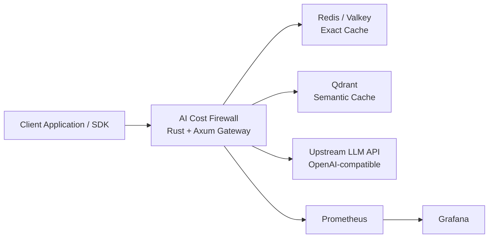
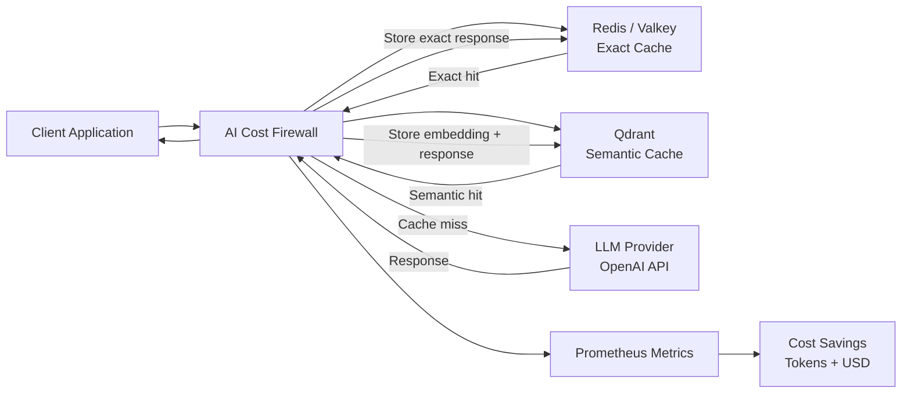

# AI Cost Firewall Architecture

AI Cost Firewall is designed as a lightweight LLM infrastructure component. It acts as a smart gateway between client applications and OpenAI-compatible APIs, providing caching, cost accounting, and observability. Instead of applications calling LLM providers directly, they send requests through the firewall.

The firewall reduces **API costs, latency, and token usage** by caching responses using both **exact matching** and **semantic similarity**.

The firewall combines **Redis / Valkey exact caching** and **Qdrant semantic caching** to maximize cache hit rates while maintaining response quality.

---

# High-Level Architecture



AI Cost Firewall sits between client applications and LLM providers, reducing latency and cost through exact and semantic caching while exporting Prometheus metrics for observability.

---

# Core Design Principles

AI Cost Firewall is built around three goals:

### Cost Reduction

Repeated prompts are served from cache, avoiding expensive API calls.

### Latency Reduction

Cached responses are returned instantly without contacting upstream providers.

### Observability

Prometheus metrics provide insight into:

- cache hit rates
- token savings
- API usage patterns

---

# Components

## AI Cost Firewall

The firewall is a **Rust-based HTTP gateway** built with **Axum**.

Responsibilities include:

- request normalization
- cache lookup
- semantic similarity checks
- upstream API forwarding
- cache storage
- metrics generation

The firewall exposes an **OpenAI-compatible API**, allowing existing
applications to use it without modification.

Example endpoint:

```text
POST /v1/chat/completions
```

---

## Redis / Valkey (Exact Cache)

Redis stores cached responses using an **exact hash of the normalized
request**.

Example cache key:

```bash
aif:exact:<sha256>
```


Benefits:

- constant-time lookup
- extremely fast responses
- zero embedding cost

---

## Qdrant (Semantic Cache)

Qdrant stores embeddings of normalized prompt text in a **vector index**.

Embeddings are generated using the configured embedding model
(e.g. `text-embedding-3-small`) and stored in the Qdrant vector index.

When an exact match is not found, the firewall performs a **semantic
similarity search**.

If a similar prompt is found above the configured similarity threshold,
the cached response is returned.

Typical thresholds:

```text
0.85 aggressive caching
0.92 balanced
0.97 strict matching
```

---

## Upstream LLM API

If no cached response is found, the firewall forwards the request to the
configured upstream provider.

Supported providers include:

- OpenAI
- OpenAI-compatible APIs (e.g. Azure OpenAI, local proxies, etc.)

The response is then stored in both caches.

---

## Prometheus Metrics

The firewall exports metrics for monitoring and observability.

Example metrics include:

```bash
aif_requests_total
aif_upstream_calls_total
aif_cache_exact_hits
aif_cache_semantic_hits
aif_cache_misses
aif_tokens_saved
aif_cost_saved_micro_usd
```

### Token and Cost Accounting

AI Cost Firewall currently calculates token and cost savings only for chat-completion responses.

The following metrics reflect savings from cached chat-completion requests:

- aif_tokens_saved
- aif_cost_saved_micro_usd

Embedding requests performed internally for semantic caching are not included in the accounting in the current version.

Future versions may extend accounting to include embedding costs.

---

## Grafana

Grafana can visualize Prometheus metrics using dashboards.

Typical dashboards include:

- request throughput
- cache hit ratios
- token savings
- estimated cost savings

---

# Two-Layer Cache Strategy

AI Cost Firewall uses a **two-stage caching strategy**.

### Stage 1 — Exact Cache (Redis / Valkey)

The firewall first checks Redis for an exact match.

```bash
hash(normalized request) -> cached response
```

If a hit is found, the response is returned immediately.

---

### Stage 2 — Semantic Cache (Qdrant)

If no exact match is found, the firewall searches the Qdrant vector
database for **similar prompts**.

If similarity exceeds the configured threshold:

```bash
similar_prompt → cached_response
```

the cached response is returned.

---

### Stage 3 — Upstream Request

If neither cache contains a match, the firewall forwards the request to
the upstream LLM provider.

The result is then stored in both caches.

---

# Request Flow



---

# Expected Performance

AI Cost Firewall is designed to introduce minimal overhead to LLM API requests.

Typical performance characteristics on a small cloud instance (4 vCPU):

| Scenario | Approx throughput | Typical latency |
|--------|--------|--------|
| Exact cache hit | 5k–20k req/sec | 1–3 ms |
| Semantic cache hit | 50–300 req/sec | 50–150 ms |
| Upstream request | depends on LLM | 0.5–5 s |

In most deployments the firewall is not the bottleneck; latency and throughput are dominated by embedding APIs and upstream LLM providers.

Actual performance depends on infrastructure, network latency, and model latency.

---

## Important Disclaimer

These values are architectural estimates and may vary by deployment.

---

# Summary

AI Cost Firewall provides a lightweight **LLM caching gateway** that:

- reduces LLM API costs
- improves latency
- provides observability
- integrates with existing OpenAI-compatible clients

By combining exact caching (Redis) and semantic caching (Qdrant), the firewall maximizes cache hit rates while maintaining response quality.