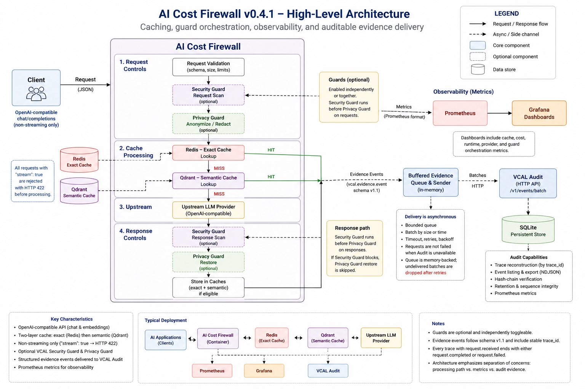
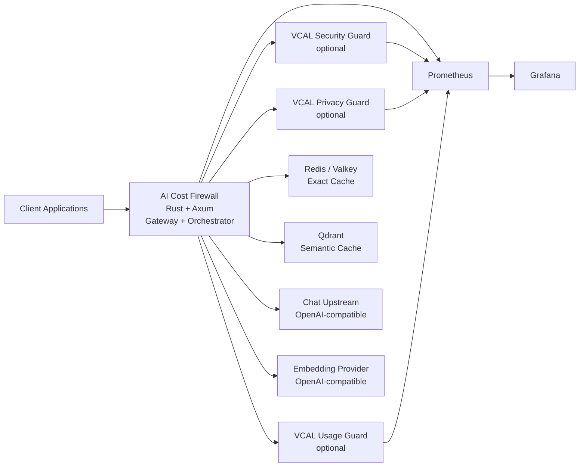
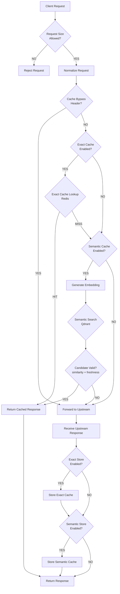
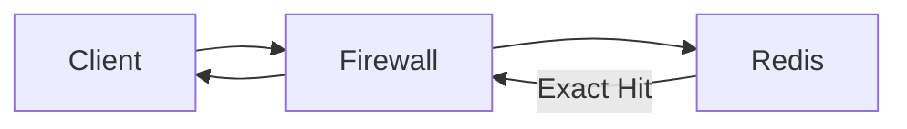
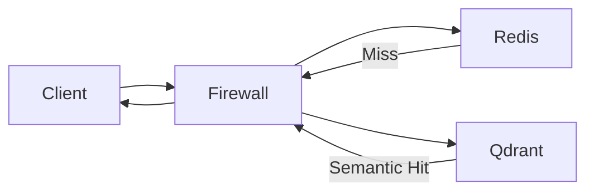
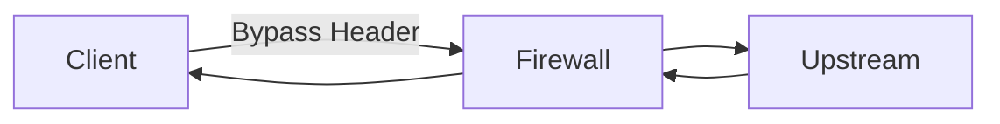
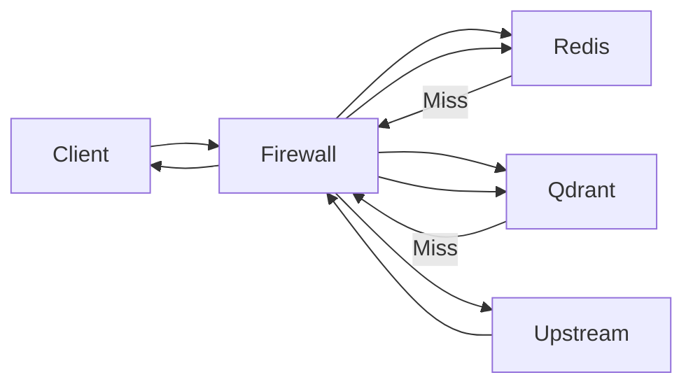

# AI Cost Firewall Architecture

AI Cost Firewall is a lightweight OpenAI-compatible gateway for LLM cost reduction, semantic caching, operational control, observability, and optional enterprise guard orchestration.

Instead of applications calling LLM providers directly, requests pass through AI Cost Firewall first.

The firewall reduces:

- API cost
- latency
- repeated token usage

and can optionally add security, privacy, and organizational usage-policy controls through VCAL Security Guard, VCAL Privacy Guard, and VCAL Usage Guard.

The default open-source deployment uses a two-layer caching strategy:

1. exact cache (Redis / Valkey)
2. semantic cache (Qdrant)

In the default `enforce` mode, only requests that miss all enabled cache layers are forwarded upstream. In v0.8.0 `observe` mode, AIF evaluates isolated shadow cache state but still forwards eligible live requests upstream.

---

# Architecture Overview

<p align="center">
  <a href="../assets/architecture/ai-cost-firewall-0-4-1.png">
    
  </a>
</p>

---

# Architectural Goals

AI Cost Firewall is designed around four primary goals.

---

## Cost Reduction

Repeated prompts and semantically similar requests are reused from cache instead of repeatedly calling upstream providers.

---

## Latency Reduction

Cache hits avoid upstream model latency and return immediately.

---

## OpenAI-Compatible Flexibility

The firewall uses a flat OpenAI-compatible provider model.

Supported deployment patterns include:

- OpenAI
- Ollama
- LM Studio
- vLLM
- LiteLLM
- OpenRouter

without requiring provider-specific configuration blocks.

---

## Enterprise Guard Orchestration

AI Cost Firewall can orchestrate optional VCAL enterprise modules while keeping the core gateway focused on caching and cost control.

VCAL Security Guard, VCAL Privacy Guard, and VCAL Usage Guard can be enabled independently or in combination. A representative full deployment is:

```text
AI Firewall
+ VCAL Security Guard
+ VCAL Privacy Guard
+ VCAL Usage Guard
```

When all three guards are enabled, the firewall orchestrates request-side Security Guard scanning, Privacy Guard anonymization/redaction, Usage Guard policy evaluation, exact and semantic cache lookup, upstream forwarding on cache miss, response-side Security Guard scanning, and Privacy Guard restoration before returning the final response.

The guard modules are optional commercial add-ons and are not required for standalone AI Firewall caching deployments.

---
## Operational Visibility

Prometheus metrics and Grafana dashboards provide visibility into:

- request traffic
- cache reuse
- semantic behavior
- cache bypass activity
- readiness state
- latency
- timeout behavior
- provider errors
- cost savings
- embedding overhead

---

# High-Level Architecture


```mermaid
flowchart LR

    Client[Client Applications]

    Firewall[AI Cost Firewall<br/>Rust + Axum<br/>Gateway + Orchestrator]

    Security[VCAL Security Guard<br/>optional]

    Privacy[VCAL Privacy Guard<br/>optional]

    Usage[VCAL Usage Guard<br/>optional]

    Redis[Redis / Valkey<br/>Exact Cache]

    Qdrant[Qdrant<br/>Semantic Cache]

    Upstream[Chat Upstream<br/>OpenAI-compatible]

    Embedding[Embedding Provider<br/>OpenAI-compatible]

    Prom[Prometheus]

    Graf[Grafana]

    Client --> Firewall

    Firewall --> Security
    Firewall --> Privacy
    Firewall --> Usage

    Firewall --> Redis
    Firewall --> Qdrant

    Firewall --> Upstream
    Firewall --> Embedding

    Firewall --> Prom
    Security --> Prom
    Privacy --> Prom
    Usage --> Prom
    Prom --> Graf
```

AI Cost Firewall sits between applications and LLM providers while exposing standard OpenAI-compatible APIs.

Applications typically require no SDK changes.

---

# Request Lifecycle

Every request follows a staged pipeline. v0.8.0 adds an AIF-level `enforce` / `observe` decision that changes whether cache decisions are applied to live traffic while leaving the guard pipeline unchanged.

```text
receive request
→ enforce request body and prompt-size limits
→ normalize request and transport-independent cache identity
→ Security Guard request scan, if enabled
→ Privacy Guard scan/anonymize/redact, if enabled
→ Usage Guard policy evaluation, if enabled
→ check per-request cache bypass
→ exact cache lookup, if enabled
→ semantic cache lookup, if enabled and not short-circuited by an exact decision
→ in enforce: upstream request on miss or bypass
→ in observe: live upstream request even when a shadow exact/semantic hit is found
→ for stream=true cache misses, consume and assemble provider SSE internally
→ normalize cache hits and upstream results into a canonical chat-completion response
→ Security Guard response scan, if enabled
→ production cache storage in enforce, or isolated shadow-state updates in observe, if enabled and allowed by the guard path
→ Privacy Guard restore, if enabled and mapping exists
→ actual usage/cost plus production or evaluation evidence/metrics accounting
→ JSON response or approved controlled-SSE replay
```

A request can skip cache lookup and cache storage when the configured cache-bypass header is present.

---

# Request Flow

The diagram below depicts the normal `enforce` path. In `observe`, a cache hit becomes a would-have decision and the live request continues to the upstream provider instead of returning the cached response.


```mermaid
flowchart TD

    A[Client Request]

    B{Request Size<br/>Allowed?}

    C[Normalize Request]

    D{Cache Bypass<br/>Header?}

    E{Exact Cache<br/>Enabled?}

    F{Exact Cache Lookup<br/>Redis}

    G[Return Cached Response]

    H{Semantic Cache<br/>Enabled?}

    I[Generate Embedding]

    J{Semantic Search<br/>Qdrant}

    K{Candidate Valid?<br/>similarity + freshness}

    L[Forward to Upstream]

    M[Receive Upstream Response]

    N{Exact Store<br/>Enabled?}

    O[Store Exact Cache]

    P{Semantic Store<br/>Enabled?}

    Q[Store Semantic Cache]

    R[Return Response]

    S[Reject Request]

    A --> B

    B -->|NO| S
    B -->|YES| C

    C --> D

    D -->|YES| L
    D -->|NO| E

    E -->|YES| F
    E -->|NO| H

    F -->|HIT| G
    F -->|MISS| H

    G --> R

    H -->|YES| I
    H -->|NO| L

    I --> J
    J --> K

    K -->|YES| G
    K -->|NO| L

    L --> M

    M --> N
    N -->|YES| O
    N -->|NO| P

    O --> P

    P -->|YES| Q
    P -->|NO| R

    Q --> R
```

---

# Full Enterprise Guard Flow

When VCAL Security Guard, VCAL Privacy Guard, and VCAL Usage Guard are enabled, the recommended flow is:

```text
Client
  -> AI Cost Firewall
      -> VCAL Security Guard request scan
          -> block unsafe request with HTTP 403, if needed
      -> VCAL Privacy Guard scan
          -> anonymize or redact sensitive text
      -> VCAL Usage Guard policy evaluation
          -> allow/warn and continue, or block/escalate before cache/upstream
      -> Redis/Qdrant cache lookup or upstream LLM
      -> VCAL Security Guard response scan
          -> block unsafe model output, if needed
      -> VCAL Privacy Guard restore
          -> restore placeholders in the final assistant response
      -> Client
```

Guard ordering matters: Security Guard sees the raw request first, Privacy Guard can anonymize sensitive text before Usage Guard evaluates organizational policy, Usage Guard runs before cache/upstream processing, Security Guard scans output before restore, and Privacy Guard restore is the final transformation before returning the response to the client.

---
# Core Components

---

# AI Cost Firewall

AI Cost Firewall is implemented in Rust using:

- Axum
- Tokio
- Reqwest
- Redis
- Qdrant gRPC
- Prometheus

Responsibilities include:

- request validation
- request normalization
- cache orchestration
- per-request cache bypass handling
- semantic similarity evaluation
- upstream forwarding
- timeout enforcement
- metrics generation
- operational diagnostics
- lifecycle management

The firewall exposes OpenAI-compatible endpoints such as:

```text
POST /v1/chat/completions
```

---

# VCAL Security Guard — Optional

VCAL Security Guard is an optional enterprise module called by AI Firewall for text-oriented security scans.

Typical request-side detections include prompt injection, jailbreak attempts, system-prompt extraction attempts, unsafe tool-use instructions, data-exfiltration attempts, and common cyber-abuse patterns.

In `enforce` mode, Security Guard can return a blocking decision that AI Firewall converts into a structured HTTP error such as `403 security_request_blocked`.

Security Guard is deterministic and rule-based in the current release. It should be described as an auditable first control layer, not as complete jailbreak or prompt-injection prevention.

---

# VCAL Privacy Guard — Optional

VCAL Privacy Guard is an optional enterprise module called by AI Firewall for text-oriented privacy protection.

Supported modes include:

```text
detect_only
redact
anonymize
```

In `anonymize` mode, sensitive values can be replaced with placeholders before cache/upstream processing. When restore is enabled, AI Firewall calls `/v1/restore` after the upstream/cache response path to replace placeholders with the original values before returning the final response to the client.

---

# VCAL Usage Guard — Optional

VCAL Usage Guard is an optional request-side policy module called by AI Firewall after Privacy Guard and before cache lookup or upstream forwarding.

It evaluates whether a request is permitted under organizational AI usage policy. AI Firewall sends the request text together with configured tenant, policy, and mode metadata to Usage Guard.

Usage Guard decisions can include:

```text
allow
warn
block
escalate
```

`allow` and `warn` decisions continue through the cache/upstream path. `block` and `escalate` decisions stop request processing and are returned by AI Firewall as structured Usage Guard errors.

When Privacy Guard anonymization is enabled, Usage Guard evaluates the anonymized request rather than the original sensitive values.

---

# Redis / Valkey — Exact Cache

Redis stores exact request-response matches.

The firewall hashes normalized request payloads:

```text
aif:exact:<sha256>
```

Benefits:

- extremely low latency
- constant-time lookup
- zero embedding overhead
- high throughput

Typical exact cache flow:

```text
hash(normalized request)
→ Redis lookup
→ cached response
```

Exact cache can be controlled with:

```conf
exact_cache_enabled true;
exact_cache_fail_open true;
exact_cache_store_enabled true;
```

When `exact_cache_enabled` is disabled, exact-cache lookup and storage are skipped.

When `exact_cache_store_enabled` is disabled, exact-cache reads may still happen, but new upstream responses are not written to Redis.

When `exact_cache_fail_open` is enabled, runtime Redis lookup/store failures behave like cache misses and requests continue upstream.

---

# Qdrant — Semantic Cache

Qdrant stores semantic embeddings of normalized prompt text.

Semantic cache enables reuse across:

- paraphrased prompts
- similar requests
- recurring support questions
- repeated agent workflows

Each semantic entry contains:

- embedding vector
- normalized prompt text
- cached response payload
- inserted_at
- expires_at
- model metadata

Semantic cache can be controlled with:

```conf
semantic_cache_enabled true;
semantic_cache_fail_open true;
semantic_cache_store_enabled true;
semantic_similarity_threshold 0.92;
```

When `semantic_cache_enabled` is disabled, embeddings are skipped and Qdrant is not required.

When `semantic_cache_store_enabled` is disabled, semantic lookups may still happen, but new upstream responses are not written to Qdrant.

---

# Embedding Providers

Embeddings are generated through OpenAI-compatible embedding providers.

The embedding provider may differ from the chat provider.

Examples:

| Chat Provider | Embedding Provider |
|---|---|
| OpenAI | OpenAI |
| OpenAI | Ollama |
| OpenRouter | OpenAI |
| Ollama | Ollama |

Typical embedding models:

| Model | Vector Size |
|---|---|
| text-embedding-3-small | 1536 |
| nomic-embed-text | 768 |

Embedding requests use `embedding_timeout_seconds` when configured.

---

# Vector Size Validation

The configured vector size must match the embedding model dimension.

Example:

```conf
embedding_model text-embedding-3-small;
qdrant_vector_size 1536;
```

If the Qdrant collection already exists, AI Cost Firewall validates vector compatibility during startup.

Mismatch example:

```text
existing collection vector size does not match qdrant_vector_size
```

---

# Semantic Similarity Evaluation

Qdrant returns semantically similar candidates.

AI Cost Firewall evaluates each candidate using:

```text
similarity_score >= semantic_similarity_threshold
AND
expires_at > now
AND
cached response payload is valid
```

Typical thresholds:

| Threshold | Behavior |
|---|---|
| 0.85 | Aggressive reuse |
| 0.92 | Balanced |
| 0.97 | Strict reuse |

Lower thresholds:

- increase semantic reuse
- increase mismatch risk

Higher thresholds:

- reduce mismatch risk
- reduce semantic hit rate

---

# Semantic Cache Lifecycle

Semantic entries contain lifecycle metadata:

- inserted_at
- expires_at

Expiration derives from:

```conf
semantic_cache_retention_seconds
```

Expired entries:

- are skipped during lookup
- are never reused
- may remain stored until pruned

Semantic correctness does not depend on cleanup.

---

# Runtime Fail-Open Behavior

AI Cost Firewall supports separate fail-open controls for exact cache and semantic cache.

```conf
exact_cache_fail_open true;
semantic_cache_fail_open true;
```

When enabled:

- runtime Redis/exact-cache failures behave like cache misses
- runtime semantic lookup failures behave like cache misses
- requests continue upstream normally

Fail-open behavior applies to runtime lookup/store activity. It does not turn invalid configuration into valid configuration.

---

# Per-request Cache Bypass

AI Cost Firewall can bypass cache lookup and cache storage for a single request.

Default configuration:

```conf
cache_bypass_header X-AIF-Cache-Bypass;
```

Example request header:

```http
X-AIF-Cache-Bypass: true
```

Accepted truthy values:

```text
true
1
yes
on
```

When cache bypass is enabled for a request:

- exact cache lookup is skipped
- semantic cache lookup is skipped
- exact cache storage is skipped
- semantic cache storage is skipped
- the request is forwarded upstream

Bypass activity is exposed through:

```text
aif_cache_bypass_requests_total
```

---

# Request Protection

AI Cost Firewall applies request-size limits before forwarding traffic upstream.

Example:

```conf
max_request_body_bytes 1M;
max_prompt_chars 200000;
```

`max_request_body_bytes` limits the full HTTP request body.

`max_prompt_chars` limits total chat message content after parsing.

These controls help prevent accidental oversized prompts and unexpected upstream cost spikes.

---

# OpenAI-Compatible Upstream Providers

When no enabled cache layer can return a response, requests are forwarded upstream.

Supported practical providers include:

- OpenAI
- Ollama
- LM Studio
- vLLM
- LiteLLM
- OpenRouter

Example configuration:

```conf
upstream_provider openai_compatible;
upstream_base_url https://api.openai.com;
```

or:

```conf
upstream_base_url http://ollama:11434/v1;
```

AI Cost Firewall internally appends:

```text
/v1/chat/completions
```

Do not configure full endpoint paths directly.

Upstream chat-completion calls use `upstream_timeout_seconds` when configured.

---

# Timeout Model

AI Cost Firewall separates chat-completion and embedding timeouts.

Example:

```conf
request_timeout_seconds 120;
upstream_timeout_seconds 120;
embedding_timeout_seconds 30;
```

`request_timeout_seconds` remains a backward-compatible fallback.

Specific timeout settings override it:

- `upstream_timeout_seconds`
- `embedding_timeout_seconds`

---

# Placeholder Authentication

Local providers may not require authentication.

Accepted placeholders:

```text
dummy
none
null
-
```

Example:

```conf
upstream_api_key dummy;
embedding_api_key dummy;
```

When placeholders are used, Authorization headers are not forwarded upstream.

---

# AIF Enforcement and Evaluation Modes

AI Cost Firewall v0.8.0 supports:

```conf
aif_enforcement_mode enforce;
```

and:

```conf
aif_enforcement_mode observe;
```

`enforce` is the default production mode. Eligible cache hits can satisfy the request without a chat-completion upstream call.

`observe` is designed for non-disruptive production evaluation. AIF computes the would-have cache decision using isolated shadow state, but the application response still comes from the live upstream provider.

Isolation rules:

- exact evaluation keys use a separate Redis namespace from production keys;
- semantic evaluation uses a separate Qdrant collection (for example `aif_semantic_cache_eval` when the production collection is `aif_semantic_cache`);
- shadow state is not automatically promoted when switching to `enforce`;
- bypassed requests do not participate in shadow lookup or store.

Failure rules:

- evaluation Redis/Qdrant/embedding failures never interrupt live traffic;
- evaluation-only Redis/Qdrant loss does not by itself fail readiness in `observe`;
- evaluation errors are recorded separately;
- exact and semantic evaluation resume after dependency recovery.

This mode controls AIF caching only. It does not change Security Guard, Privacy Guard, or Usage Guard enforcement.

---

# Two-Layer Cache Strategy

AI Cost Firewall uses a staged cache pipeline.

---

## Stage 1 — Exact Cache

Redis exact cache lookup:

```text
hash(normalized request)
→ cached response
```

Fastest possible path in `enforce`. In `observe`, an exact shadow hit becomes the would-have decision but AIF still calls upstream and does not continue into semantic lookup for that simulated request.

Can be disabled with:

```conf
exact_cache_enabled false;
```

---

## Stage 2 — Semantic Cache

Qdrant semantic similarity search:

```text
similar_prompt
→ cached response
```

Used when exact matching fails. In `observe`, a semantic shadow hit is recorded as a would-have hit while the live request still reaches upstream; shadow exact state may be warmed to mirror the state transition enforcement would have made.

Can be disabled with:

```conf
semantic_cache_enabled false;
```

---

## Stage 3 — Upstream Request

Requests reach upstream providers when:

- cache bypass is active
- exact cache misses or is disabled
- semantic cache misses or is disabled
- cache infrastructure fails open
- tool/function/structured-output behavior makes semantic reuse ineligible

Streaming itself does not bypass cache. Controlled streaming and non-streaming delivery use the same transport-independent cache identity, so eligible cached completions can be reused across JSON and SSE delivery.

Returned responses are stored only in enabled cache stores.

---

# Cache Flow Examples

---

## Exact Cache Hit


```mermaid
flowchart LR

    Client --> Firewall

    Firewall --> Redis

    Redis -->|Exact Hit| Firewall

    Firewall --> Client
```

---

## Semantic Cache Hit


```mermaid
flowchart LR

    Client --> Firewall

    Firewall --> Redis

    Redis -->|Miss| Firewall

    Firewall --> Qdrant

    Qdrant -->|Semantic Hit| Firewall

    Firewall --> Client
```

---

## Cache Bypass Request


```mermaid
flowchart LR

    Client -->|Bypass Header| Firewall

    Firewall --> Upstream

    Upstream --> Firewall

    Firewall --> Client
```

---

## Full Upstream Request


```mermaid
flowchart LR

    Client --> Firewall

    Firewall --> Redis

    Redis -->|Miss| Firewall

    Firewall --> Qdrant

    Qdrant -->|Miss| Firewall

    Firewall --> Upstream

    Upstream --> Firewall

    Firewall --> Redis

    Firewall --> Qdrant

    Firewall --> Client
```

---

---

# VCAL Audit Integration

AI Cost Firewall can send structured evidence to VCAL Audit through a buffered HTTP sink.

```text
Request processing
      |
      +-- emit vcal.evidence.event v1.1
              |
              +-- bounded in-memory queue
                      |
                      +-- batch by size or interval
                              |
                              +-- POST /v1/events/batch
                                      |
                                      +-- VCAL Audit
                                              |
                                              +-- SQLite
                                              +-- trace reconstruction
                                              +-- SHA-256 record chain
```

The Audit integration is optional and disabled by default.

AI Firewall remains the producer of lifecycle evidence. VCAL Audit becomes the authoritative receiver and assigns persistent sequence numbers and record hashes.

The producer queue is memory-backed and not durable. Audit availability is therefore decoupled from request availability, but prolonged outages can cause evidence loss after retry exhaustion.

# Streaming Behavior

AI Cost Firewall supports **controlled OpenAI-compatible chat-completion streaming** with `stream=true`.

Controlled streaming is intentionally different from raw SSE passthrough. On an upstream cache miss, AI Cost Firewall:

1. runs request-side Security Guard, Privacy Guard, and Usage Guard processing
2. performs the normal exact/semantic cache lookup
3. requests provider SSE internally
4. consumes and parses the complete provider stream
5. reconstructs a canonical `ChatCompletionResponse`, including fragmented content and tool-call arguments
6. scans the complete response with Security Guard, when enabled
7. stores eligible cache-miss responses using the normal pre-Privacy-restore cache semantics
8. restores Privacy Guard placeholders, when required
9. records usage, cost, metrics, and evidence
10. encodes the approved canonical response as OpenAI-compatible SSE and returns `[DONE]`

The JSON and controlled-streaming paths converge on the same canonical response pipeline and diverge only at final delivery:

```text
                          ┌── exact / semantic cache hit ───────────┐
                          │                                         │
stream=false cache miss ──┼─► ordinary upstream JSON ───────────────┤
                          │                                         │
stream=true cache miss ───┴─► provider SSE ─► parser / assembler ──┤
                                                                    │
                                                                    ▼
                                                      canonical ChatCompletionResponse
                                                                    │
                                                                    ▼
                                                      response Security Guard
                                                      eligible cache store
                                                      (cache miss only, pre-restore)
                                                      Privacy Guard restore
                                                      usage / cost accounting
                                                      metrics / evidence
                                                                    │
                                                       ┌────────────┴────────────┐
                                                       ▼                         ▼
                                                JSON serializer            SSE encoder / replay
                                                stream=false               stream=true
                                                                           → [DONE]
```

The architectural guarantee is:

> No generated response content leaves AI Cost Firewall until AI Cost Firewall has approved the complete response.

This commit barrier means malformed, truncated, failed, oversized, idle, or excessively long provider streams fail before any model-generated content is exposed to the client.

Controlled streaming is enabled by default:

```conf
streaming_enabled true;
max_stream_upstream_bytes 8M;
upstream_timeout_seconds 120;
```

`streaming_enabled` permits `stream=true`; it does not force streaming. `stream=false` or an omitted `stream` field continues to use the JSON response path.

`max_stream_upstream_bytes` limits the **cumulative provider SSE bytes accepted for one controlled streaming request**. It is a total-response-size limit rather than a measurement of instantaneous parser-buffer occupancy, and a zero value is invalid.

For controlled provider streams, `upstream_timeout_seconds` also limits the idle gap between SSE body chunks after response headers have arrived. Controlled generation additionally has a 15-minute absolute ceiling so a provider cannot retain an upstream concurrency permit indefinitely by continuously drip-feeding data.

Cache identity is transport-independent: `stream` and client `stream_options` are excluded from the cache identity. An eligible completion stored through JSON delivery can therefore be replayed as SSE, and a completion assembled from an upstream stream can later satisfy a JSON request.

Controlled streaming prioritizes response-control guarantees over token-by-token immediacy. Client SSE begins only after upstream generation and response controls have completed, so downstream time-to-first-byte includes the controlled-generation and approval phase.

---

# Structured Outputs and Tools

Semantic cache may also be skipped for:

- tool-calling requests
- function-calling requests
- structured output requests

These request types often reduce safe semantic reuse.

---

# Readiness and Health

AI Cost Firewall exposes:

```text
/healthz
/readyz
```

`/healthz` indicates process liveness.

`/readyz` indicates whether the instance should receive traffic.

Readiness behavior can be configured with:

```conf
readiness_requires_redis true;
readiness_requires_qdrant false;
readiness_requires_upstream false;
```

This lets deployments decide whether Redis, Qdrant, or upstream-provider availability should affect readiness. In `observe`, Redis and Qdrant are evaluation-only dependencies and do not make the service unready solely because the evaluation cache is unavailable. Upstream remains part of the live request path.

---

# Metrics & Observability

AI Cost Firewall exports Prometheus metrics:

```text
/metrics
```

Example:

```bash
curl http://localhost:8080/metrics
```

The metrics endpoint can optionally require bearer-token authentication:

```conf
metrics_auth_required true;
metrics_auth_token your-prometheus-token;
```

---

# Core Metrics

```text
aif_requests_total
aif_upstream_calls_total
aif_cache_hits_total{cache_type="exact"}
aif_cache_hits_total{cache_type="semantic"}
aif_cache_misses
aif_cache_bypass_requests_total
```

---

# Evaluation Metrics

Evaluation metrics are deliberately separate from production cache-hit and savings counters:

```text
aif_enforcement_mode_info
aif_evaluation_requests_total
aif_evaluation_cache_outcomes_total
aif_evaluation_upstream_calls_avoided_total
aif_evaluation_tokens_avoided_total
aif_evaluation_gross_saved_micro_usd_total
aif_evaluation_net_saved_micro_usd_total
aif_evaluation_shadow_store_total
aif_evaluation_errors_total
```

Evidence for evaluation decisions carries `enforcement_mode`, `decision`, `would_action`, and `applied_action` attributes so a would-have cache action cannot be confused with what was actually applied to the live request.

---

# Semantic Diagnostics

```text
aif_semantic_candidates_checked_total
aif_semantic_threshold_results_total
aif_semantic_lookup_duration_seconds
aif_semantic_expired_entries_skipped_total
aif_semantic_store_total
aif_semantic_store_errors_total
```

Useful for tuning:

- semantic thresholds
- embedding quality
- retention windows
- semantic store behavior

---

# Runtime Metrics

```text
aif_inflight_requests
aif_shutdown_in_progress
aif_readiness_state
```

---

# Timeout Metrics

```text
aif_upstream_timeouts_total
aif_embedding_timeouts_total
aif_upstream_request_duration_seconds
aif_embedding_request_duration_seconds
```

---

# Cost Metrics

```text
aif_model_cost_micro_usd_total
aif_gross_saved_micro_usd_total
aif_embedding_overhead_micro_usd_total
aif_net_saved_micro_usd_total
```

These distinguish:

- gross chat savings
- embedding overhead
- net savings

---

# Controlled Streaming Metrics

Controlled streaming exposes separate upstream-consumption and downstream-commit signals:

```text
aif_stream_requests_total
aif_stream_completed_total
aif_stream_errors_total
aif_stream_aborted_total
aif_stream_upstream_errors_total
aif_stream_upstream_chunks_total
aif_stream_upstream_bytes_total
aif_stream_upstream_time_to_first_byte_seconds
aif_stream_generation_duration_seconds
aif_stream_client_time_to_first_byte_seconds
aif_stream_upstream_response_bytes
aif_stream_client_buffer_bytes
aif_stream_duration_seconds
```

`upstream.stream.completed` and `upstream.stream.failed` evidence distinguish provider-stream assembly outcomes. Failure evidence records `committed_to_client=false` when controlled streaming fails before the commit barrier.

---

# Included Dashboards

AI Cost Firewall includes pre-configured Grafana dashboards.

---

## Cost Savings Overview

Shows:

- total request volume
- estimated chat-completion cost
- gross savings
- embedding overhead
- net savings
- net savings percentage
- cache hit rate
- exact and semantic cache activity
- cache bypass request rate
- per-model spend and savings
- savings by cache type
- Usage Guard policy blocks
- high-level guard orchestration health

---

## Semantic Diagnostics

Shows:

- readiness state
- semantic lookup volume
- semantic threshold pass/fail behavior
- semantic candidate activity
- expired semantic entries skipped during lookup
- semantic lookup latency
- upstream and embedding latency
- embedding overhead by operation
- gross vs net semantic savings
- semantic store health
- provider error classes
- guard orchestration outcomes and latency
- Usage Guard policy blocks by category

Dashboards are provisioned automatically in Docker deployments that use the provided Grafana provisioning files.

---

# Deployment Patterns

AI Cost Firewall supports:

| Pattern | Example |
|---|---|
| Cloud provider | OpenAI |
| Fully local | Ollama |
| Hybrid deployment | OpenAI + local embeddings |
| Routing layer | OpenRouter |
| Self-hosted GPU inference | vLLM |

Deployment examples:

```text
deploy/examples/
```

---

# Typical Performance Characteristics

Approximate behavior on a small cloud instance:

| Scenario | Approx Throughput | Typical Latency |
|---|---:|---:|
| Exact cache hit | 5k–20k req/sec | 1–3 ms |
| Semantic cache hit | 50–300 req/sec | 50–150 ms |
| Upstream request | depends on provider | 0.5–5 s |

Actual performance depends on:

- embedding provider latency
- vector search latency
- upstream model latency
- infrastructure
- network topology
- request size
- cache hit ratio

---

# Operational Notes

- Redis is used for exact cache when exact cache is enabled.
- Qdrant is required only when semantic cache is enabled.
- Vector dimensions must match the embedding model.
- Expired semantic entries are filtered during lookup.
- Semantic correctness is independent of pruning.
- Exact and semantic cache writes can be disabled independently.
- Cache bypass skips lookup and storage for a single request.
- Fail-open controls apply to runtime cache behavior.
- Providers are accessed through OpenAI-compatible APIs.
- `request_timeout_seconds` remains a fallback for specific timeout settings.
- `streaming_enabled` controls whether clients may request controlled streaming.
- `max_stream_upstream_bytes` bounds cumulative provider SSE bytes accepted per controlled streaming request.

---

# Non-text Content

The current guard modules inspect text content. Non-text content such as images, audio, video, and binary payloads is preserved where possible but is not scanned, anonymized, or classified by AI Firewall guard modules.

If a chatbot extracts OCR text, captions, or metadata from non-text assets and sends that extracted text through AI Firewall, the extracted text can be scanned and anonymized normally.

---

# Guard Orchestration Metrics

```text
aif_guard_requests_total
aif_guard_latency_seconds
aif_security_blocks_total
aif_privacy_restore_skipped_total
aif_usage_blocks_total
```

These metrics show guard calls by guard/stage/result, guard latency, Security Guard blocks by stage/rule ID, skipped Privacy Guard restore when a response is blocked before restore, and Usage Guard blocks by policy category/rule ID.

---
# Summary

AI Cost Firewall acts as a lightweight LLM gateway that:

- reduces API cost
- improves latency
- increases effective cache reuse
- provides operational visibility
- adds practical gateway controls for pilot and production-like deployments
- supports OpenAI-compatible deployments

By combining:

- exact caching (Redis / Valkey)
- semantic caching (Qdrant)
- request controls
- cache-store controls
- Prometheus/Grafana observability

the firewall maximizes reusable responses while maintaining operational simplicity.

---

# Additional Documentation

See also:

- `docs/how-it-works.md`
- `docs/quickstart.md`
- `docs/config-reference.md`
- `docs/provider-compatibility.md`
- `docs/operation.md`
- `docs/troubleshooting.md`
