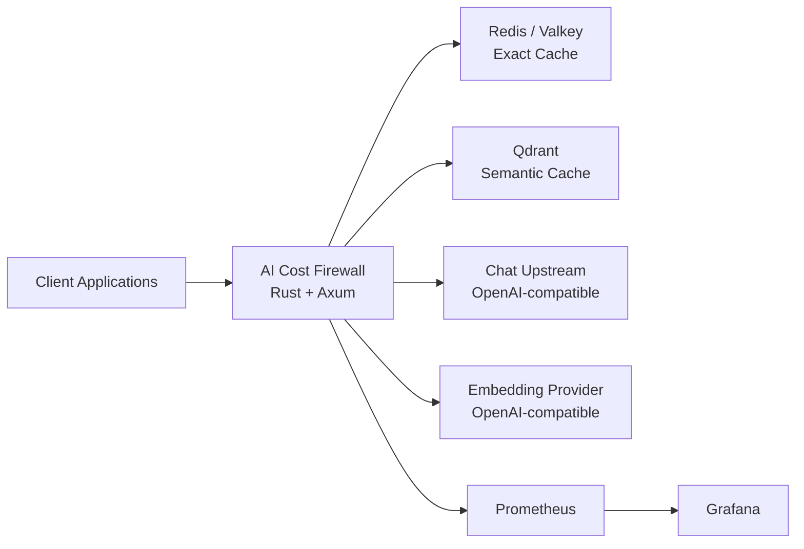
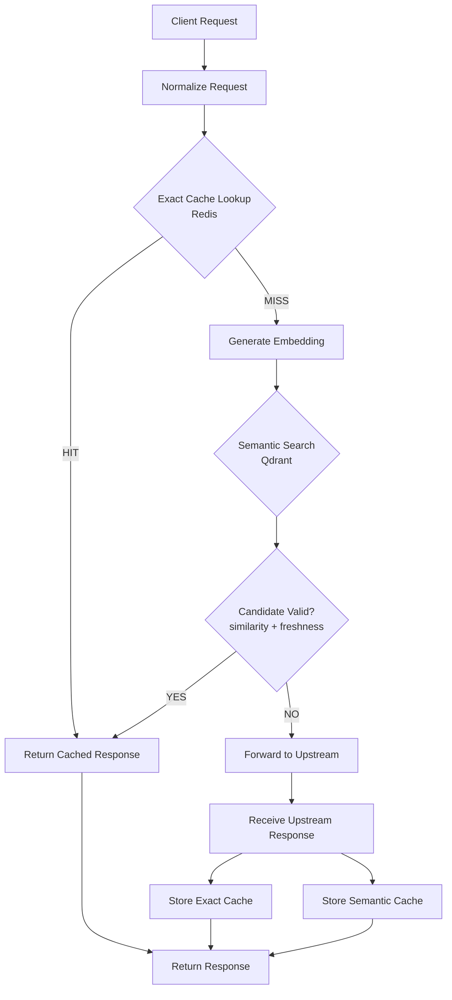
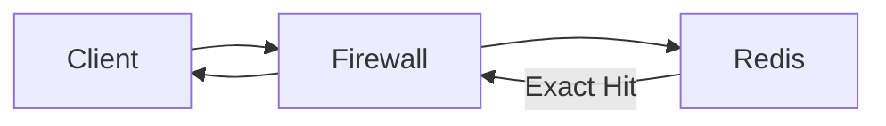
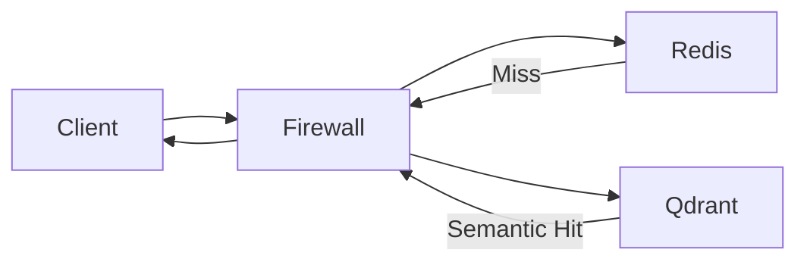
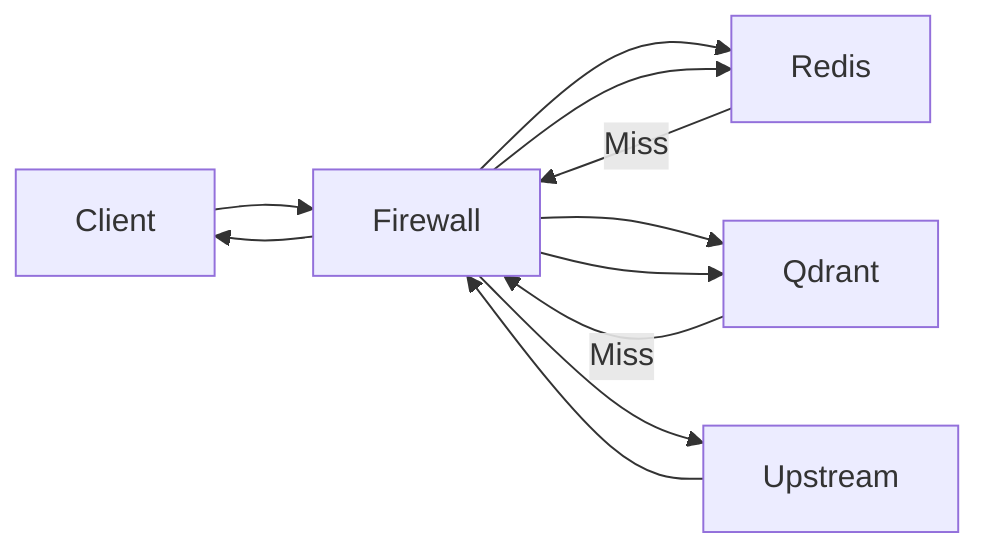

# AI Cost Firewall Architecture

AI Cost Firewall is a lightweight OpenAI-compatible gateway for LLM cost reduction, semantic caching, operational control, and observability.

Instead of applications calling LLM providers directly, requests pass through AI Cost Firewall first.

The firewall reduces:

- API cost
- latency
- repeated token usage

using a two-layer caching strategy:

1. exact cache (Redis / Valkey)
2. semantic cache (Qdrant)

Only cache misses are forwarded upstream.

---

# Architectural Goals

AI Cost Firewall is designed around four primary goals.

---

## Cost Reduction

Repeated prompts and semantically similar requests are reused from cache instead of repeatedly calling upstream providers.

---

## Latency Reduction

Cache hits avoid upstream model latency and return immediately.

---

## OpenAI-Compatible Flexibility

The firewall uses a flat OpenAI-compatible provider model.

Supported deployment patterns include:

- OpenAI
- Ollama
- LM Studio
- vLLM
- LiteLLM
- OpenRouter

without requiring provider-specific configuration blocks.

---

## Operational Visibility

Prometheus metrics and Grafana dashboards provide visibility into:

- request traffic
- cache reuse
- semantic behavior
- latency
- timeout behavior
- cost savings
- embedding overhead

---

# High-Level Architecture


```mermaid
flowchart LR

    Client[Client Applications]

    Firewall[AI Cost Firewall<br/>Rust + Axum]

    Redis[Redis / Valkey<br/>Exact Cache]

    Qdrant[Qdrant<br/>Semantic Cache]

    Upstream[Chat Upstream<br/>OpenAI-compatible]

    Embedding[Embedding Provider<br/>OpenAI-compatible]

    Prom[Prometheus]

    Graf[Grafana]

    Client --> Firewall

    Firewall --> Redis
    Firewall --> Qdrant

    Firewall --> Upstream
    Firewall --> Embedding

    Firewall --> Prom
    Prom --> Graf
```

AI Cost Firewall sits between applications and LLM providers while exposing standard OpenAI-compatible APIs.

Applications typically require no SDK changes.

---

# Request Lifecycle

Every request follows a staged pipeline.

```text
normalize request
→ exact cache lookup
→ semantic cache lookup
→ upstream request
→ cache storage
→ response return
```

---

# Request Flow


```mermaid
flowchart TD

    A[Client Request]

    B[Normalize Request]

    C{Exact Cache Lookup<br/>Redis}

    D[Return Cached Response]

    E[Generate Embedding]

    F{Semantic Search<br/>Qdrant}

    G{Candidate Valid?<br/>similarity + freshness}

    H[Forward to Upstream]

    I[Receive Upstream Response]

    J[Store Exact Cache]

    K[Store Semantic Cache]

    L[Return Response]

    A --> B

    B --> C

    C -->|HIT| D

    D --> L

    C -->|MISS| E

    E --> F

    F --> G

    G -->|YES| D

    G -->|NO| H

    H --> I

    I --> J
    I --> K

    J --> L
    K --> L
```

---

# Core Components

---

# AI Cost Firewall

AI Cost Firewall is implemented in Rust using:

- Axum
- Tokio
- Reqwest
- Redis
- Qdrant gRPC
- Prometheus

Responsibilities include:

- request normalization
- cache orchestration
- semantic similarity evaluation
- upstream forwarding
- metrics generation
- operational diagnostics
- lifecycle management

The firewall exposes OpenAI-compatible endpoints such as:

```text
POST /v1/chat/completions
```

---

# Redis / Valkey — Exact Cache

Redis stores exact request-response matches.

The firewall hashes normalized request payloads:

```text
aif:exact:<sha256>
```

Benefits:

- extremely low latency
- constant-time lookup
- zero embedding overhead
- high throughput

Typical exact cache flow:

```text
hash(normalized request)
→ Redis lookup
→ cached response
```

---

# Qdrant — Semantic Cache

Qdrant stores semantic embeddings of normalized prompt text.

Semantic cache enables reuse across:

- paraphrased prompts
- similar requests
- recurring support questions
- repeated agent workflows

Each semantic entry contains:

- embedding vector
- normalized prompt text
- cached response payload
- inserted_at
- expires_at
- model metadata

---

# Embedding Providers

Embeddings are generated through OpenAI-compatible embedding providers.

The embedding provider may differ from the chat provider.

Examples:

| Chat Provider | Embedding Provider |
|---|---|
| OpenAI | OpenAI |
| OpenAI | Ollama |
| OpenRouter | OpenAI |
| Ollama | Ollama |

Typical embedding models:

| Model | Vector Size |
|---|---|
| text-embedding-3-small | 1536 |
| nomic-embed-text | 768 |

---

# Vector Size Validation

The configured vector size must match the embedding model dimension.

Example:

```conf
embedding_model text-embedding-3-small;
qdrant_vector_size 1536;
```

If the Qdrant collection already exists, AI Cost Firewall validates vector compatibility during startup.

Mismatch example:

```text
existing collection vector size does not match qdrant_vector_size
```

---

# Semantic Similarity Evaluation

Qdrant returns semantically similar candidates.

AI Cost Firewall evaluates each candidate using:

```text
similarity_score >= semantic_similarity_threshold
AND
expires_at > now
```

Typical thresholds:

| Threshold | Behavior |
|---|---|
| 0.85 | Aggressive reuse |
| 0.92 | Balanced |
| 0.97 | Strict reuse |

Lower thresholds:

- increase semantic reuse
- increase mismatch risk

Higher thresholds:

- reduce mismatch risk
- reduce semantic hit rate

---

# Semantic Cache Lifecycle

Semantic entries contain lifecycle metadata:

- inserted_at
- expires_at

Expiration derives from:

```conf
semantic_cache_retention_seconds
```

Expired entries:

- are skipped during lookup
- are never reused
- may remain stored until pruned

Semantic correctness does not depend on cleanup.

---

# semantic_cache_fail_open

Optional runtime behavior:

```conf
semantic_cache_fail_open true;
```

When enabled:

- semantic lookup failures behave like cache misses
- requests continue upstream normally

This prevents semantic infrastructure failures from blocking traffic.

It does not bypass startup validation.

---

# OpenAI-Compatible Upstream Providers

When no cache match exists, requests are forwarded upstream.

Supported practical providers include:

- OpenAI
- Ollama
- LM Studio
- vLLM
- LiteLLM
- OpenRouter

Example configuration:

```conf
upstream_provider openai_compatible;
upstream_base_url https://api.openai.com;
```

or:

```conf
upstream_base_url http://ollama:11434/v1;
```

AI Cost Firewall internally appends:

```text
/v1/chat/completions
```

Do not configure full endpoint paths directly.

---

# Placeholder Authentication

Local providers may not require authentication.

Accepted placeholders:

```text
dummy
none
null
-
```

Example:

```conf
upstream_api_key dummy;
embedding_api_key dummy;
```

When placeholders are used, Authorization headers are not forwarded upstream.

---

# Two-Layer Cache Strategy

AI Cost Firewall uses a staged cache pipeline.

---

## Stage 1 — Exact Cache

Redis exact cache lookup:

```text
hash(normalized request)
→ cached response
```

Fastest possible path.

---

## Stage 2 — Semantic Cache

Qdrant semantic similarity search:

```text
similar_prompt
→ cached response
```

Used when exact matching fails.

---

## Stage 3 — Upstream Request

Only requests missing both cache layers reach upstream providers.

Returned responses are then stored in both caches.

---

# Cache Flow Examples

---

## Exact Cache Hit


```mermaid
flowchart LR

    Client --> Firewall

    Firewall --> Redis

    Redis -->|Exact Hit| Firewall

    Firewall --> Client
```

---

## Semantic Cache Hit


```mermaid
flowchart LR

    Client --> Firewall

    Firewall --> Redis

    Redis -->|Miss| Firewall

    Firewall --> Qdrant

    Qdrant -->|Semantic Hit| Firewall

    Firewall --> Client
```

---

## Full Upstream Request


```mermaid
flowchart LR

    Client --> Firewall

    Firewall --> Redis

    Redis -->|Miss| Firewall

    Firewall --> Qdrant

    Qdrant -->|Miss| Firewall

    Firewall --> Upstream

    Upstream --> Firewall

    Firewall --> Redis

    Firewall --> Qdrant

    Firewall --> Client
```

---

# Streaming Behavior

Streaming requests are forwarded upstream normally.

Example:

```json
{
  "stream": true
}
```

Current behavior:

- streaming requests bypass semantic cache
- streaming responses are not stored in semantic cache

---

# Structured Outputs and Tools

Semantic cache may also be skipped for:

- tool-calling requests
- function-calling requests
- structured output requests

These request types often reduce safe semantic reuse.

---

# Metrics & Observability

AI Cost Firewall exports Prometheus metrics:

```text
/metrics
```

---

# Core Metrics

```text
aif_requests_total
aif_upstream_calls_total
aif_cache_exact_hits
aif_cache_semantic_hits
aif_cache_misses
```

---

# Semantic Diagnostics

```text
aif_semantic_candidates_checked_total
aif_semantic_threshold_results_total
aif_semantic_lookup_duration_seconds
aif_semantic_expired_entries_skipped_total
```

Useful for tuning:

- semantic thresholds
- embedding quality
- retention windows

---

# Runtime Metrics

```text
aif_inflight_requests
aif_shutdown_in_progress
aif_readiness_state
```

---

# Timeout Metrics

```text
aif_upstream_timeouts_total
aif_embedding_timeouts_total
aif_upstream_request_duration_seconds
aif_embedding_request_duration_seconds
```

---

# Cost Metrics

```text
aif_model_cost_micro_usd_total
aif_gross_saved_micro_usd_total
aif_embedding_overhead_micro_usd_total
aif_net_saved_micro_usd_total
```

These distinguish:

- gross chat savings
- embedding overhead
- net savings

---

# Included Dashboards

AI Cost Firewall includes pre-configured Grafana dashboards.

---

## Overview Dashboard

Shows:

- cache hit rates
- cost savings
- embedding overhead
- request traffic
- net savings

---

## Diagnostics Dashboard

Shows:

- semantic threshold pass/fail behavior
- semantic lookup latency
- runtime cache diagnostics
- semantic candidate activity

Dashboards are provisioned automatically in Docker deployments.

---

# Deployment Patterns

AI Cost Firewall supports:

| Pattern | Example |
|---|---|
| Cloud provider | OpenAI |
| Fully local | Ollama |
| Hybrid deployment | OpenAI + local embeddings |
| Routing layer | OpenRouter |
| Self-hosted GPU inference | vLLM |

Deployment examples:

```text
deploy/examples/
```

---

# Typical Performance Characteristics

Approximate behavior on a small cloud instance:

| Scenario | Approx Throughput | Typical Latency |
|---|---|---|
| Exact cache hit | 5k–20k req/sec | 1–3 ms |
| Semantic cache hit | 50–300 req/sec | 50–150 ms |
| Upstream request | depends on provider | 0.5–5 s |

Actual performance depends on:

- embedding provider latency
- vector search latency
- upstream model latency
- infrastructure
- network topology

---

# Operational Notes

- Redis always required
- Qdrant required only when semantic cache enabled
- vector dimensions must match embedding model
- expired semantic entries filtered during lookup
- semantic correctness independent of pruning
- fail-open affects runtime semantic lookups only
- providers accessed through OpenAI-compatible APIs

---

# Summary

AI Cost Firewall acts as a lightweight LLM gateway that:

- reduces API cost
- improves latency
- increases effective cache reuse
- provides operational visibility
- supports OpenAI-compatible deployments

By combining:

- exact caching (Redis / Valkey)
- semantic caching (Qdrant)

the firewall maximizes reusable responses while maintaining operational simplicity.

---

# Additional Documentation

See also:

- `docs/how-it-works.md`
- `docs/quickstart.md`
- `docs/config-reference.md`
- `docs/provider-compatibility.md`
- `docs/operation.md`
- `docs/troubleshooting.md`
