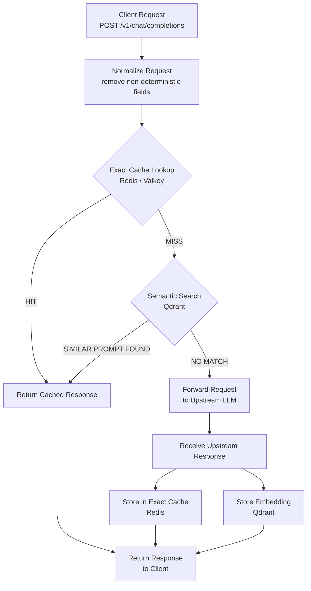

# How AI Cost Firewall Works

This document explains how AI Cost Firewall processes requests and how the caching system reduces LLM API costs and latency.

The firewall sits between client applications and LLM providers and implements a two-layer caching strategy:

1. Exact cache (Redis)
2. Semantic cache (Qdrant)

Only if both caches miss does the firewall forward the request to the upstream LLM API.

## Request Lifecycle Diagram



---

# Example Request

A client sends a request to the firewall using the OpenAI-compatible API.

Example request:

```bash
curl http://localhost:8080/v1/chat/completions \
  -H "Content-Type: application/json" \
  -H "Authorization: Bearer <your-key>" \
  -d '{
    "model": "gpt-4o-mini",
    "messages": [
      {"role":"user","content":"Explain Redis briefly"}
    ]
  }'
  ```

---

# Step 1 — Request Normalization

Before checking the cache, the firewall normalizes the request.

Normalization ensures that semantically identical requests generate the
same cache key.

Example normalized semantic text:

```text
user: Explain Redis briefly
```

If a system message exists, it is included as well:

```text
system: You are a concise assistant
user: Explain Redis briefly
```

This normalized text is used for:
- semantic embeddings
- semantic similarity search

---

# Step 2 — Exact Cache Lookup (Redis / Valkey)

The firewall generates a SHA256 hash of the normalized request JSON.

Example key:

```bash
aif:exact:<sha256>
```

Redis lookup:

```bash
GET aif:exact:<sha256>
```

## Possible outcomes

### Exact Cache Hit

If a cached response exists:

```text
Redis → cached response
```

The firewall immediately returns the cached result to the client.

Benefits:
- no upstream API call
- near-zero latency
- no token usage

### Exact Cache Miss

If Redis does not contain the key:

```text
Redis → MISS
```

The firewall proceeds to semantic search.

---

# Step 3 — Semantic Cache Search (Qdrant)

The firewall generates an embedding for the normalized prompt text.

Example embedding model:

```text
text-embedding-3-small
```

The embedding is used to search the Qdrant vector collection:

```bash
aif_semantic_cache
```

Search example:

```text
vector search → top matches
```

---

# Step 4 — Semantic Similarity Check

Each match returned by Qdrant includes a similarity score.

Example:

```text
Prompt: "Explain Redis briefly"
Cached prompt: "What is Redis used for?"
Similarity score: 0.94
```

The firewall compares this score to the configured threshold.

Example configuration:

```text
semantic_similarity_threshold 0.92
```

## Semantic Cache Hit

If the similarity score exceeds the threshold:

```text
0.94 > 0.92
```

The firewall returns the cached response.

Benefits:
- avoids an expensive LLM call
- reuses previously generated answers
- significantly increases cache hit rates

## Semantic Cache Miss

If no similar prompt exceeds the threshold:

```text
semantic MISS
```

The firewall forwards the request to the upstream LLM API.

---

### Step 5 — Upstream LLM Request

The firewall forwards the request to the configured upstream provider.

Example upstream endpoint:

```bash
https://api.openai.com/v1/chat/completions
```

The upstream response is then returned to the firewall.

---

# Step 6 — Store in Cache

After receiving the upstream response, the firewall stores the result in both caches.

## Redis

Exact request → response

```bash
SET aif:exact:<sha256> response
```

## Qdrant

Prompt embedding → response

Stored data includes:
- normalized prompt text
- embedding vector
- response payload

---

# Step 7 — Return Response to Client

Finally, the firewall returns the response to the client application.

The client receives a **standard OpenAI-compatible response**, meaning no application changes are required.

---

# Complete Request Flow

```text
Client Request
      |
      v
Normalize Request
      |
      v
Exact Cache Lookup (Redis)
      |
      |-- HIT ---------> Return Cached Response
      |
      v
Generate Embedding
      |
      v
Semantic Search (Qdrant)
      |
      |-- HIT ---------> Return Cached Response
      |
      v
Forward to Upstream API
      |
      v
Store Response in Cache
      |
      v
Return Response to Client
```

---

# When Semantic Caching is Disabled

For certain request types, semantic caching is automatically disabled.

Examples:

- streaming responses (`stream=true`)
- tool usage
- structured response formats

In these cases the firewall only uses the exact cache.

---

# Observability

AI Cost Firewall exposes Prometheus metrics that allow monitoring of:

- cache hit rates
- upstream API usage
- token savings
- estimated cost savings

Example metrics:

```text
aif_requests_total
aif_cache_exact_hits
aif_cache_semantic_hits
aif_cache_misses
aif_tokens_saved
aif_cost_saved_micro_usd
```
These metrics can be visualized using Grafana dashboards.

---

# Summary

AI Cost Firewall reduces LLM costs using a layered caching strategy:

1. Exact cache (Redis) for identical requests
2. Semantic cache (Qdrant) for similar prompts
3. Upstream LLM calls only when necessary

This architecture significantly reduces:
- API costs
- response latency
- token consumption

while remaining fully OpenAI API compatible.
