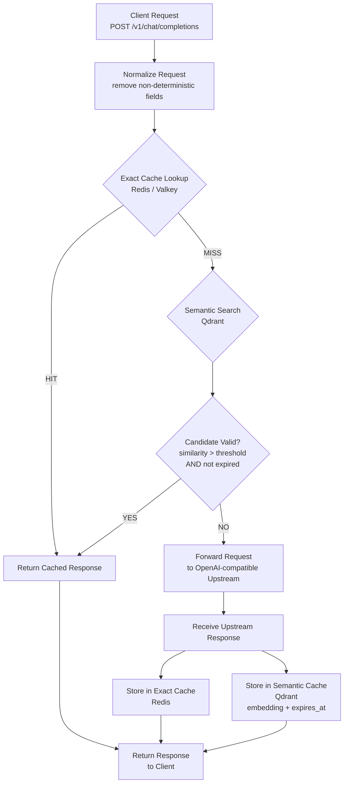

# How AI Cost Firewall Works

This document explains how AI Cost Firewall processes requests and how the caching system reduces LLM API costs and latency.

The firewall sits between client applications and LLM providers and implements a two-layer caching strategy:

1. Exact cache (Redis)
2. Semantic cache (Qdrant)

Only if both caches miss does the firewall forward the request to the configured OpenAI-compatible upstream.

## Request Lifecycle Diagram


```mermaid
flowchart TD

    A[Client Request<br/>POST /v1/chat/completions]

    B[Normalize Request<br/>remove non-deterministic fields]

    C{Exact Cache Lookup<br/>Redis / Valkey}

    D[Return Cached Response]

    E{Semantic Search<br/>Qdrant}

    E2{Candidate Valid?<br/>similarity &gt; threshold<br/>AND not expired}

    F[Forward Request<br/>to OpenAI-compatible Upstream]

    G[Receive Upstream Response]

    H[Store in Exact Cache<br/>Redis]

    I[Store in Semantic Cache<br/>Qdrant<br/>embedding + expires_at]

    J[Return Response<br/>to Client]

    A --> B
    B --> C

    C -->|HIT| D
    D --> J

    C -->|MISS| E

    E --> E2

    E2 -->|YES| D
    E2 -->|NO| F

    F --> G
    G --> H
    G --> I

    H --> J
    I --> J
```

---

# Example Request

A client sends a request to the firewall using the OpenAI-compatible API.

Example request:

```bash
curl http://localhost:8080/v1/chat/completions \
  -d '{
    "model": "gpt-4o-mini-2024-07-18",
    "messages": [
      {"role":"user","content":"Explain Redis briefly"}
    ]
  }'
```

> By default, AI Cost Firewall does not require client-side authorization on incoming requests.
> The `upstream_api_key` in the configuration is used by the firewall when calling the upstream LLM provider.
> For production deployments, place the firewall behind an authenticated reverse proxy, API gateway, VPN, or private network boundary.

---

# Step 1 — Request Normalization

Before checking the cache, the firewall normalizes the request.

Normalization ensures that semantically identical requests generate the
same cache key.

Example normalized semantic text:

```text
user: Explain Redis briefly
```

If a system message exists, it is included as well:

```text
system: You are a concise assistant
user: Explain Redis briefly
```

This normalized text is used for:
- semantic embeddings
- semantic similarity search

---

# Step 2 — Exact Cache Lookup (Redis / Valkey)

The firewall generates a SHA256 hash of the normalized request JSON.

Example key:

```bash
aif:exact:<sha256>
```

Redis lookup:

```bash
GET aif:exact:<sha256>
```

## Possible outcomes

### Exact Cache Hit

If a cached response exists:

```text
Redis → cached response
```

The firewall immediately returns the cached result to the client.

Benefits:
- no upstream API call
- near-zero latency
- no token usage

### Exact Cache Miss

If Redis does not contain the key:

```text
Redis → MISS
```

The firewall proceeds to semantic search.

---

# Step 3 — Semantic Cache Search (Qdrant)

The firewall generates an embedding for the normalized prompt text.

Embeddings are generated through the configured OpenAI-compatible embedding provider. The embedding provider may use a different `embedding_base_url` from the main chat upstream.

Example embedding model:

```
text-embedding-3-small
```

The embedding is used to search the Qdrant vector collection:

```
aif_semantic_cache
```

Search example:

```
vector search → top matches
```

Each returned candidate represents a previously cached response with similar meaning.

---

# Step 4 — Semantic Similarity & Lifecycle Check

> Semantic cache decisions are based on both similarity and freshness.

Each semantic cache entry stored in Qdrant includes:

- an embedding vector
- cached response payload
- lifecycle metadata (`inserted_at`, `expires_at`)
- model metadata

Example:

```text
Prompt: "Explain Redis briefly"
Cached prompt: "What is Redis used for?"
Similarity score: 0.94
```

Expired semantic entries are filtered before similarity ranking.

The lookup flow is:

1. Qdrant searches only entries for the same model.
2. Qdrant filters out expired entries using `expires_at > now`.
3. The firewall evaluates returned candidates against `semantic_similarity_threshold`.
4. The firewall verifies that the cached response payload is valid.
5. The first valid candidate is returned as a semantic cache hit.

Example configuration:

```conf
semantic_similarity_threshold 0.92;
```

---

## Semantic Cache Hit

A candidate is considered a hit only if:

```
expires_at > now
AND
similarity_score >= semantic_similarity_threshold
AND
cached response payload is valid
```

Example:

```
expires_at > now → valid
0.94 >= 0.92 → pass
cached response payload exists → valid
```

The firewall returns the cached response.

Benefits:

- avoids an expensive LLM call
- reuses previously generated answers
- improves response latency
- increases effective cache hit rate

---

## Semantic Cache Miss

A semantic miss occurs if:

- no non-expired candidate is returned by Qdrant
- no returned candidate meets the similarity threshold
- a returned candidate is missing required metadata
- a returned candidate has an invalid or missing cached response payload
- semantic lookup fails and fail-open behavior continues the request upstream

Example:

```
semantic MISS
```

the firewall forwards the request to the configured OpenAI-compatible upstream.

---

## Important Notes

- Expired semantic entries are never returned, even if similarity would otherwise be high.
- Expired entries are filtered during lookup before similarity ranking.
- Expiration is enforced by query-time filtering and defensive runtime checks, not by automatic Qdrant deletion.
- Expired entries may remain stored in Qdrant until manually pruned.
- Manual pruning removes expired entries where `expires_at <= now`.

---

# Step 5 — OpenAI-Compatible Upstream Request

The firewall forwards cache misses to the configured OpenAI-compatible upstream.

The configured `upstream_base_url` may be the provider root URL or its `/v1` base path:

```text
https://api.openai.com
http://ollama:11434/v1
http://vllm:8000/v1
```

AI Cost Firewall builds the final chat-completions endpoint internally:

```text
/v1/chat/completions
```

Do not configure the full endpoint path as `upstream_base_url`.

For local providers without authentication, `upstream_api_key` may be set to `dummy`, `none`, `null`, or `-`. In that case, AI Cost Firewall does not send an upstream `Authorization: Bearer ...` header.

The upstream response is then returned to the firewall.

---

# Step 6 — Store in Cache

After receiving the upstream response, the firewall stores the result in both caches.

## Redis

Exact request → response

```bash
SET aif:exact:<sha256> response
```

## Qdrant

Prompt embedding → response

Stored data includes:
- normalized prompt text
- embedding vector
- response payload
- `inserted_at`
- `expires_at`

The expiration timestamp is calculated using `semantic_cache_retention_seconds`.

---

# Step 7 — Return Response to Client

Finally, the firewall returns the response to the client application.

The client receives a **standard OpenAI-compatible response**, meaning no application changes are required.

---

# Complete Request Flow

```text
Client Request
      |
      v
Normalize Request
      |
      v
Exact Cache Lookup (Redis)
      |
      |-- HIT ---------> Return Cached Response
      |
      v
Generate Embedding
      |
      v
Semantic Search (Qdrant)
      |
      |-- HIT ---------> Return Cached Response
      |
      v
Forward to Upstream API
      |
      v
Store Response in Cache
      |
      v
Return Response to Client
```

---

# When Semantic Caching is Disabled

Semantic caching can be disabled globally or skipped automatically for specific request types.

## Globally disabled by configuration

Semantic caching is disabled for all requests when the configuration contains:

```conf
semantic_cache_enabled false;
```

In this mode, the firewall uses only the exact cache and upstream forwarding.

## Automatically skipped for specific requests

Even when semantic caching is enabled globally, the firewall skips semantic lookup for streaming requests.

Streaming is controlled by the incoming request body, not by the firewall configuration.

Examples include:

- streaming requests, where the request body contains `stream: true`
- requests using tools or function-calling
- requests using structured response formats

Example streaming request:

```json
{
  "model": "gpt-4o-mini-2024-07-18",
  "stream": true,
  "messages": [
    {"role": "user", "content": "Say hello"}
  ]
}
```

In these cases, the firewall does not use semantic caching for that request. The request is handled through exact cache logic where applicable, or forwarded upstream.

---

# Observability

AI Cost Firewall exposes Prometheus metrics that show how requests move through the cache and upstream path.

Metrics are available at:

```text
/metrics
```

Example:

```bash
curl http://localhost:8080/metrics
```

- cache hit rates
- upstream API usage
- token savings
- estimated cost savings

The most useful metrics for understanding request flow are:

```text
aif_requests_total
aif_cache_exact_hits
aif_cache_semantic_hits
aif_cache_misses
aif_upstream_calls_total
aif_upstream_request_duration_seconds
aif_upstream_timeouts_total
aif_embedding_request_duration_seconds
aif_embedding_timeouts_total
aif_semantic_lookup_duration_seconds
```
These show whether requests are served from cache or forwarded upstream.
