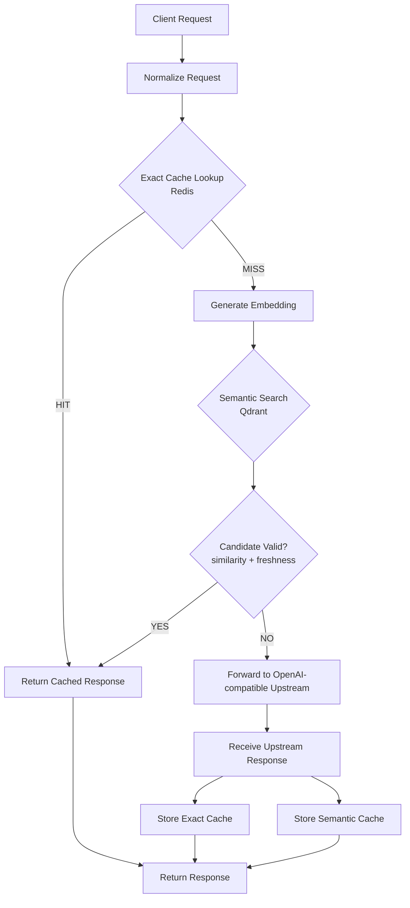

# How AI Cost Firewall Works

This document explains how AI Cost Firewall processes requests, evaluates cache reuse, communicates with OpenAI-compatible providers, and reduces LLM API cost and latency.

AI Cost Firewall sits between client applications and LLM providers and applies a two-layer cache strategy:

1. exact cache (Redis)
2. semantic cache (Qdrant)

Only cache misses are forwarded upstream.

---

# High-Level Architecture

```text
Client Applications
        │
        ▼
AI Cost Firewall
        │
        ├── Redis (exact cache)
        ├── Qdrant (semantic cache)
        │
        ▼
OpenAI-compatible provider
```

Supported OpenAI-compatible providers include:

- OpenAI
- Ollama
- LM Studio
- vLLM
- LiteLLM
- OpenRouter

---

# Request Lifecycle

AI Cost Firewall evaluates requests in stages:

1. normalize request
2. exact cache lookup
3. semantic cache lookup
4. upstream request
5. cache storage
6. response return

---

# Request Flow Diagram


```mermaid
flowchart TD

    A[Client Request]

    B[Normalize Request]

    C{Exact Cache Lookup<br/>Redis}

    D[Return Cached Response]

    E[Generate Embedding]

    F{Semantic Search<br/>Qdrant}

    G{Candidate Valid?<br/>similarity + freshness}

    H[Forward to OpenAI-compatible Upstream]

    I[Receive Upstream Response]

    J[Store Exact Cache]

    K[Store Semantic Cache]

    L[Return Response]

    A --> B
    B --> C

    C -->|HIT| D
    D --> L

    C -->|MISS| E
    E --> F

    F --> G

    G -->|YES| D
    G -->|NO| H

    H --> I

    I --> J
    I --> K

    J --> L
    K --> L
```

---

# Example Request

Client applications use the standard OpenAI-compatible API.

Example:

```bash
curl http://localhost:8080/v1/chat/completions \
  -H "Content-Type: application/json" \
  -d '{
    "model": "gpt-4o-mini-2024-07-18",
    "messages": [
      {"role":"user","content":"Explain Redis briefly"}
    ]
  }'
```

The firewall returns a standard OpenAI-compatible response.

No client-side API changes are required.

---

# Client Authentication Notes

By default, AI Cost Firewall does not require incoming client authentication.

The configured:

```text
upstream_api_key
```

is used only for upstream provider communication.

For production environments, place the firewall behind:

- authenticated reverse proxy
- API gateway
- VPN
- private network boundary
- service mesh

---

# Step 1 — Request Normalization

Before cache lookup, the firewall normalizes requests.

Normalization removes non-deterministic request fields and produces stable semantic text.

Example normalized prompt:

```text
user: Explain Redis briefly
```

With system message:

```text
system: You are a concise assistant
user: Explain Redis briefly
```

Normalization is used for:

- exact cache hashing
- semantic embeddings
- semantic search consistency

---

# Step 2 — Exact Cache Lookup

The firewall creates a SHA256 hash from the normalized request JSON.

Example key:

```text
aif:exact:<sha256>
```

Redis lookup:

```text
GET aif:exact:<sha256>
```

---

# Exact Cache Hit

If the response already exists in Redis:

```text
Redis → HIT
```

The firewall immediately returns the cached response.

Benefits:

- near-zero latency
- no upstream API call
- no additional token usage
- predictable response times

---

# Exact Cache Miss

If Redis does not contain the request:

```text
Redis → MISS
```

the firewall continues to semantic lookup.

---

# Step 3 — Embedding Generation

The firewall generates an embedding from the normalized semantic text.

Embeddings are produced through the configured embedding provider.

The embedding provider may differ from the chat provider.

Examples:

| Chat Provider | Embedding Provider |
|---|---|
| OpenAI | OpenAI |
| OpenAI | Ollama |
| OpenRouter | OpenAI |
| Ollama | Ollama |

---

# Embedding Models

Typical embedding models:

| Model | Vector Size |
|---|---|
| text-embedding-3-small | 1536 |
| nomic-embed-text | 768 |

Example configuration:

```conf
embedding_model text-embedding-3-small;
qdrant_vector_size 1536;
```

The vector size must match the embedding model dimension.

---

# Step 4 — Semantic Search

The generated embedding is used to query Qdrant.

Typical collection:

```text
aif_semantic_cache
```

Qdrant returns semantically similar candidates.

Each candidate contains:

- embedding vector
- cached response payload
- similarity score
- inserted_at
- expires_at
- model metadata

---

# Semantic Candidate Evaluation

AI Cost Firewall validates semantic candidates before reuse.

A candidate is reusable only if:

```text
similarity_score >= semantic_similarity_threshold
AND
expires_at > now
AND
cached response payload is valid
```

---

# Semantic Threshold Example

Example:

```text
Prompt: "Explain Redis briefly"
Cached Prompt: "What is Redis used for?"
Similarity: 0.94
Threshold: 0.92
```

Because:

```text
0.94 >= 0.92
```

the candidate may be reused.

---

# Semantic Cache Hit

When a valid semantic candidate exists:

```text
semantic HIT
```

the firewall returns the cached response.

Benefits:

- reduced upstream API cost
- reduced latency
- reuse of semantically equivalent answers
- higher effective cache utilization

---

# Semantic Cache Miss

Semantic miss occurs when:

- no candidates returned
- similarity below threshold
- entry expired
- payload invalid
- semantic lookup failure occurs

The firewall then forwards the request upstream.

---

# Semantic Cache Lifecycle

Semantic entries contain lifecycle metadata:

- inserted_at
- expires_at

Expiration derives from:

```conf
semantic_cache_retention_seconds 604800;
```

Expired entries:

- are filtered during lookup
- are never reused
- may remain stored until pruned

Semantic correctness does not depend on cleanup.

---

# Runtime Fail-Open Behavior

Optional runtime behavior:

```conf
semantic_cache_fail_open true;
```

When enabled:

- semantic lookup failures behave like cache misses
- requests continue upstream normally

This prevents semantic infrastructure failures from blocking chat traffic.

---

# Step 5 — Upstream Request

When both cache layers miss, the firewall forwards the request upstream.

Example providers:

```text
https://api.openai.com
http://ollama:11434/v1
http://vllm:8000/v1
```

AI Cost Firewall internally appends:

```text
/v1/chat/completions
```

Do not configure the full endpoint path as:

```text
upstream_base_url
```

---

# Correct vs Wrong Base URLs

## Correct

```text
http://ollama:11434/v1
```

## Wrong

```text
http://ollama:11434/v1/chat/completions
```

---

# Local Provider Authentication

Local providers often do not require authentication.

Accepted placeholders:

```text
dummy
none
null
-
```

Example:

```conf
upstream_api_key dummy;
embedding_api_key dummy;
```

When placeholders are used, AI Cost Firewall does not send:

```text
Authorization: Bearer ...
```

headers upstream.

---

# Step 6 — Cache Storage

After receiving the upstream response, the firewall stores results in both caches.

---

# Exact Cache Storage

Redis stores:

```text
exact request → response
```

Example:

```text
SET aif:exact:<sha256> response
```

---

# Semantic Cache Storage

Qdrant stores:

- normalized prompt text
- embedding vector
- response payload
- inserted_at
- expires_at
- model metadata

---

# Step 7 — Return Response

The firewall returns a standard OpenAI-compatible response to the client.

Applications do not need special cache-awareness logic.

---

# Streaming Behavior

Streaming requests are forwarded upstream normally.

Example:

```json
{
  "stream": true
}
```

Current behavior:

- streaming requests bypass semantic cache
- streaming responses are not stored in semantic cache
- exact cache behavior may vary depending on request flow

---

# Structured Outputs and Tools

Semantic cache may also be skipped for:

- tool-calling requests
- function-calling requests
- structured response formats

These request types often contain non-deterministic structures that reduce safe semantic reuse.

---

# When Semantic Cache Is Disabled

Semantic cache may be disabled globally:

```conf
semantic_cache_enabled false;
```

In this mode:

- only exact cache is used
- semantic embeddings are skipped
- Qdrant not required

---

# Metrics and Observability

AI Cost Firewall exposes Prometheus metrics:

```text
/metrics
```

Example:

```bash
curl http://localhost:8080/metrics
```

---

# Core Request Metrics

```text
aif_requests_total
aif_cache_exact_hits
aif_cache_semantic_hits
aif_cache_misses
aif_upstream_calls_total
```

These metrics show whether requests were:

- exact cache hits
- semantic cache hits
- upstream requests

---

# Semantic Diagnostics Metrics

```text
aif_semantic_candidates_checked_total
aif_semantic_threshold_results_total
aif_semantic_lookup_duration_seconds
aif_semantic_expired_entries_skipped_total
```

These metrics help tune:

- semantic similarity thresholds
- retention windows
- embedding quality
- semantic reuse behavior

---

# Timeout Metrics

```text
aif_upstream_timeouts_total
aif_embedding_timeouts_total
aif_upstream_request_duration_seconds
aif_embedding_request_duration_seconds
```

Useful for diagnosing:

- slow providers
- overloaded local models
- embedding bottlenecks
- network latency

---

# Cost Metrics

```text
aif_model_cost_micro_usd_total
aif_gross_saved_micro_usd_total
aif_embedding_overhead_micro_usd_total
aif_net_saved_micro_usd_total
```

These metrics distinguish:

- gross avoided chat-completion cost
- embedding overhead
- net savings after embeddings

---

# Included Dashboards

AI Cost Firewall includes pre-configured Grafana dashboards.

Overview dashboard:

- cost savings
- cache hit rates
- request traffic
- net savings

Diagnostics dashboard:

- semantic threshold pass/fail behavior
- lookup latency
- semantic cache diagnostics
- runtime semantic activity

---

# Why Semantic Cache Matters

Exact cache alone only reuses identical prompts.

Semantic cache enables reuse across:

- paraphrased questions
- slightly modified prompts
- repeated support requests
- repeated agent interactions
- recurring enterprise workflows

This significantly improves effective cache utilization.

---

# Typical Deployment Patterns

AI Cost Firewall supports:

| Pattern | Example |
|---|---|
| Cloud upstream | OpenAI |
| Fully local | Ollama |
| Hybrid | OpenAI + local embeddings |
| Routing layer | OpenRouter |
| Self-hosted inference | vLLM |

Deployment examples:

```text
deploy/examples/
```

---

# Operational Notes

- Redis required for exact cache
- Qdrant required only when semantic cache enabled
- vector size must match embedding dimension
- semantic correctness does not depend on pruning
- expired entries filtered during lookup
- semantic cache fail-open affects runtime only
- OpenAI-compatible providers supported through flat configuration model

---

# Additional Documentation

See also:

- `docs/quickstart.md`
- `docs/config-reference.md`
- `docs/provider-compatibility.md`
- `docs/operation.md`
- `docs/troubleshooting.md`
